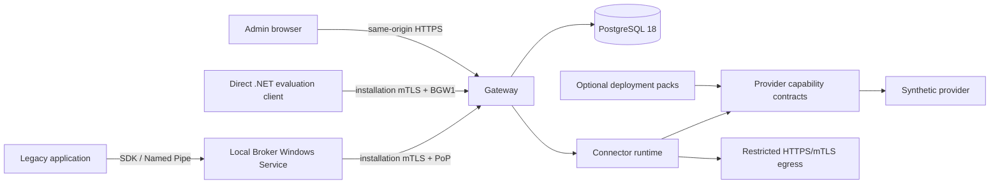

# Architecture

Secure Integration Platform separates the local Windows trust boundary from the central integration plane.

The Broker owns local DPAPI and CNG material and never receives vendor credentials. The Gateway derives tenant and installation from authenticated identity, enforces grants, resolves logical endpoint/secret/certificate bindings server-side, and applies outbound credentials. The Admin UI is static React served by the Gateway; it uses only authenticated Admin APIs and never connects to storage, providers, or the Broker.

The open-source Core candidate contains Broker, Gateway, PostgreSQL persistence, Connector runtime/SDK contracts, provider abstractions, Synthetic Provider, CLI, Admin UI, local Compose and tests. Deployment and vertical connector packs depend on those contracts; dependency direction is never reversed. The default Gateway image contains no healthcare pack. Detailed current and target views are in [the system architecture](docs/architecture/system-architecture.md).

Security invariants include deny-by-default grants, server-derived tenant scope, checksum-specific four-eyes publication, immutable Published definitions, TLS validation, CSRF, secure cookies, CSP, metadata-only audit and no client/Broker/UI `GetSecret` API. Audit is metadata-only and append-only for application roles: migration 0017 removes `gateway_admin` UPDATE/DELETE/TRUNCATE on audit and all its invocation-event privileges. Owner/migration and privileged database/host administrators remain trusted; this is not signed or administrator-proof audit. Local Administrator and SYSTEM remain residual privileged threats.
