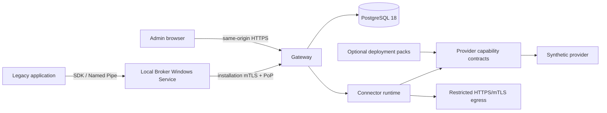

# Architecture

Secure Integration Platform separates the local Windows trust boundary from the central integration plane.

The Broker owns local DPAPI and CNG material and never receives vendor credentials. The Gateway derives tenant and installation from authenticated identity, enforces grants, resolves logical endpoint/secret/certificate bindings server-side, and applies outbound credentials. The Admin UI is static React served by the Gateway; it uses only authenticated Admin APIs and never connects to storage, providers, or the Broker.

The open-source Core contains Broker, Gateway, PostgreSQL persistence, Connector runtime/SDK, provider abstractions, synthetic provider, CLI, Admin UI, local Compose and tests. Deployment and vertical connector packs depend on those contracts and are never referenced by the Core. Detailed diagrams and trust boundaries are in [the architecture documentation](docs/architecture/m5-admin-ui-and-provider-boundaries.md).

Security invariants include deny-by-default grants, server-derived tenant scope, checksum-specific four-eyes publication, immutable Published definitions, TLS validation, CSRF, secure cookies, CSP, metadata-only audit and no `GetSecret` API.
