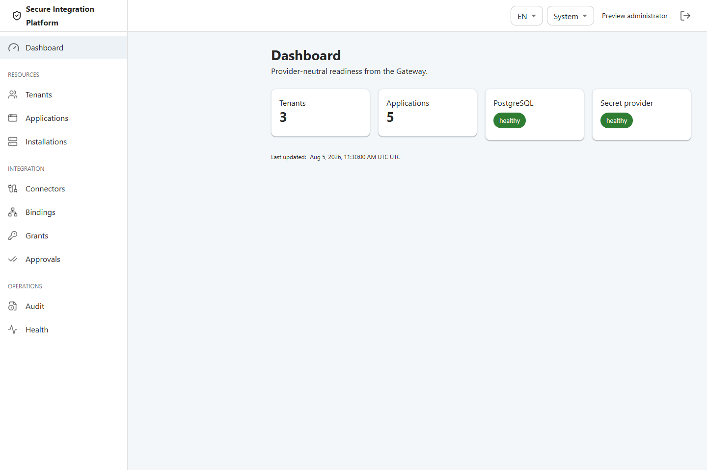

# Secure Integration Platform

Piattaforma provider-neutral per integrare software on-premise e legacy senza distribuire
credenziali, chiavi private o destinazioni operative ai client. Il Core comprende Local
Broker, Gateway, runtime dei Connector, PostgreSQL, Admin UI/API, provider sintetico e
client .NET Direct. I pack healthcare sono opzionali e non diventano dipendenze del Core.

> Stato: private preview tecnica, non produzione. Il pilot locale sintetico è disponibile.
> Per FSE2 OfficialTest è live-qualified soltanto `validate-cda`; non sono qualificati
> accreditamento, produzione o copertura completa del Gateway FSE 2.0.



## Scegli il tuo percorso

| Obiettivo | Inizia qui | Risultato supportato |
|---|---|---|
| Provare il prodotto in locale | [Quick start](docs/user/quickstart.md) → [pilot locale](docs/user/local-pilot.md) | Una chiamata Direct .NET → Gateway → Connector Published → mock HTTPS/mTLS, con risposta sanificata e audit metadata-only. |
| Provare FSE2 OfficialTest | [Pilot FSE2 OfficialTest](https://github.com/marcobiz/secure-integration-platform/blob/main/docs/user/fse2-officialtest.md) | Configurazione e pubblicazione di `validate-cda`; la chiamata live è qualificata sulla baseline, ma non è ancora self-service per un nuovo adottante. |
| Amministrare la piattaforma | [Guida di amministrazione](docs/user/administration.md) | Ruoli, lifecycle, binding, grant, four-eyes, audit e recovery tramite superfici supportate. |
| Sviluppare un Connector | [Guida per sviluppatori](docs/connector-development/README.md) | Definizione minima provider-neutral e golden path `plan → apply → verify → first call`. |
| Capire stato e regole interne | [Indice interno](https://github.com/marcobiz/secure-integration-platform/blob/main/docs/internal/README.md) | Autorità documentali, governance della complessità e regole per agenti/contributor. |

Limitazioni e rimedi operativi sono raccolti in
[problemi noti](docs/user/known-limitations.md) e
[troubleshooting](docs/user/troubleshooting.md). L’indice completo, separato per
pubblico, è in [docs/README.md](https://github.com/marcobiz/secure-integration-platform/blob/main/docs/README.md);
i documenti di milestone, review e gate precedenti sono classificati
nell’[indice storico](https://github.com/marcobiz/secure-integration-platform/blob/main/docs/history/README.md).

## Pilot locale, senza cloud

Prerequisiti: Docker con Linux containers e Compose, SDK .NET risolto da `global.json`
e PowerShell 5.1 o 7. Node non è richiesto sull’host per questo percorso.

```powershell
dotnet --version
./tools/alpha/Invoke-AlphaGoldenPath.ps1 -Phase Validate
./tools/alpha/Invoke-AlphaGoldenPath.ps1 -Phase Run
```

Il runner usa solo materiale sintetico per-run, verifica una singola chiamata e rimuove
container, rete, volume e materiale temporaneo. In caso di interruzione:

```powershell
./tools/alpha/Invoke-AlphaGoldenPath.ps1 -Phase Stop
```

Il percorso canonico e i marker attesi sono in
[docs/user/local-pilot.md](docs/user/local-pilot.md). Non usare i vecchi quickstart di
milestone come percorsi alternativi.

## Stato FSE2 in una riga

- `validate-cda`: **LIVE_QUALIFIED** su OfficialTest, per il solo pilot di qualità CDA;
- `delete`: **PRODUCT_PATH_OFFLINE_QUALIFIED**, non live né productizzato;
- altre nove operazioni: **IMPLEMENTED_PARTIAL**;
- copertura completa del Gateway FSE 2.0: **NO**;
- pilot di pubblicazione: richiede almeno `create` e `get-status-by-workflow`, ancora
  parziali;
- produzione e accreditamento: **NON QUALIFICATI**.

## Build, sicurezza e confini

I controlli repository sono descritti in [AGENTS.md](AGENTS.md). L’architettura e i
confini dell’export Core sono in [ARCHITECTURE.md](ARCHITECTURE.md) e
[OPEN_SOURCE_BOUNDARIES.md](OPEN_SOURCE_BOUNDARIES.md). Segnalare vulnerabilità tramite
[SECURITY.md](SECURITY.md), senza pubblicare dettagli sfruttabili, token, certificati,
payload o risposte raw.
