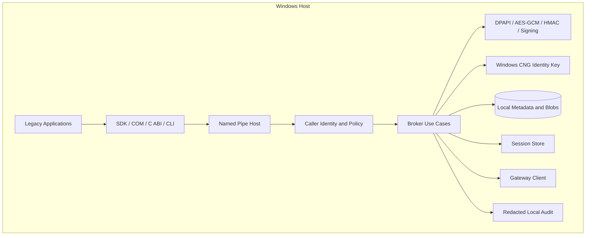
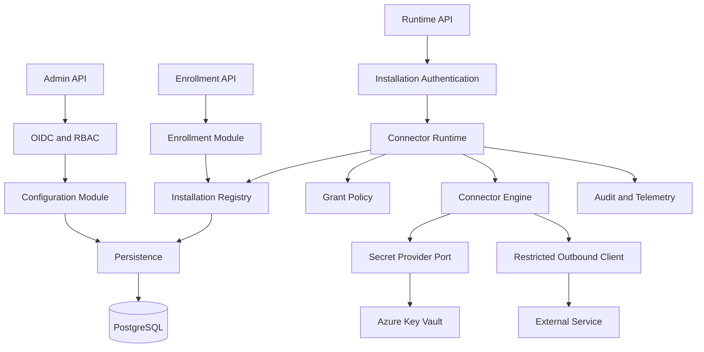
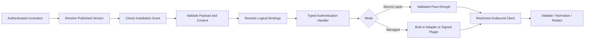
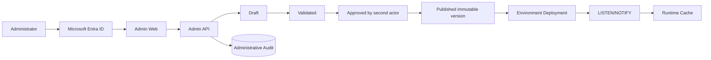
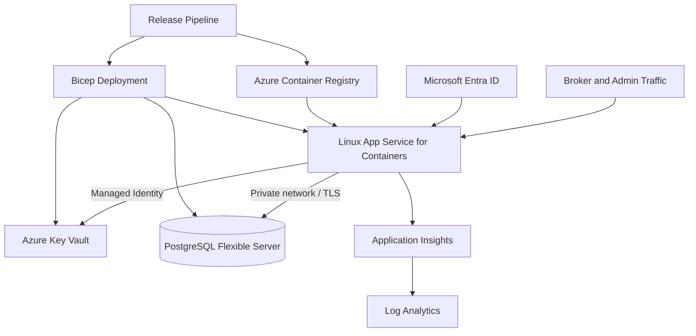
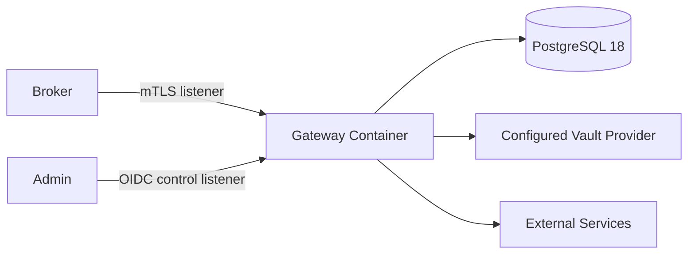

# Diagrammi di container e componenti

## Local Broker

## Gateway modular monolith

## Connector runtime

Il plugin non riceve un generico proxy o un endpoint client-controlled. L'interfaccia ristretta non costituisce sandbox: un plugin .NET in-process resta full-trust.

## Admin plane

## Azure deployment

## Self-hosted deployment

Il provider produttivo iniziale resta Azure Key Vault. `LocalDevelopmentSecretProvider` accetta solo fixture sintetiche e deve rifiutare l'ambiente Production.

