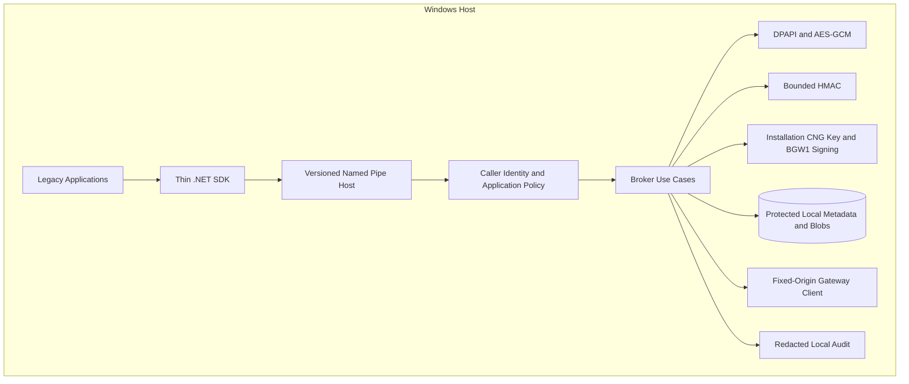
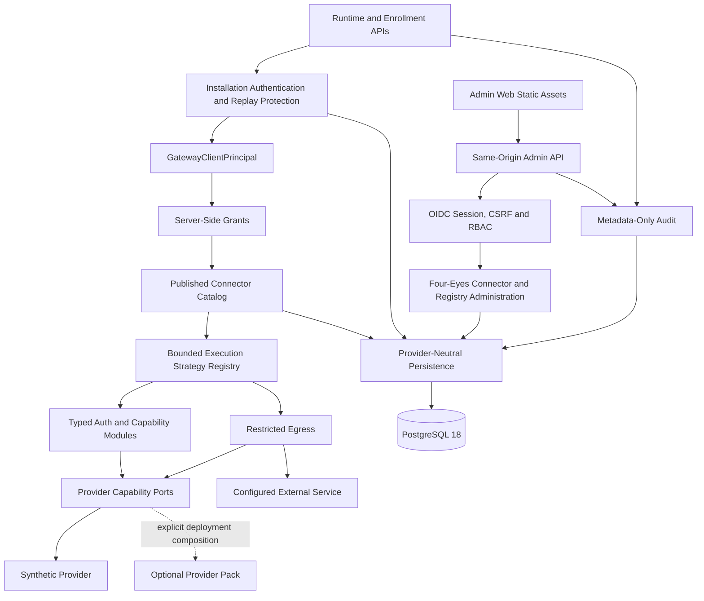
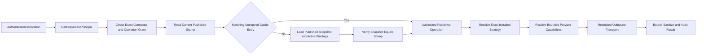
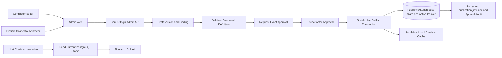
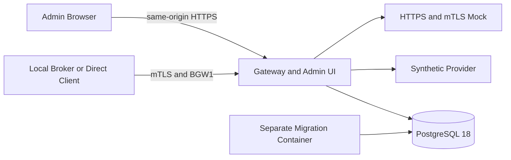
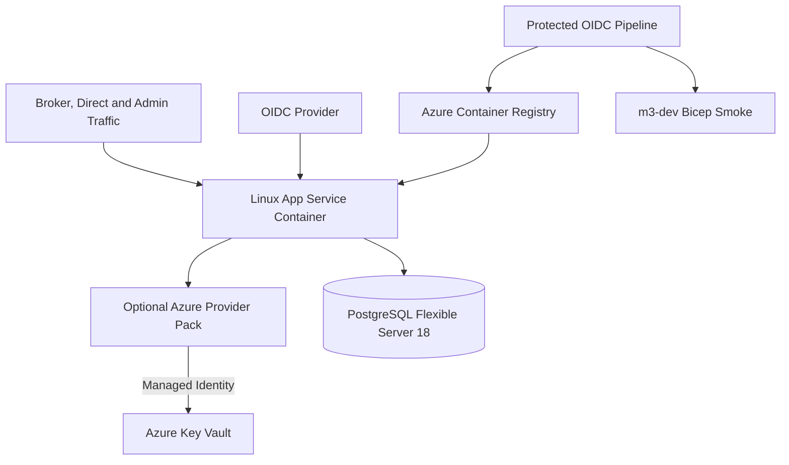

# Diagrammi di container e componenti

Le viste **CURRENT** rappresentano componenti presenti. Le viste **TARGET** descrivono
packaging o qualifiche ancora aperte.

## CURRENT — Local Broker

Le operation IPC correnti includono storage/delete di secret locali ammessi,
protect/unprotect, HMAC, invoke Gateway e status. Non esiste un'interfaccia Broker per
leggere un secret. Lo SDK corrente è .NET; native/COM e smart-card signing appartengono
al target legacy.

## CURRENT — Gateway modular monolith

Domain e Application restano provider-neutral. `Gateway.Api` compone Infrastructure,
Synthetic Provider, auth runtime e moduli esplicitamente configurati. Azure, local
PKCS#12 e i pack verticali sono consumer opzionali e non entrano nel grafo Core. Il pack
local PKCS#12 dichiara `SecretValues=false`; il generic secret provider fornito al factory
è deny-only.

## CURRENT — Connector runtime e cache Published

Lo stamp copre la Published authority e le revisioni binding/resource pertinenti. Viene
verificato a ogni invocazione; una cache TTL non diventa fallback stale quando lo store è
indisponibile o cambia. Il modulo non riceve un proxy generico, un endpoint
client-controlled, un locator o un provider facade. Un modulo .NET in-process resta
comunque full-trust.

## CURRENT — Admin plane e pubblicazione

L'approvazione è separata dallo stato della versione e lega checksum canonico e digest
dei binding. La pubblicazione rende la nuova versione `Published`, la precedente
`Superseded` e aggiorna il puntatore attivo. Il rollback riattiva una versione
`Superseded` già pubblicata senza copiarne o modificarne i byte.

Il runtime e l'Admin plane producono record metadata-only. Il comportamento applicativo
è append-only, ma `gateway_admin` conserva una grant UPDATE storica sulle tabelle audit;
la claim di immutabilità DB completa resta deferred fino a migration e test di privilege.

## CURRENT — laboratorio locale no-cloud

I profili Compose M2-M5 combinano questi componenti per test e quickstart. Sono ambienti
sintetici, non una topologia production qualificata. PostgreSQL usa ruoli distinti, ma
il Compose locale non è prova di TLS database o HA production.

## CURRENT, opt-in — laboratorio local PKCS#12

L'overlay FSE2 sostituisce solo l'immagine Gateway con una composizione che include il
provider local PKCS#12 e il modulo verticale. Manifest e materiale sintetico per-run sono
montati read-only; il container resta non-root/read-only. Il gate prova provider
certificate/signing, readiness e tamper response senza eseguire chiamate FSE2 live.

## TARGET — qualifica Azure opzionale

Il pack e lo skeleton Bicep esistono, ma M3B non ha un gate live attestato. Networking
privato, HA/DR, backup/restore, release signing, monitoring operativo e provider
production-qualified sono target, non claim della baseline.

## TARGET — distribuzione

- Core alpha: packaging, licenza, security channel e clean-clone del golden path REST;
- legacy: MSI, adapter aggiuntivi e compatibility matrix;
- FSE2 OfficialTest: composizione verticale, custody/import e driver redatto, con
  `validate-cda` come primo outcome futuro;
- enterprise: provider/cloud qualificati, provenance, backup/restore, HA/DR, load/soak
  e pentest.

Early-adopter completion non è dichiarata finché `ALPHA-ADOPT` resta aperto.
