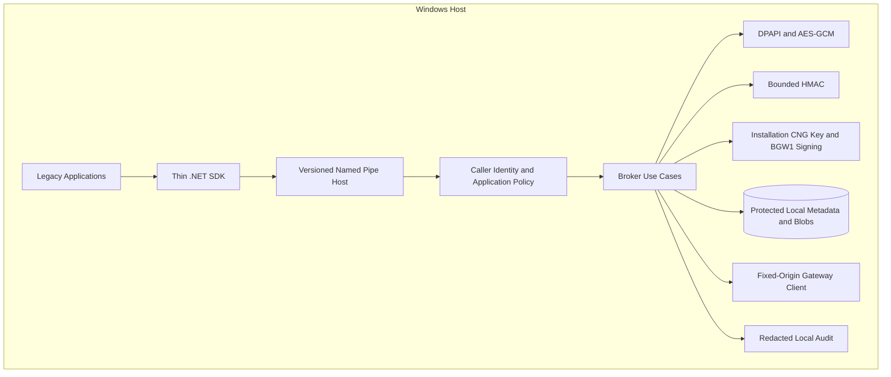
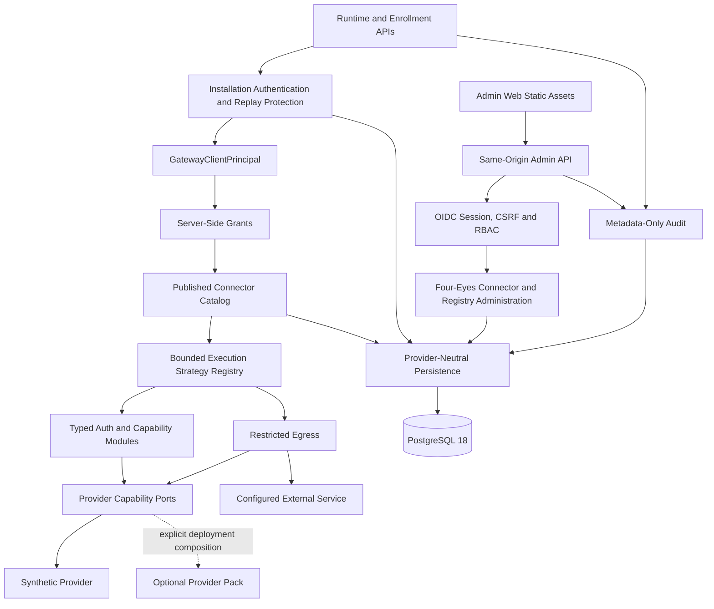
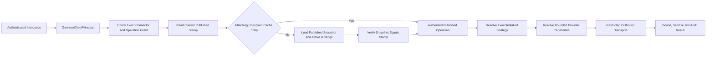
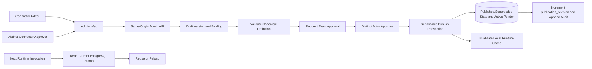
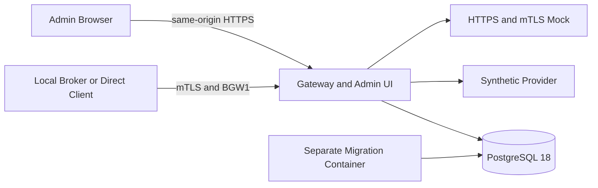
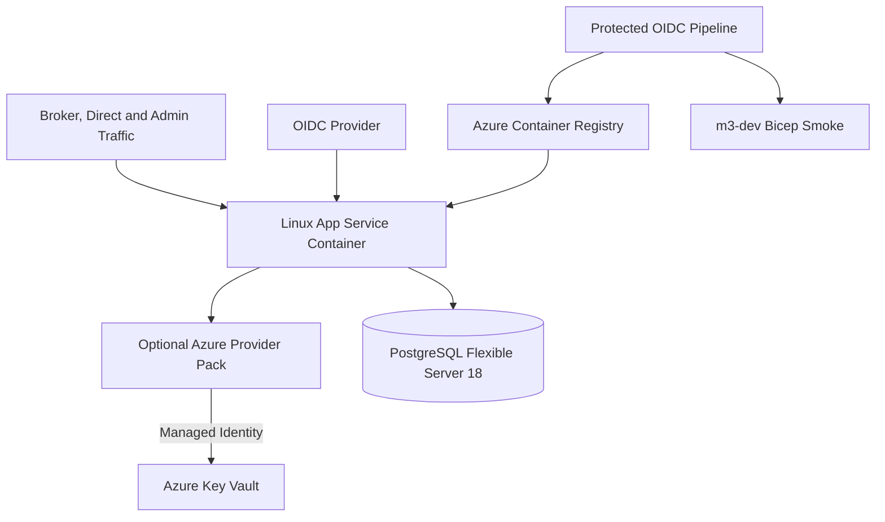

# Container and component diagrams

**CURRENT** views represent existing components. **TARGET** views describe
packaging or qualifications that remain open.

## CURRENT — Local Broker

Current IPC operations include storage/deletion of permitted local secrets,
protect/unprotect, HMAC, Gateway invocation and status. There is no Broker interface for
reading a secret. The current SDK is .NET; native/COM and smart-card signing belong to
the legacy target.

## CURRENT — Gateway modular monolith

Domain and Application remain provider-neutral. `Gateway.Api` composes Infrastructure,
Synthetic Provider, authentication runtime and explicitly configured modules. Azure, local
PKCS#12 and vertical packs are optional consumers and do not enter the Core graph. The
local PKCS#12 pack declares `SecretValues=false`; the generic secret provider supplied to the factory
is deny-only.

## CURRENT — Connector runtime and Published cache

The stamp covers Published authority and relevant binding/resource revisions. It is
checked on every invocation; a TTL cache does not become a stale fallback when the store is
unavailable or changes. The module receives no generic proxy, client-controlled
endpoint, locator or provider facade. An in-process .NET module nevertheless remains
full-trust.

## CURRENT — Admin plane and publication

Approval is separate from version state and binds the canonical checksum and binding
digest. Publication makes the new version `Published`, the previous one
`Superseded` and updates the active pointer. Rollback reactivates a previously
published `Superseded` version without copying or modifying its bytes.

The runtime and Admin plane produce metadata-only records. Migration 0017 revokes
application-role modification of existing event records: runtime retains only INSERT on
audit/invocation and Admin only SELECT/INSERT on audit. Owner/migration and
host/DB administrators remain in the TCB; no signing or notarization is introduced.

## CURRENT — local no-cloud laboratory

M2–M5 Compose profiles combine these components for tests and quickstart. They are synthetic
environments, not a qualified production topology. PostgreSQL uses separate roles, but
local Compose is not evidence of database TLS or production HA.

## CURRENT, opt-in — local PKCS#12 laboratory

The FSE2 overlay replaces only the Gateway image with a composition including the
local PKCS#12 provider and vertical module. The manifest and per-run synthetic material are
mounted read-only; the container remains non-root/read-only. The gate tests provider
certificate/signing, readiness and tamper response without executing live FSE2 calls.

## TARGET — optional Azure qualification

The pack and Bicep skeleton exist, but M3B has no attested live gate. Private
networking, HA/DR, backup/restore, release signing, operational monitoring and
production-qualified providers are targets, not baseline claims.

## TARGET — distribution

- Core alpha: publication and adoption gates; existing licensing and security-reporting
  policies are in [LICENSING.md](../../LICENSING.md) and [SECURITY.md](../../SECURITY.md);
- legacy: MSI, additional adapters and compatibility matrix;
- FSE2 OfficialTest: the [current optional pilot](https://github.com/marcobiz/secure-integration-platform/blob/main/docs/user/fse2-validation-status.md)
  covers validation and lookup; remaining qualification targets are in the
  [capability summary](../../IMPLEMENTATION_STATUS.md);
- enterprise: qualified providers/cloud, provenance, backup/restore, HA/DR, load/soak
  and pentest.

Historical adopter-simulation evidence applies to its recorded baseline; it does not
by itself establish release readiness or production adoption.
