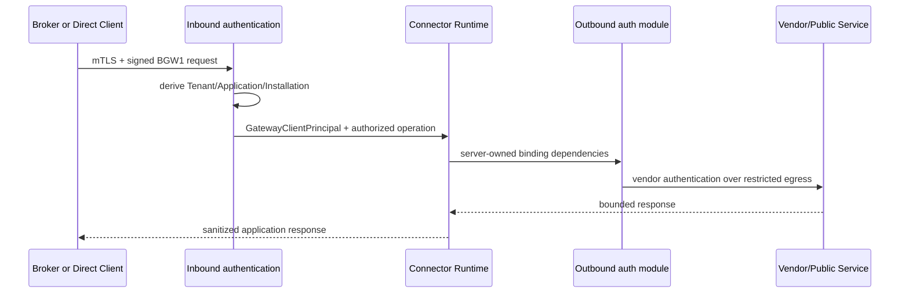

# Connector Runtime authentication contract

## Freeze per M6

Questo documento congela il confine che i moduli di autenticazione Connector successivi
possono assumere. Distingue due direzioni indipendenti:

### Inbound: client verso Gateway

Responsabilita del Gateway Core:

- autenticare certificate/PoP/BGW1;
- derivare Tenant, Application, Installation, Environment e caller kind dal registry;
- verificare stato, revoca, replay e grant;
- produrre il `GatewayClientPrincipal` provider-neutral;
- impedire che il client selezioni endpoint o credential binding.

Il Connector Runtime riceve un caller gia autenticato. M6 non deve reinterpretare il
certificato inbound, fidarsi di Tenant/Application nel payload o creare un principal
alternativo.

### Outbound: Gateway verso servizio vendor/pubblico

Responsabilita di un auth module Connector:

- consumare esclusivamente `OperationBindingDependencies` pubblicate e approvate;
- richiedere capability provider strette (secret use, certificate use, signing o MAC)
  senza introdurre un `GetSecret` per client/Broker/UI;
- applicare credenziali solo alla richiesta outbound autorizzata;
- non restituire password, API key, token non necessari, private key, PFX o locator;
- rispettare restricted egress, timeout, redirect, header e redaction comuni.

Per OAuth Authorization Code il Connector fornisce soltanto un logical profile ID. Il
runtime crea una `OAuthAuthorizedInvocation` non costruibile dal Connector dopo grant e
autenticazione. `PublishedOAuthAuthorityResolver` combina quella capability, il relativo
`GatewayClientPrincipal` e lo snapshot Published corrente con le
`OperationBindingDependencies`, la binding revision e la provider resource esatta. Il
risultato e una `OAuthResolvedExecutionContext` immutabile, con costruttore non pubblico;
raw profile, endpoint, client ID, scope/audience e provider locator non fanno parte della
superficie Connector-facing.

La capability di secret use e scoped al solo provider reference risolto per quel binding.
Il client OAuth non riceve un `ISecretValueProvider` generico e non accetta reference dal
consumer.

## Contratto minimo stabile

Un writer M6 puo dipendere da:

- `GatewayClientPrincipal` gia autenticato;
- Connector e operation ID gia autorizzati;
- Environment e Tenant derivati server-side;
- ConnectorVersion Published e binding revision immutabili;
- `OperationBindingDependencies` con riferimenti logici;
- capability provider-neutral e trasporto ristretto;
- correlation ID e audit sink metadata-only.

Una token session outbound e legata a ConnectorVersion, operation, Environment, endpoint
e binding revision, scope/audience, provider resource revision e resource stamp. Il bearer
non puo essere attached a un `HttpRequestMessage` del consumer: il modulo costruisce la
request verso il protected-resource endpoint Published, inietta il bearer immediatamente
prima del dispatch e usa sempre `IRestrictedTransport`.

L'authorization endpoint e un confine differente: `BeginAuthorizationAsync` valida il
Published HTTPS endpoint e produce una navigation per external user agent, senza fetch
server-side. Token endpoint e protected-resource endpoint sono invece sempre dereferenziati
dal Gateway tramite restricted transport.

Non puo dipendere da:

- presenza del Local Broker;
- `InstallationKind` per cambiare business logic o auth outbound;
- URL, provider reference, secret/certificate binding forniti dal caller;
- accesso diretto a PostgreSQL, Vault o filesystem dal frontend/client;
- secret value nel principal, audit o risposta.

## Compatibilita

BGW1 e le route runtime restano il contratto inbound corrente per Broker e Direct. Nuovi
metodi inbound futuri devono terminare nello stesso `GatewayClientPrincipal`; nuovi auth
module outbound devono innestarsi dopo authorization e publication resolution. Qualsiasi
deviazione richiede ADR, threat-model update e test positivi/negativi.
