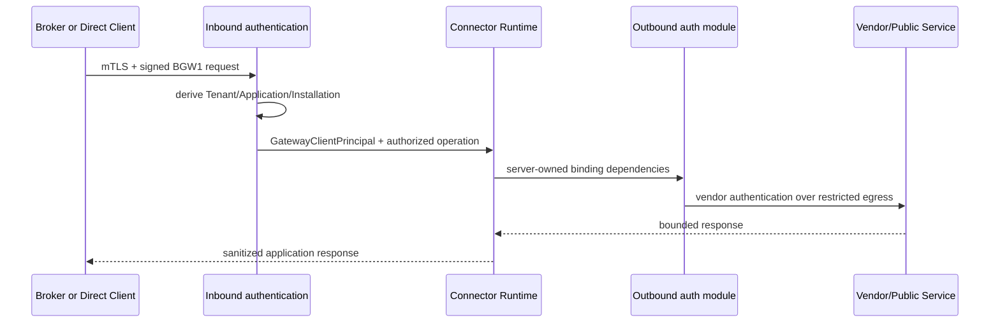

# Connector Runtime authentication contract

## Freeze per M6

Questo documento congela il confine che i moduli di autenticazione Connector successivi
possono assumere. Distingue due direzioni indipendenti:

### Inbound: client verso Gateway

Responsabilita del Gateway Core:

- autenticare certificate/PoP/BGW1;
- derivare Tenant, Application, Installation, Environment e caller kind dal registry;
- verificare stato, revoca, replay e grant;
- produrre il `GatewayClientPrincipal` provider-neutral;
- impedire che il client selezioni endpoint o credential binding.

Il Connector Runtime riceve un caller gia autenticato. M6 non deve reinterpretare il
certificato inbound, fidarsi di Tenant/Application nel payload o creare un principal
alternativo.

I vertical pack che necessitano una prova esplicita post-auth usano
`IGatewayInvocationAuthorizer`: il Gateway Core verifica stato attivo e grant esatto per
Connector/operation e produce `AuthorizedGatewayInvocation`, una capability opaca con costruttore
non pubblico. Il pack non riceve `IGatewayRegistry`, DER/certificato o metodi di identity lookup e
non puo costruire autonomamente la prova di autorizzazione. Il controllo grant avviene anche per
operation senza secret/certificate binding.

### Outbound: Gateway verso servizio vendor/pubblico

Responsabilita di un auth module Connector:

- consumare esclusivamente `OperationBindingDependencies` pubblicate e approvate;
- richiedere capability provider strette (secret use, certificate use, signing o MAC)
  senza introdurre un `GetSecret` per client/Broker/UI;
- applicare credenziali solo alla richiesta outbound autorizzata;
- non restituire password, API key, token non necessari, private key, PFX o locator;
- rispettare restricted egress, timeout, redirect, header e redaction comuni.

Per OAuth Authorization Code il Connector fornisce soltanto un logical profile ID. Il
runtime crea una `OAuthAuthorizedInvocation` non costruibile dal Connector dopo grant e
autenticazione. `PublishedOAuthAuthorityResolver` combina quella capability, il relativo
`GatewayClientPrincipal` e lo snapshot Published corrente con le
`OperationBindingDependencies`, la binding revision e la provider resource esatta. Il
risultato e una `OAuthResolvedExecutionContext` immutabile, con costruttore non pubblico;
raw profile, endpoint, client ID, scope/audience e provider locator non fanno parte della
superficie Connector-facing.

La capability di secret use e scoped al solo provider reference risolto per quel binding.
Il client OAuth non riceve un `ISecretValueProvider` generico e non accetta reference dal
consumer.

Per l'estensione generica Phase 2, la stessa capability risolve Authorization Code oppure
Client Credentials dal `kind` Published. Authorization Code usa `NONE` solo per compatibilita
esplicitamente pubblicata; `S256_REQUIRED` genera e conserva il verifier nel tentativo one-time.
Client Credentials riusa lo stesso token-session store e la stessa reference opaca. Il Connector
continua a fornire solo il logical profile ID e non puo selezionare grant, modalita PKCE, token
endpoint, client identity, secret, scope, audience, resource o client-auth method.

## Contratto minimo stabile

Un writer M6 puo dipendere da:

- `GatewayClientPrincipal` gia autenticato;
- Connector e operation ID gia autorizzati;
- Environment e Tenant derivati server-side;
- ConnectorVersion Published e binding revision immutabili;
- `OperationBindingDependencies` con riferimenti logici;
- capability provider-neutral e trasporto ristretto;
- correlation ID e audit sink metadata-only.

Una token session outbound e legata a ConnectorVersion, operation, Environment, endpoint
e binding revision, scope/audience, provider resource revision e resource stamp. Il bearer
non puo essere attached a un `HttpRequestMessage` del consumer: il modulo costruisce la
request verso il protected-resource endpoint Published, inietta il bearer immediatamente
prima del dispatch e usa sempre `IRestrictedTransport`.

L'authorization endpoint e un confine differente: `BeginAuthorizationAsync` valida il
Published HTTPS endpoint e produce una navigation per external user agent, senza fetch
server-side. Token endpoint e protected-resource endpoint sono invece sempre dereferenziati
dal Gateway tramite restricted transport.

Non puo dipendere da:

- presenza del Local Broker;
- `InstallationKind` per cambiare business logic o auth outbound;
- URL, provider reference, secret/certificate binding forniti dal caller;
- accesso diretto a PostgreSQL, Vault o filesystem dal frontend/client;
- secret value nel principal, audit o risposta.

## Compatibilita

BGW1 e le route runtime restano il contratto inbound corrente per Broker e Direct. Nuovi
metodi inbound futuri devono terminare nello stesso `GatewayClientPrincipal`; nuovi auth
module outbound devono innestarsi dopo authorization e publication resolution. Qualsiasi
deviazione richiede ADR, threat-model update e test positivi/negativi.

## Implementazione Track A sintetica

`Gateway.ConnectorRuntime.Auth.Soap` implementa AP-01/AP-02/AP-07 senza modificare il
contratto inbound. Il runtime costruisce `ConnectorAuthExecutionContext`,
`SoapEndpointBinding` e `SoapSessionProfile` soltanto dopo grant, publication e binding
resolution. Il connector dichiara operazioni, QName, action, mapping di campi bounded,
estrazione/placement sessione, fault di expiry e policy di retry; non riceve un raw HTTP
client, un parser configurabile o un motore di scripting.

Le sole reference restituibili al runtime sono opache. Username, password, challenge
state upstream e session value restano nell'assembly e non sono parte di cache key,
audit, errori o risposta. La cache include Tenant/Installation/Application,
Connector/version, Environment, binding revision, endpoint revision, credential revision
e profile. Per key esistono al massimo una interaction e una session generation corrente;
la promotion dopo challenge è atomica, il digest precedente non è più risolvibile e il
numero globale di key è limitato a 256 con sweep lazy delle entry scadute.

`ISoapSessionResourceStampProvider` è obbligatorio: prima della risoluzione e subito prima
dell'uso il client confronta lo stamp server-side corrente con credential resource
revision/status `Active`, binding revision ed endpoint revision. Un disable o rotate
fallisce prima di secret provider, DNS o transport. La deadline effettiva resta collegata
fino al completamento del response body bounded e del parsing XML. Il subset Fault SOAP
1.1/1.2 ha struttura e cardinalità esatte; un Fault ambiguo produce
`SOAP-FAULT-STRUCTURE` e non può attivare la riacquisizione di sessione.

Il server Kestrel sotto `tools/m6/SyntheticSoapServer` e i test associati qualificano
esclusivamente il profilo sintetico. Non costituiscono caratterizzazione o conformità
SOGEI e non autorizzano un connector healthcare production.

## M6 Wave 2 certificate/signing implementation note

The certificate/signing primitive consumes the frozen outbound side only. Its public
methods accept an immutable server-derived execution context, a named profile and
logical binding IDs fixed by that profile. A protected resolver produces the exact
ConnectorVersion/operation/profile/Environment/endpoint/catalog-revision binding;
provider locators never appear in `SignJwtAsync` or
`PurposeBoundMutualTlsSender.SendAsync`. The signing call accepts only a logical policy ID
and allowlisted business claims; the mTLS call owns certificate resolution and one-shot
transport attachment and never returns an `X509Certificate2` handle.
The implementation does not inspect the inbound certificate, create another principal,
branch on `InstallationKind`, or fall back to the Broker when central custody is absent.

## Wave 1 generic opaque-session HTTP projection

The generic capability is owned by `Gateway.ConnectorRuntime.Auth.Http/OpaqueSessions`, not by the
SOAP API. The SOAP assembly provides only a compatibility adapter from its existing bounded
lifecycle. A future HTTP/REST lifecycle consumer uses `OpaqueSessionHttpClient`,
`OpaqueSessionReference`, `OpaqueSessionResolvedExecutionContext` and
`OpaqueSessionAuthException` without depending on a SOAP-named type.

The connector-facing request contains only a logical policy ID. The authenticated runtime creates
`OpaqueSessionAuthorizedInvocation` through an internal constructor. Then
`PublishedOpaqueSessionAuthorityResolver`, whose production constructor requires
`IConnectorConfigurationStore`, resolves the current Published ConnectorVersion, authorized
operation, `OperationBindingDependencies`, Environment, endpoint/binding/resource revisions and
the closed raw/fixed-scheme header placement. Resolved authority types cannot be constructed by
caller code, and endpoint, method, header, scheme and revision overrides are absent from dispatch.

SOAP cache identity retains the M6 multi-operation semantics and does not include operation ID or
resource stamp. HTTP dispatch identity is separate and binds operation/profile/resource/endpoint
in the non-forgeable resolved context and final Published revalidation. Request body copying,
unauthenticated request construction and DNS resolution occur before that final authorization.
Session generation/expiry, policy and resource state are then checked adjacent to header
projection and `IRestrictedTransport.SendAsync`, with no await between final lease acquisition and
transport invocation. No authenticated `HttpRequestMessage`, raw session or attach helper is returned.

## Wave 1 typed composed SOAP production dispatch

Production gateway dispatch does not expose the lower-level capability selectors. After installation
scope, exact grant and current Published operation resolution, `RestrictedEgressService` derives a
server-owned `ConnectorExecutionStrategyKey` and resolves exactly one
`IConnectorExecutionStrategy`. Authentication kind remains an independent outbound policy. The
authorized handoff has no public constructor. A missing or duplicate registration fails closed and an
explicit unknown key never falls back to the ordinary REST sender. Definitions without a key retain
their server-side legacy mapping.

Each strategy declares a closed set of supported outbound authentication kinds. The startup registry
validates and snapshots that set, and Core rejects an incompatible Published kind before invoking the
strategy. An external module cannot preserve a caller-chosen `GatewayException`; only internally marked
Core strategies and exact authority-bound capability failures retain qualified host codes.

For compiled runtimes that need the existing typed-session bootstrap or composed SOAP path, the
handoff exposes a narrow one-shot bridge bound to that exact invocation. It takes no identity, profile,
endpoint, credential, provider or service selector, cannot be publicly constructed and cannot be
retained for another invocation. The external runtime therefore participates without a friend grant
while the existing Published resolver, external-admission boundary, restricted transport and single
SOAP session lifecycle remain authoritative.

The composed strategy takes policy and session-profile identifiers from the Published operation and the
current opaque-session reference from the server-owned cache. The gateway caller supplies only the
bounded operation payload. `ServerBoundBasicAuthentication`, `ResolvedBasicCredentialBinding` and the
Basic apply operation are internal runtime details; provider/resource identity, version, revision,
checksum and active resource stamp remain exact execution dependencies, and no authenticated request or
Authorization value is returned.

The strict authentication-placement denylist is distinct from historical Connector Definition v1
`allowedClientHeaders` validation. This preserves load/publication/execution of an already-valid v1
definition containing `SOAPAction`, while a new opaque-session or composed-SOAP placement using
`SOAPAction` or `Content-Type` is rejected.

## Wave 1 generic JWT/X.509 extension note

The connector-facing signing API remains policy ID plus allowlisted business claims. A
typed server-owned policy may additionally select no certificate header, the verified
leaf, or the verified leaf and issuer chain. Public DER is retrieved through the exact
`JwtSigning` resource binding and never supplied by the connector. The signer derives
fingerprint and SPKI from the actual leaf, binds them to the approved catalog identity,
and uses that same SPKI to verify the provider signature before emitting standard-Base64
`x5c`.

Temporal claim inclusion is a typed policy choice that preserves the M6 default or omits
`nbf` while retaining `iat` and `exp`; the existing lifetime/skew controls are unchanged.
Trusted dynamic subject/claim values are limited to authenticated Tenant, Application
and Installation identifiers already present in the server-derived execution context.
No expression engine, reflection path, arbitrary runtime dictionary or caller subject
override is introduced.

## Wave 1 authorized signing slots note

For an external execution strategy, the signing bridge now accepts one canonical
`ConnectorSigningSlotKey` in addition to the existing bounded business claims. The key is only an
exact selector for a complete signing authority already present in Published A; it cannot select a
provider, certificate, algorithm, purpose, endpoint or identity. Core permits one token per slot and
at most four slots per invocation.

Each Published slot owns its required flag and either Authorization Bearer or one bounded
signed-token HTTP field. Core retains the opaque slot-bound handles and performs every projection
inside restricted transport; the strategy supplies neither field names nor values. Duplicate Bearer
or case-insensitive custom fields, transport-controlled fields and missing required tokens are denied
before network. Historical single-signing definitions derive one internal `legacy` Bearer slot without
rewriting their canonical JSON or checksum. See ADR-0025 and
`docs/implementation/WAVE1-AUTHORIZED-SIGNING-SLOTS.md`.
