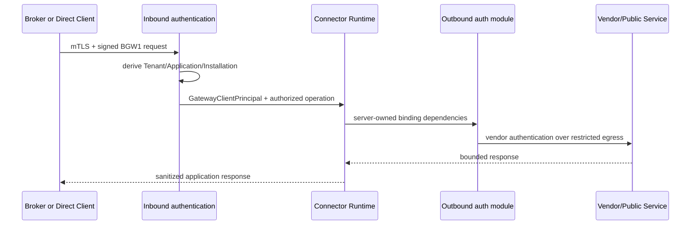

# Connector Runtime authentication contract

## M6 freeze

This document freezes the boundary that subsequent Connector authentication modules
may assume. It distinguishes two independent directions:

### Inbound: client to Gateway

Gateway Core responsibilities:

- authenticate certificate/PoP/BGW1;
- derive Tenant, Application, Installation, Environment and caller kind from the registry;
- check state, revocation, replay and grants;
- produce the provider-neutral `GatewayClientPrincipal`;
- prevent client selection of endpoints or credential bindings.

The Connector Runtime receives an already authenticated caller. M6 must not reinterpret the
inbound certificate, trust Tenant/Application in the payload or create an alternative
principal.

Vertical packs needing explicit post-authentication proof use
`IGatewayInvocationAuthorizer`: Gateway Core checks active state and the exact
Connector/operation grant and produces `AuthorizedGatewayInvocation`, an opaque capability with a
non-public constructor. The pack receives no `IGatewayRegistry`, DER/certificate or identity-lookup methods and
cannot construct its own authorization proof. Grant checks also apply to
operations without secret/certificate bindings.

### Outbound: Gateway to vendor/public service

Connector authentication-module responsibilities:

- consume only Published and approved `OperationBindingDependencies`;
- request narrow provider capabilities (secret use, certificate use, signing or MAC)
  without introducing `GetSecret` for clients/Broker/UI;
- apply credentials only to the authorized outbound request;
- return no passwords, API keys, unnecessary tokens, private keys, PFX or locators;
- follow shared restricted-egress, timeout, redirect, header and redaction controls.

For OAuth Authorization Code, the Connector supplies only a logical profile ID. The
runtime creates an `OAuthAuthorizedInvocation`, which the Connector cannot construct, after grants and
authentication. `PublishedOAuthAuthorityResolver` combines that capability, its
`GatewayClientPrincipal` and the current Published snapshot with
`OperationBindingDependencies`, binding revision and the exact provider resource. The
result is an immutable `OAuthResolvedExecutionContext` with a non-public constructor;
raw profiles, endpoints, client IDs, scope/audience and provider locators are not part of the
Connector-facing surface.

The secret-use capability is scoped only to the provider reference resolved for that binding.
The OAuth client receives no generic `ISecretValueProvider` and accepts no references from
the consumer.

For the generic Phase 2 extension, the same capability resolves Authorization Code or
Client Credentials from the Published `kind`. Authorization Code uses `NONE` only for
explicitly published compatibility; `S256_REQUIRED` generates and retains the verifier in the one-time attempt.
Client Credentials reuses the same token-session store and opaque reference. The Connector
continues to supply only the logical profile ID and cannot select grant, PKCE mode, token
endpoint, client identity, secret, scope, audience, resource or client-auth method.

## Stable minimum contract

An M6 implementer may depend on:

- an already authenticated `GatewayClientPrincipal`;
- already authorized Connector and operation IDs;
- server-derived Environment and Tenant;
- immutable Published ConnectorVersion and binding revision;
- `OperationBindingDependencies` with logical references;
- provider-neutral capabilities and restricted transport;
- correlation ID and metadata-only audit sink.

An outbound token session is bound to ConnectorVersion, operation, Environment, endpoint
and binding revision, scope/audience, provider resource revision and resource stamp. The bearer
cannot be attached to a consumer's `HttpRequestMessage`: the module constructs the
request to the Published protected-resource endpoint, injects the bearer immediately
before dispatch and always uses `IRestrictedTransport`.

The authorization endpoint is a different boundary: `BeginAuthorizationAsync` validates the
Published HTTPS endpoint and produces navigation for an external user agent, without a
server-side fetch. Token and protected-resource endpoints are instead always dereferenced
by the Gateway through restricted transport.

It may not depend on:

- the presence of a Local Broker;
- `InstallationKind` to change business logic or outbound authentication;
- caller-supplied URLs, provider references or secret/certificate bindings;
- direct frontend/client access to PostgreSQL, Vault or the filesystem;
- secret values in the principal, audit or response.

## Compatibility

BGW1 and runtime routes remain the current inbound contract for Broker and Direct. Future new
inbound methods must terminate at the same `GatewayClientPrincipal`; new outbound authentication
modules must attach after authorization and publication resolution. Any
deviation requires an ADR, threat-model update and positive/negative tests.

## Synthetic Track A implementation

`Gateway.ConnectorRuntime.Auth.Soap` implements AP-01/AP-02/AP-07 without changing the
inbound contract. The runtime constructs `ConnectorAuthExecutionContext`,
`SoapEndpointBinding` and `SoapSessionProfile` only after grants, publication and binding
resolution. The connector declares operations, QNames, actions, bounded field mappings,
session extraction/placement, expiry faults and retry policy; it receives no raw HTTP
client, configurable parser or scripting engine.

Only opaque references may be returned to the runtime. Username, password, upstream challenge
state and session values remain inside the assembly and are not part of cache keys,
audit, errors or responses. The cache includes Tenant/Installation/Application,
Connector/version, Environment, binding revision, endpoint revision, credential revision
and profile. Each key has at most one interaction and one current session generation;
promotion after challenge is atomic, the previous digest is no longer resolvable and the
global number of keys is limited to 256 with lazy sweeping of expired entries.

`ISoapSessionResourceStampProvider` is mandatory: before resolution and immediately before
use, the client compares the current server-side stamp with credential resource
revision/`Active` status, binding revision and endpoint revision. Disabling or rotating
fails before the secret provider, DNS or transport. The effective deadline stays linked
until completion of the bounded response body and XML parsing. The SOAP
1.1/1.2 Fault subset has exact structure and cardinality; an ambiguous Fault produces
`SOAP-FAULT-STRUCTURE` and cannot trigger session reacquisition.

The Kestrel server under `tools/m6/SyntheticSoapServer` and its tests qualify
only the synthetic profile. They do not constitute SOGEI characterization or compliance
and do not authorize a production healthcare connector.

## M6 Wave 2 certificate/signing implementation note

The certificate/signing primitive consumes the frozen outbound side only. Its public
methods accept an immutable server-derived execution context, a named profile and
logical binding IDs fixed by that profile. A protected resolver produces the exact
ConnectorVersion/operation/profile/Environment/endpoint/catalog-revision binding;
provider locators never appear in `SignJwtAsync` or
`PurposeBoundMutualTlsSender.SendAsync`. The signing call accepts only a logical policy ID
and allowlisted business claims; the mTLS call owns certificate resolution and one-shot
transport attachment and never returns an `X509Certificate2` handle.
The implementation does not inspect the inbound certificate, create another principal,
branch on `InstallationKind`, or fall back to the Broker when central custody is absent.

## Wave 1 generic opaque-session HTTP projection

The generic capability is owned by `Gateway.ConnectorRuntime.Auth.Http/OpaqueSessions`, not by the
SOAP API. The SOAP assembly provides only a compatibility adapter from its existing bounded
lifecycle. A future HTTP/REST lifecycle consumer uses `OpaqueSessionHttpClient`,
`OpaqueSessionReference`, `OpaqueSessionResolvedExecutionContext` and
`OpaqueSessionAuthException` without depending on a SOAP-named type.

The connector-facing request contains only a logical policy ID. The authenticated runtime creates
`OpaqueSessionAuthorizedInvocation` through an internal constructor. Then
`PublishedOpaqueSessionAuthorityResolver`, whose production constructor requires
`IConnectorConfigurationStore`, resolves the current Published ConnectorVersion, authorized
operation, `OperationBindingDependencies`, Environment, endpoint/binding/resource revisions and
the closed raw/fixed-scheme header placement. Resolved authority types cannot be constructed by
caller code, and endpoint, method, header, scheme and revision overrides are absent from dispatch.

SOAP cache identity retains the M6 multi-operation semantics and does not include operation ID or
resource stamp. HTTP dispatch identity is separate and binds operation/profile/resource/endpoint
in the non-forgeable resolved context and final Published revalidation. Request body copying,
unauthenticated request construction and DNS resolution occur before that final authorization.
Session generation/expiry, policy and resource state are then checked adjacent to header
projection and `IRestrictedTransport.SendAsync`, with no await between final lease acquisition and
transport invocation. No authenticated `HttpRequestMessage`, raw session or attach helper is returned.

## Wave 1 typed composed SOAP production dispatch

Production gateway dispatch does not expose the lower-level capability selectors. After installation
scope, exact grant and current Published operation resolution, `RestrictedEgressService` derives a
server-owned `ConnectorExecutionStrategyKey` and resolves exactly one
`IConnectorExecutionStrategy`. Authentication kind remains an independent outbound policy. The
authorized handoff has no public constructor. A missing or duplicate registration fails closed and an
explicit unknown key never falls back to the ordinary REST sender. Definitions without a key retain
their server-side legacy mapping.

Each strategy declares a closed set of supported outbound authentication kinds. The startup registry
validates and snapshots that set, and Core rejects an incompatible Published kind before invoking the
strategy. An external module cannot preserve a caller-chosen `GatewayException`; only internally marked
Core strategies and exact authority-bound capability failures retain qualified host codes.

For compiled runtimes that need the existing typed-session bootstrap or composed SOAP path, the
handoff exposes a narrow one-shot bridge bound to that exact invocation. It takes no identity, profile,
endpoint, credential, provider or service selector, cannot be publicly constructed and cannot be
retained for another invocation. The external runtime therefore participates without a friend grant
while the existing Published resolver, external-admission boundary, restricted transport and single
SOAP session lifecycle remain authoritative.

The composed strategy takes policy and session-profile identifiers from the Published operation and the
current opaque-session reference from the server-owned cache. The gateway caller supplies only the
bounded operation payload. `ServerBoundBasicAuthentication`, `ResolvedBasicCredentialBinding` and the
Basic apply operation are internal runtime details; provider/resource identity, version, revision,
checksum and active resource stamp remain exact execution dependencies, and no authenticated request or
Authorization value is returned.

The strict authentication-placement denylist is distinct from historical Connector Definition v1
`allowedClientHeaders` validation. This preserves load/publication/execution of an already-valid v1
definition containing `SOAPAction`, while a new opaque-session or composed-SOAP placement using
`SOAPAction` or `Content-Type` is rejected.

## Wave 1 generic JWT/X.509 extension note

The connector-facing signing API remains policy ID plus allowlisted business claims. A
typed server-owned policy may additionally select no certificate header, the verified
leaf, or the verified leaf and issuer chain. Public DER is retrieved through the exact
`JwtSigning` resource binding and never supplied by the connector. The signer derives
fingerprint and SPKI from the actual leaf, binds them to the approved catalog identity,
and uses that same SPKI to verify the provider signature before emitting standard-Base64
`x5c`.

Temporal claim inclusion is a typed policy choice that preserves the M6 default or omits
`nbf` while retaining `iat` and `exp`; the existing lifetime/skew controls are unchanged.
Trusted dynamic subject/claim values are limited to authenticated Tenant, Application
and Installation identifiers already present in the server-derived execution context.
No expression engine, reflection path, arbitrary runtime dictionary or caller subject
override is introduced.

## Wave 1 authorized signing slots note

For an external execution strategy, the signing bridge now accepts one canonical
`ConnectorSigningSlotKey` in addition to the existing bounded business claims. The key is only an
exact selector for a complete signing authority already present in Published A; it cannot select a
provider, certificate, algorithm, purpose, endpoint or identity. Core permits one token per slot and
at most four slots per invocation.

Each Published slot owns its required flag and either Authorization Bearer or one bounded
signed-token HTTP field. Core retains the opaque slot-bound handles and performs every projection
inside restricted transport; the strategy supplies neither field names nor values. Duplicate Bearer
or case-insensitive custom fields, transport-controlled fields and missing required tokens are denied
before network. Historical single-signing definitions derive one internal `legacy` Bearer slot without
rewriting their canonical JSON or checksum. ADR-0025 records the durable decision.
