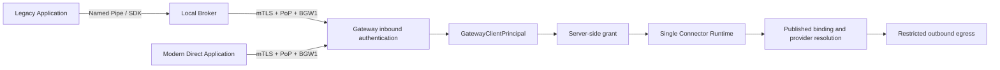

# Direct Gateway Access

## Purpose

M5.5 extends the Gateway inbound boundary to two machine-to-machine identities without
duplicating the runtime. The Local Broker remains mandatory for legacy applications that
need the local Windows boundary; an authorized modern application can instead
own a `DirectInstallation` directly.

The convergence point is `GatewayClientPrincipal`. Beyond that point there is no
Broker/Direct branch.

## Inbound boundary

1. the ClientAuth certificate presented through mTLS is looked up by SHA-256 in the registry;
2. the registry derives Installation, Application, Tenant, Environment and
   `InstallationKind`;
3. state, credential validity and revocation are checked fail-closed;
4. the BGW1 signature covers method, target, timestamp, nonce and body digest;
5. the nonce is consumed atomically;
6. a `GatewayClientPrincipal` is created with credential ID, the
   `MutualTlsPopBgw1` method, correlation context and protocol scope;
7. the Connector/operation grant is checked separately, server-side.

The principal contains no Connector logic and accepts no authoritative claims from the payload.
`GatewayInvokeRequest` exposes no TenantId, ApplicationId, InstallationId, URL,
provider, locator or credential bindings.

## Types and lifecycle

| Type | Use | Enrollment version | Local dependencies |
|---|---|---|---|
| `Broker` | Legacy through Local Broker | `BrokerVersion`, checked against Application policy | Windows Service, Named Pipe, DPAPI/CNG |
| `Direct` | Modern M2M application | `ClientVersion` | Client-chosen key store; no Broker |

Both reuse `Pending -> Active -> Revoked`, single-use activation codes, PoP challenges,
renewal, overlap and immediate revocation. The private key is generated and held by the
client; the Gateway persists the public certificate, fingerprint, SPKI, serial, validity and
state. The Admin API does not return DER, private keys or activation codes after the
one-time creation response.

## Unified runtime

The following components are identical for both types:

- `OperationBindingDependencies` and immutable publication artifact;
- deny-by-default grants;
- server-owned endpoint, secret and certificate resolution;
- provider capability contracts and fail-closed cache;
- SSRF/DNS-rebinding protection, TLS, redirect and header policy;
- transport, response sanitization and metadata-only audit.

Audit adds only `callerKind=Broker|Direct` and the authentication method; the
rest of the model remains shared.

## Persistence and compatibility

Migration `0011_direct_installation_m55.sql` adds `installation_kind`,
`client_version` and `updated_at`, backfills to `broker` and preserves FORCE RLS and
existing roles. The M2 `resolve_installation_identity` function keeps its signature: a
new narrow function returns only the M5.5 classification. This preserves M5 upgrades,
application to an empty database and existing Broker clients.

## Threat boundary and residual risk

- theft of a Direct key allows acting as that Installation until revocation;
- the key must be non-exportable or protected in production, a choice left to the
  deployment/client rather than the Gateway;
- client hosts, Gateway hosts and privileged DBAs remain in the TCB;
- revocation, rotation, minimal scope and audit reduce blast radius but do not eliminate
  endpoint compromise;
- no vendor secret, locator or outbound private key crosses the inbound boundary.

The `samples/DirectGatewayClient` sample uses an in-memory-only key for demonstration;
it is not a production key-storage strategy.
