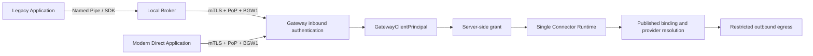

# Direct Gateway Access

## Scopo

M5.5 estende il confine inbound del Gateway a due identita machine-to-machine senza
duplicare il runtime. Il Local Broker resta obbligatorio per applicazioni legacy che
necessitano del confine Windows locale; un'applicazione moderna autorizzata puo invece
possedere direttamente una `DirectInstallation`.

Il punto di convergenza e `GatewayClientPrincipal`. Da quel punto in avanti non esiste
un ramo Broker/Direct.

## Confine inbound

1. il certificato ClientAuth presentato via mTLS viene cercato per SHA-256 nel registry;
2. il registry deriva Installation, Application, Tenant, Environment e
   `InstallationKind`;
3. stato, validita credential e revoca sono verificati fail-closed;
4. la firma BGW1 copre metodo, target, timestamp, nonce e digest del body;
5. il nonce viene consumato atomicamente;
6. nasce un `GatewayClientPrincipal` con credential ID, metodo
   `MutualTlsPopBgw1`, correlation context e scope di protocollo;
7. il grant Connector/operation viene verificato separatamente e server-side.

Il principal non contiene logica Connector e non accetta claim autorevoli dal payload.
`GatewayInvokeRequest` non espone TenantId, ApplicationId, InstallationId, URL,
provider, locator o binding di credenziali.

## Tipi e lifecycle

| Tipo | Uso | Versione di enrollment | Dipendenze locali |
|---|---|---|---|
| `Broker` | Legacy tramite Local Broker | `BrokerVersion`, verificata contro la policy Application | Windows Service, Named Pipe, DPAPI/CNG |
| `Direct` | Applicazione moderna M2M | `ClientVersion` | key store scelto dal client; nessun Broker |

Entrambi riusano `Pending -> Active -> Revoked`, activation code monouso, challenge PoP,
renewal, overlap e revoca immediata. La chiave privata viene generata e custodita dal
client; il Gateway persiste certificato pubblico, fingerprint, SPKI, seriale, validita e
stato. L'Admin API non restituisce DER, chiavi private o activation code dopo la risposta
one-time di creazione.

## Runtime unificato

I seguenti componenti sono identici per entrambi i tipi:

- `OperationBindingDependencies` e publication artifact immutabile;
- grant deny-by-default;
- risoluzione endpoint, secret e certificato server-owned;
- provider capability contracts e cache fail-closed;
- SSRF/DNS-rebinding protection, TLS, redirect e header policy;
- trasporto, sanitizzazione risposta e audit metadata-only.

L'audit aggiunge soltanto `callerKind=Broker|Direct` e il metodo di autenticazione; il
resto del modello rimane comune.

## Persistenza e compatibilita

La migration `0011_direct_installation_m55.sql` aggiunge `installation_kind`,
`client_version` e `updated_at`, effettua il backfill a `broker` e mantiene FORCE RLS e
ruoli esistenti. La funzione M2 `resolve_installation_identity` non cambia firma: una
nuova funzione stretta restituisce la sola classificazione M5.5. Questo preserva upgrade
M5, applicazione da database vuoto e Broker client esistenti.

## Threat boundary e rischio residuo

- il furto della chiave Direct consente di agire come quella Installation fino a revoca;
- la chiave deve essere non esportabile o protetta in produzione, scelta lasciata al
  deployment/client e non al Gateway;
- host client, Gateway host e DBA privilegiati restano nella TCB;
- revoca, rotazione, scope minimo e audit riducono il blast radius ma non eliminano la
  compromissione endpoint;
- nessun vendor secret, locator o chiave privata outbound attraversa il confine inbound.

Il sample `samples/DirectGatewayClient` usa una chiave solo in memoria per dimostrazione,
non costituisce una strategia di key storage production.
