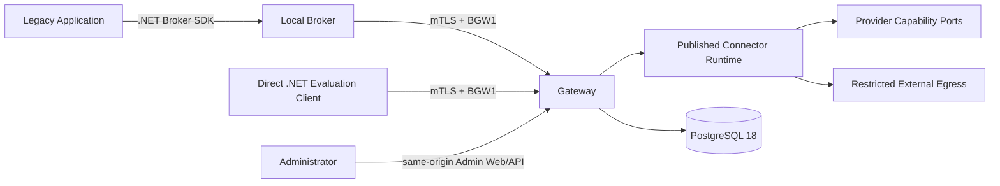

# Executive architecture

**CURRENT** and **TARGET** labels distinguish what exists from what still requires
implementation or qualification. The authoritative capability summary is
[IMPLEMENTATION_STATUS.md](../../IMPLEMENTATION_STATUS.md), included in the Core export;
its optional-pack links point to the full repository.

## CURRENT — problem and solution

The platform removes distributed credentials and client-controlled authority from
on-premises integration flows without requiring a complete rewrite. The two implemented
entry points converge on the same runtime:

- The **Local Broker** authorizes the Windows application, protects local secrets and data
  keys with DPAPI/CNG, offers bounded operations and invokes the Gateway. It offers no generic
  secret retrieval.
- The **Gateway** derives Installation, Application, Tenant and Environment from the registry,
  applies grants, resolves only the Published version and uses server-side provider
  capabilities before restricted egress.
- The **Connector Runtime** executes bounded operations from immutable Published
  configurations; it is not a workflow engine or arbitrary proxy.
- The **Admin Plane** uses same-origin UI/API, OIDC, server-side sessions, CSRF, RBAC,
  concurrency and four-eyes controls without exposing secret values or private keys.
- **Deployment and vertical packs** depend on Core abstractions. The Synthetic
  Provider is the default path; Azure and local PKCS#12 are optional packs.

## CURRENT — paths and capabilities

REST Secure Layer is the demonstrated generic path: the caller retains the payload,
while the Gateway and Published configuration own endpoint, method, authentication and limits.
Broker and Direct clients pass through the same grants, bindings, providers and egress
controls.

Core also integrates SOAP/session, OAuth, JWT/X.509, signing-slot and mTLS foundations and
an execution-module seam. These primitives are not equivalent to a distributable generic
Managed Connector or qualification of an external service. Modules are
deployment-allowlisted and full-trust in-process; they do not receive generic providers/stores,
caller-owned endpoints or private keys through the supported contract.

## CURRENT — implemented guarantees

- No Vendor Secret is returned to legacy applications, Broker, Direct clients or browsers.
- Tenant/Application/Installation derive from authenticated server-side state.
- Endpoints, paths, methods, authentication headers and resource bindings come from approved
  Published authority, not the runtime payload.
- Provider capabilities are separate; missing capabilities are not emulated.
- Publication and rollback preserve checksum/provenance and do not modify an already
  Published version in place.
- Replay protection, TLS, DNS/IP validation, redirect denial, response bounds, redaction and
  metadata-only audit are enforced server-side.
- The runtime rechecks the PostgreSQL stamp on every invocation and does not use stale-on-error.
- Purely local Broker operations can work without the Gateway.

These guarantees describe product behavior and deterministic tests. They do not imply qualified
public packaging, cloud, HA/DR, real providers or external services.

## CURRENT — limits and findings

- Local Administrator and SYSTEM can compromise the service, filesystem or memory and
  remain residual privileged threats.
- The Gateway/provider is in the TCB and temporarily observes necessary material.
- The Local PKCS#12 pack is qualified only with per-run synthetic material; it is not HSM/KMS,
  operational import or production custody.
- Application audit is metadata-only. Migration 0017 makes audit/invocation
  append-only for application roles; `gateway_admin` retains SELECT/INSERT only
  on audit. Owner/migration and host/DB administrators remain in the TCB, and there is no
  signing or notarization.
- OAuth/session caches remain process-local. FSE2 technical workflow correlation is
  durable in PostgreSQL; this does not make every session or cache distributed.
- The Direct sample keeps the client key in memory and is not a production custody
  strategy.

## Evidence and claims

- **Automated synthetic:** unit/integration/hosted tests with controlled fixtures and services.
- **Synthetic live lab:** real processes/containers or Windows hosts with synthetic material.
- **OfficialTest:** an official external environment with attested outcomes and prerequisites.
- **Production:** production operations, custody, monitoring, recovery and accreditation.

One level does not automatically promote to the next. Received and correlated certificates
do not mean operational import. The [capability summary](../../IMPLEMENTATION_STATUS.md)
owns the current FSE2 offline/live distinction and residual limits; the
[current optional pilot](https://github.com/marcobiz/secure-integration-platform/blob/main/docs/user/fse2-validation-status.md)
records the observed CDA and workflow results. Neither is overall live qualification.

## TARGET — active tracks

Core targets a non-production developer `0.1.0-alpha` with a single synthetic REST
golden path. [Licensing](../../LICENSING.md) and the [security-reporting channel](../../SECURITY.md)
are already documented. Their presence does not close publication or `ALPHA-ADOPT`:
early-adopter adoption must not be declared complete before its acceptance gate closes.

The FSE2 Organization OfficialTest track is separate: provider/custody, import, official
environment, driver and redacted evidence have their own gates and do not block Core release.

MSI/native/COM, Azure qualification, artifact signing/provenance, HA/DR, backup/restore,
load/soak, pentest and production pilot remain further targets.
