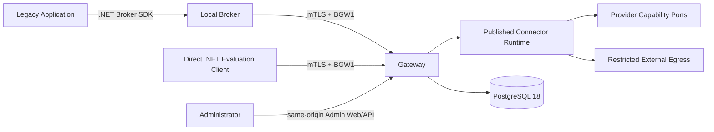

# Executive architecture

Le etichette **CURRENT** e **TARGET** distinguono ciò che è presente da ciò che richiede
ancora implementazione o qualifica. Nel repository completo la dashboard autorevole è
`IMPLEMENTATION_STATUS.md`, che non fa parte dell'export Core.

## CURRENT — problema e soluzione

La piattaforma rimuove credenziali distribuite e authority client-controlled dai flussi
di integrazione on-premise senza richiedere una riscrittura completa. I due ingressi
implementati convergono sullo stesso runtime:

- Il **Local Broker** autorizza l'applicazione Windows, protegge secret e data key
  locali con DPAPI/CNG, offre operation bounded e invoca il Gateway. Non offre generic
  secret retrieval.
- Il **Gateway** deriva Installation, Application, Tenant ed Environment dal registry,
  applica grant, risolve la sola versione Published e usa capability provider
  server-side prima dell'egress ristretto.
- Il **Connector Runtime** esegue operation bounded da configurazioni Published
  immutabili; non è un workflow engine o proxy arbitrario.
- L'**Admin Plane** usa UI/API same-origin, OIDC, sessione server-side, CSRF, RBAC,
  concorrenza e four-eyes senza esporre secret value o private key.
- I **deployment e vertical pack** dipendono dalle astrazioni Core. Il Synthetic
  Provider è il percorso predefinito; Azure e local PKCS#12 sono pack opzionali.

## CURRENT — percorsi e capability

Il Secure Layer REST è il percorso generico dimostrato: il caller conserva il payload,
mentre Gateway e configurazione Published possiedono endpoint, metodo, auth e limiti.
Broker e Direct client attraversano gli stessi grant, binding, provider e controlli di
egress.

Il Core integra inoltre foundation SOAP/session, OAuth, JWT/X.509, signing slot, mTLS e
un seam per moduli di execution. Queste primitive non equivalgono a un Managed Connector
generico distribuibile né alla qualifica di un servizio esterno. I moduli sono
allowlisted dal deployment e full-trust in-process; non ricevono provider/store generici,
endpoint caller-owned o private key tramite il contratto supportato.

## CURRENT — garanzie implementate

- Nessun Vendor Secret è restituito al legacy, Broker, Direct client o browser.
- Tenant/Application/Installation derivano dallo stato autenticato server-side.
- Endpoint, path, metodo, header auth e resource binding provengono dalla Published
  authority approvata, non dal payload runtime.
- Provider capabilities sono separate; capability assenti non sono emulate.
- Pubblicazione e rollback conservano checksum/provenance e non modificano in place una
  versione già Published.
- Replay protection, TLS, DNS/IP validation, redirect deny, response bounds, redaction e
  audit metadata-only sono applicati server-side.
- Il runtime ricontrolla lo stamp PostgreSQL a ogni invocazione e non usa stale-on-error.
- Le operazioni puramente locali del Broker possono funzionare senza Gateway.

Queste garanzie descrivono prodotto e test deterministici. Non implicano packaging
pubblico, cloud, HA/DR, provider reale o servizio esterno qualificato.

## CURRENT — limiti e finding

- Local Administrator e SYSTEM possono compromettere servizio, filesystem o memoria e
  restano minacce privilegiate residue.
- Il Gateway/provider è nella TCB e osserva temporaneamente il materiale necessario.
- Il Local PKCS#12 pack è qualificato solo con materiale sintetico per-run; non è HSM/KMS,
  import operativo o custody production.
- L'audit applicativo è metadata-only e il runtime può solo inserire eventi. Il ruolo
  `gateway_admin` conserva però una grant UPDATE storica sulle tabelle audit: append-only
  DB completo è deferred, non PASS.
- Cache OAuth/session e workflow verticali correnti sono process-local, non distribuiti
  o durevoli attraverso restart.
- Il sample Direct mantiene la chiave client in memoria e non è una strategia di custody
  production.

## Evidenza e claim

- **Automated synthetic:** test unit/integration/hosted con fixture e servizi controllati.
- **Live lab sintetico:** processi/container o Windows host reali con materiale sintetico.
- **OfficialTest:** ambiente ufficiale esterno, con outcome e precondizioni attestati.
- **Production:** operatività, custody, monitoring, recovery e accreditamento production.

Un livello non promuove automaticamente al successivo. Certificati ricevuti e correlati
non significano import operativo. Nessuna chiamata FSE2 live è parte della baseline;
`validate-cda` resta il primo outcome OfficialTest futuro.

## TARGET — track attive

Il Core punta a una developer `0.1.0-alpha` non-production con un solo golden path REST
sintetico. Packaging, licenza, security channel, clean-clone e `ALPHA-ADOPT` devono
chiudersi prima di dichiarare completata l'adozione early-adopter.

La track FSE2 Organization OfficialTest è separata: provider/custody, import, ambiente
ufficiale, driver e evidence redatta hanno gate propri e non bloccano la release Core.

MSI/native/COM, Azure qualification, artifact signing/provenance, HA/DR, backup/restore,
load/soak, pentest e pilot production restano target ulteriori.
