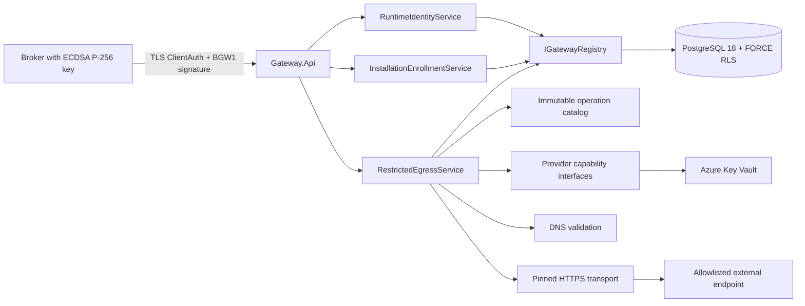

# HISTORICAL — M2 implemented architecture — minimal Gateway

**Starting baseline:** `d1113d34a18e166c9eb0c14d8e11c3c1a1a20c12`
**Scope:** M2; no adapters or M3 vertical slice

> This document preserves the M2 baseline architecture. It does not describe current
> dependencies: since ADR-0019, Core uses provider-neutral capabilities and
> Azure/local PKCS#12 packs depend on Core, never the reverse. For the current view, see
> [system architecture](system-architecture.md).

## Component view



Projects follow ADR-0002: Domain does not depend on infrastructure; Application contains
policies and ports; Infrastructure implements PostgreSQL, Key Vault, DNS and transport;
Gateway.Api composes the host. Migrations are a separate executable and are not
automatically applied by the runtime process.

## Trust and identity boundaries

```mermaid
sequenceDiagram
  participant B as Broker/Installation
  participant G as Gateway API
  participant R as PostgreSQL registry
  participant V as Key Vault
  participant X as External system
  B->>G: certificate + timestamp + nonce + body hash + signature
  G->>R: certificate SHA-256 lookup
  R-->>G: Installation, Tenant, Application, public credential
  G->>G: verify state, expiry, signature and canonical target
  G->>R: INSERT nonce hash (unique, TTL)
  G->>R: verify grant with derived Tenant
  G->>V: read secret through server-side reference
  G->>G: resolve DNS and reject non-public addresses
  G->>X: socket bound to validated IP; HTTPS; centralized auth
  X-->>G: bounded response
  G->>R: metadata-only audit
  G-->>B: result, never credentials or vault references
```

The client selects only `connectorId` and `operationId`. Tenant, URL, method,
authentication headers, secret references, timeout and limits come from the server.
DNS resolution occurs once per invocation and the socket uses the same
validated addresses, closing the DNS-rebinding window.

## Enrollment and lifecycle

```mermaid
stateDiagram-v2
  [*] --> Pending: provisioning + activation HMAC
  Pending --> Active: challenge + code + certificate + PoP
  Active --> Active: renewal; old credential Overlap at most 7 days
  Active --> Revoked: revocation
  Overlap --> Expired: overlap end/expiry
  Revoked --> [*]
```



- activation code: 256 random bits, stored only as an HMAC, 24-hour TTL, at most
  five attempts and atomic consumption;
- challenge: 256 bits, node memory, 5-minute TTL, single use;
- credential: ECDSA P-256, ClientAuth EKU, maximum lifetime 93 days;
- renewal: allowed in the final 30 days, PoP of the new key and at most
  seven days of overlap;
- revocation: Installation and active/overlap credentials become unusable before
  grants, Vault or network access.

## PostgreSQL isolation

Tenant-scoped tables have composite FKs, `ENABLE ROW LEVEL SECURITY` and `FORCE ROW
LEVEL SECURITY`. Every runtime transaction sets `app.tenant_id` with `SET LOCAL`.
Three global locators contain only identifiers and public digests needed to
start authentication; runtime roles have no access. Narrow
`SECURITY DEFINER` functions read the locator, set the RLS Tenant and
only then access tenant-scoped rows. Roles are `gateway_runtime`,
`gateway_admin` and `gateway_readonly`; the migration identity is not used
by the runtime.

## Vault and egress

In production, the Gateway uses Managed Identity and a single configured HTTPS Vault.
`keyvault://<vault-host>/<name>[/<version>]` references are validated against the Vault
host; values do not enter the database, responses, Problem Details or audit. The
host can register the in-memory provider only in `Development`/`Testing`.
Production values have a five-minute in-process cache; versioned references
remain preferable when rotation requires determinism.

Transport disables ambient proxies, cookies, decompression and redirects; allows
TLS 1.2/1.3, enforces timeouts and response limits during streaming and supports
Basic, API keys and client certificates loaded into ephemeral memory. Retries (at most two)
are accepted only for operations declared idempotent.

## Protocol status

- Gateway HTTP v1/BGW1: initial M2 implementation, **provisional until the M3 gate**;
- Broker IPC v1: remains **provisional** and is not frozen for COM/C ABI/CLI before
  M3 validation, as required by the M0/M1 Gate Review.

No ADR decision was deviated from: the startup operation catalog is intentionally
an M2 mechanism and does not bring forward M4 ConnectorVersion, publication or rollback.

The Azure/Key Vault sections above are therefore historical M2 evidence, not a current
cloud-qualification claim. The current baseline uses the Synthetic Provider by default and
includes no vertical packs in the Core Gateway image.
