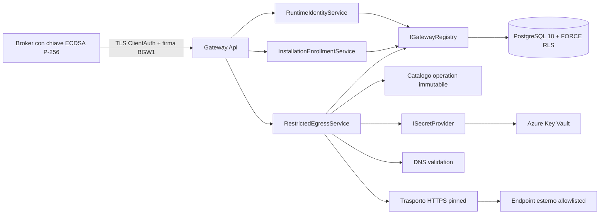

# Architettura implementata M2 — Gateway minimo

**Baseline di partenza:** `d1113d34a18e166c9eb0c14d8e11c3c1a1a20c12`
**Perimetro:** M2; nessun adapter o vertical slice M3

## Vista dei componenti



I progetti seguono ADR-0002: Domain non dipende da infrastruttura; Application contiene
policy e porte; Infrastructure implementa PostgreSQL, Key Vault, DNS e trasporto;
Gateway.Api compone l'host. Le migration sono un eseguibile distinto e non vengono
applicate automaticamente dal processo runtime.

## Confini di fiducia e identità

```mermaid
sequenceDiagram
  participant B as Broker/Installation
  participant G as Gateway API
  participant R as Registry PostgreSQL
  participant V as Key Vault
  participant X as Sistema esterno
  B->>G: certificato + timestamp + nonce + body hash + firma
  G->>R: lookup SHA-256 certificato
  R-->>G: Installation, Tenant, Application, credential pubblica
  G->>G: verifica stato, scadenza, firma e target canonico
  G->>R: INSERT nonce hash (unique, TTL)
  G->>R: verifica grant con Tenant derivato
  G->>V: legge secret tramite riferimento server-side
  G->>G: risolve DNS e rifiuta indirizzi non pubblici
  G->>X: socket vincolato all'IP validato; HTTPS; auth centralizzata
  X-->>G: risposta entro limite
  G->>R: audit metadata-only
  G-->>B: risultato, mai credential o vault reference
```

Il client seleziona soltanto `connectorId` e `operationId`. Tenant, URL, metodo,
header di autenticazione, secret reference, timeout e limiti provengono dal server.
La risoluzione DNS avviene una sola volta per invocazione e il socket usa gli stessi
indirizzi validati, chiudendo la finestra di DNS rebinding.

## Enrollment e lifecycle

```mermaid
stateDiagram-v2
  [*] --> Pending: provisioning + activation HMAC
  Pending --> Active: challenge + code + certificate + PoP
  Active --> Active: renewal; vecchia credential Overlap max 7 giorni
  Active --> Revoked: revoca
  Overlap --> Expired: fine overlap/scadenza
  Revoked --> [*]
```



- activation code: 256 bit casuali, conservato solo come HMAC, TTL 24 ore, massimo
  cinque tentativi e consumo atomico;
- challenge: 256 bit, memoria del nodo, TTL 5 minuti, consumo singolo;
- credential: ECDSA P-256, EKU ClientAuth, durata massima 93 giorni;
- renewal: consentito negli ultimi 30 giorni, PoP della nuova chiave e overlap massimo
  sette giorni;
- revoca: Installation e credential attive/overlap diventano inutilizzabili prima di
  grant, Vault o rete.

## Isolamento PostgreSQL

Le tabelle tenant-scoped hanno composite FK, `ENABLE ROW LEVEL SECURITY` e `FORCE ROW
LEVEL SECURITY`. Ogni transazione runtime imposta `app.tenant_id` con `SET LOCAL`.
Tre locator globali contengono soltanto identificatori e digest pubblici necessari ad
avviare l'autenticazione; non sono concessi ai ruoli runtime. Funzioni
`SECURITY DEFINER` a superficie stretta leggono il locator, impostano il Tenant RLS e
solo allora accedono alle righe tenant-scoped. I ruoli sono `gateway_runtime`,
`gateway_admin` e `gateway_readonly`; l'identità che applica le migration non è usata
dal runtime.

## Vault ed egress

In produzione il Gateway usa Managed Identity e un solo Vault HTTPS configurato.
I riferimenti `keyvault://<vault-host>/<name>[/<version>]` sono validati contro l'host
del Vault; i valori non entrano in database, response, Problem Details o audit. Il
provider in-memory è registrabile dall'host soltanto in `Development`/`Testing`.
I valori produttivi hanno una cache in-process di cinque minuti; i riferimenti versionati
restano preferibili quando la rotazione richiede determinismo.

Il trasporto disabilita proxy ambientale, cookie, decompressione e redirect; consente
TLS 1.2/1.3, applica timeout e limiti di response durante lo streaming e supporta
Basic, API key e certificato client caricati in memoria effimera. I retry (massimo due)
sono accettati soltanto per operation dichiarate idempotenti.

## Stato dei protocolli

- Gateway HTTP v1/BGW1: implementazione M2 iniziale, **provvisoria fino al gate M3**;
- IPC Broker v1: resta **provvisorio** e non è congelato per COM/C ABI/CLI prima della
  validazione M3, come richiesto dalla Gate Review M0/M1.

Nessuna decisione ADR è stata deviata: l'operation catalog di startup è intenzionalmente
un meccanismo M2 e non anticipa ConnectorVersion, publish o rollback M4.
