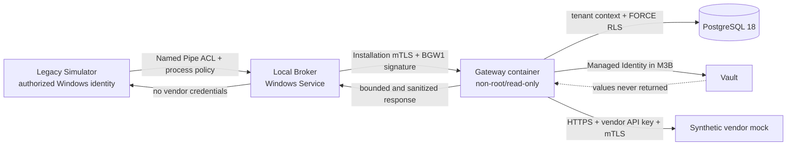

# M3 architecture — production-like vertical slice

**Immutable baseline:** tag `m2-gateway-baseline-2026-08-04`, commit
`abee866e683ed38b2a2c8350288c7a93ab0550ff`
**Protocol status:** Gateway HTTP/BGW1 and Broker IPC v1 remain provisional until
the M3 review; they are not frozen for M6 adapters.
**Out of scope:** M4 Connector lifecycle/publication/rollback.

## Objective and trust boundaries

M3 demonstrates the actual path Legacy Simulator → Windows Service Broker → Gateway
container → PostgreSQL 18 → Vault → HTTPS/mTLS vendor service. The Broker owns the
non-exportable Installation key and ClientAuth certificate; the Gateway derives the
Tenant exclusively from the authenticated credential. URL, method, authentication headers,
Vault references and vendor certificate are immutable server-side configuration.



Two environments are planned, with the same application invariants:

| Level | Gateway/DB | Vault | Vendor mock | Cloud identity |
|---|---|---|---|---|
| Deterministic M3A | Real containers + PostgreSQL 18 | Synthetic HTTPS service, test-only | Synthetic HTTPS/mTLS | None |
| M3B Azure smoke | M3 image in Azure dev + PostgreSQL 18 | Real Azure Key Vault | Synthetic HTTPS/mTLS | Managed Identity |

The synthetic Vault provider can be enabled only in `M3Testing`, requires
TLS and an explicitly configured host, and does not change Installation, grant,
replay or egress controls. In `Production`, startup remains fail-closed without Managed Identity/Key
Vault. Certificates, activation codes and canary values are generated per run and
remain in raw artifacts ignored by Git.

## Actual sequence

```mermaid
sequenceDiagram
  autonumber
  participant L as Legacy Simulator
  participant B as Broker Windows Service
  participant G as Gateway container
  participant P as PostgreSQL 18
  participant V as Vault
  participant X as HTTPS/mTLS vendor mock
  L->>B: Invoke(connectorId, operationId, payload) via Named Pipe
  B->>G: enrollment challenge (SPKI ECDSA P-256)
  G->>P: activation code HMAC + Installation pending
  G-->>B: single-use challenge
  B->>G: activation code + certificate + PoP
  G->>P: atomically consume code + bind certificate
  G-->>B: derived Installation/Tenant
  B->>G: BGW1 signed invoke + client certificate + nonce
  G->>P: certificate lookup, status, consume nonce, grant
  G->>V: secret API key + client certificate by server-owned refs
  G->>G: resolve/validate/pin destination
  G->>X: HTTPS, fixed URL, API key, mTLS
  X-->>G: synthetic bounded response
  G->>P: metadata-only audit
  G-->>B: bounded sanitized result
  B-->>L: Broker result; no Vault/vendor material
```

Enrollment is performed once and the activation code is not persisted after
success. Every invocation uses a timestamp, random 128-bit nonce, body digest and
ECDSA P-256 signature in IEEE P1363 format. Revocation and nonce consumption precede any
Vault access or socket opening.

## Restricted egress and private fixture

Ordinary policy continues to deny loopback, RFC1918, link-local, metadata, multicast
and reserved addresses. M3A can reach the mock on a private container network only
through a test-only allowance comprising **exact host + single IP/CIDR + synthetic
CA**. The allowance accepts no client input, is unavailable in
`Production` and does not apply to other hosts; loopback, metadata and all other private
addresses remain denied. The connection uses the same validated address, so a second
DNS resolution cannot change the destination.

Automatic redirects, ambient proxies, cookies and hop-by-hop headers are disabled. A
redirect is a denied result, not a new destination. The client certificate and
API key are obtained from the Vault immediately before the call and never pass through
the Broker, legacy application, database, response or logs.

## Failures and redaction

The fifteen required negative paths have stable codes and include no
exception/provider details. `vault unavailable` and `postgres unavailable` fail closed and do not
trigger egress. The collector searches for eleven distinct canaries in Gateway,
Broker, mock and PostgreSQL stdout/stderr and redacted evidence; a single canary fails the
run. Raw artifacts stay outside Git, and the final bundle contains only
manifests, results, public configuration, hashes and redacted logs.

## Gate constraints

M3 is not `Done` until the same commit has:

1. M3A PASS in the split-host laboratory: Linux container stack on the HOST and a
   reviewed script run manually from the VM administrative console for the real Broker;
2. M3B PASS in the GitHub `azure-dev` Environment through OIDC, without persistent Azure
   secrets;
3. passing build, tests, scans, SBOM, evidence validation and diff review;
4. synthetic configuration and redacted evidence commits separate from the product commit.

As of August 4, 2026, M3A uses a SHA-256-verified operator handoff; a
self-hosted runner or generic SYSTEM executor is not a product requirement. The
`azure-dev` Environment remains an operational dependency of M3B, not a reason to simulate
evidence.
