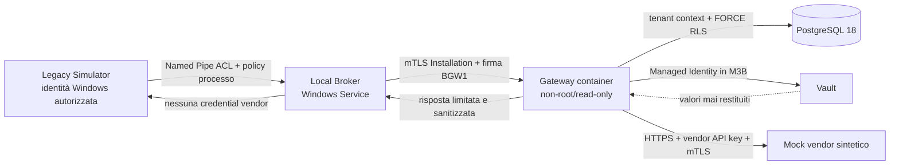

# Architettura M3 — vertical slice production-like

**Baseline immutabile:** tag `m2-gateway-baseline-2026-08-04`, commit
`abee866e683ed38b2a2c8350288c7a93ab0550ff`  
**Stato del protocollo:** Gateway HTTP/BGW1 e IPC Broker v1 restano provvisori fino
alla review M3; non sono congelati per gli adapter M6.  
**Fuori perimetro:** lifecycle/publish/rollback dei Connector M4.

## Obiettivo e confini di fiducia

M3 dimostra il percorso effettivo Legacy Simulator → Windows Service Broker → Gateway
container → PostgreSQL 18 → Vault → servizio vendor HTTPS/mTLS. Il Broker possiede la
chiave Installation non esportabile e il certificato ClientAuth; il Gateway ricava il
Tenant esclusivamente dalla credential autenticata. URL, metodo, header di autenticazione,
riferimenti Vault e certificato vendor sono configurazione server-side immutabile.



Sono previsti due ambienti, con le stesse invarianti applicative:

| Livello | Gateway/DB | Vault | Mock vendor | Identità cloud |
|---|---|---|---|---|
| M3A deterministico | container + PostgreSQL 18 reali | servizio sintetico HTTPS, test-only | HTTPS/mTLS sintetico | nessuna |
| M3B Azure smoke | immagine M3 in Azure dev + PostgreSQL 18 | Azure Key Vault reale | HTTPS/mTLS sintetico | Managed Identity |

Il provider Vault sintetico è abilitabile soltanto nell'ambiente `M3Testing`, richiede
TLS e un host esplicitamente configurato e non cambia i controlli Installation, grant,
replay o egress. In `Production` l'avvio resta fail-closed senza Managed Identity/Key
Vault. Certificati, activation code e valori canary sono generati per singola run e
rimangono negli artefatti raw ignorati da Git.

## Sequenza effettiva

```mermaid
sequenceDiagram
  autonumber
  participant L as Legacy Simulator
  participant B as Broker Windows Service
  participant G as Gateway container
  participant P as PostgreSQL 18
  participant V as Vault
  participant X as Mock vendor HTTPS/mTLS
  L->>B: Invoke(connectorId, operationId, payload) via Named Pipe
  B->>G: enrollment challenge (SPKI ECDSA P-256)
  G->>P: activation code HMAC + Installation pending
  G-->>B: challenge monouso
  B->>G: activation code + certificate + PoP
  G->>P: consume code atomico + bind certificate
  G-->>B: Installation/Tenant derivati
  B->>G: BGW1 signed invoke + client certificate + nonce
  G->>P: certificate lookup, status, consume nonce, grant
  G->>V: secret API key + client certificate by server-owned refs
  G->>G: resolve/validate/pin destination
  G->>X: HTTPS, fixed URL, API key, mTLS
  X-->>G: synthetic bounded response
  G->>P: audit metadata-only
  G-->>B: bounded sanitized result
  B-->>L: Broker result; no Vault/vendor material
```

Enrollment è eseguito una volta e l'activation code non viene persistito dopo il
successo. Ogni invoke usa timestamp, nonce casuale da 128 bit, digest del body e firma
ECDSA P-256 in formato IEEE P1363. La revoca e il consumo del nonce precedono qualsiasi
accesso al Vault o apertura di socket.

## Restricted egress e fixture privata

La policy ordinaria continua a negare loopback, RFC1918, link-local, metadata, multicast
e indirizzi riservati. M3A può raggiungere il mock su una rete container privata soltanto
mediante una concessione test-only composta da **host esatto + singolo IP/CIDR + CA
sintetica**. La concessione non accetta input dal client, non è disponibile in
`Production` e non si applica ad altri host; loopback, metadata e ogni altro indirizzo
privato restano negati. La connessione usa lo stesso indirizzo validato, così una seconda
risoluzione DNS non può cambiare la destinazione.

Redirect automatici, proxy ambientale, cookie e header hop-by-hop sono disabilitati. Un
redirect è un risultato negato, non una nuova destinazione. Il certificato client e
l'API key sono ottenuti dal Vault immediatamente prima della chiamata e non transitano
nel Broker, nel legacy, nel database, nella response o nei log.

## Failures e redazione

Le quindici negative path richieste hanno codici stabili e non includono dettagli di
eccezioni/provider. `vault unavailable` e `postgres unavailable` sono fail-closed e non
innescano egress. Il collector cerca undici canary distinti in stdout/stderr Gateway,
Broker, mock, PostgreSQL ed evidence redatta; la presenza di una sola canary fallisce la
run. Gli artefatti raw sono mantenuti fuori Git e il bundle finale contiene soltanto
manifest, risultati, configurazione pubblica, hash e log redatti.

## Vincoli del gate

M3 non è `Done` finché lo stesso commit non ha:

1. M3A PASS sul laboratorio split-host: stack Linux container sull'HOST e script
   revisionato eseguito manualmente da console amministrativa VM per il vero Broker;
2. M3B PASS nell'Environment GitHub `azure-dev` mediante OIDC, senza secret Azure
   persistenti;
3. build, test, scan, SBOM, evidence validation e review del diff PASS;
4. commit di configurazione sintetica ed evidence redatta separati dal commit prodotto.

Al 4 agosto 2026 M3A usa un handoff operatore verificato con SHA-256; un runner
self-hosted o un executor SYSTEM generico non è requisito del prodotto. L'Environment
`azure-dev` resta invece una dipendenza operativa di M3B, non un motivo per simulare le
evidenze.
