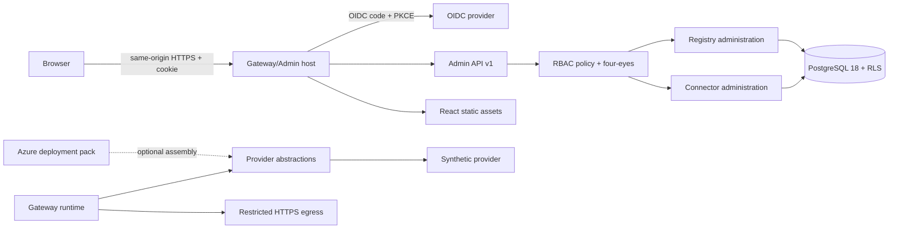
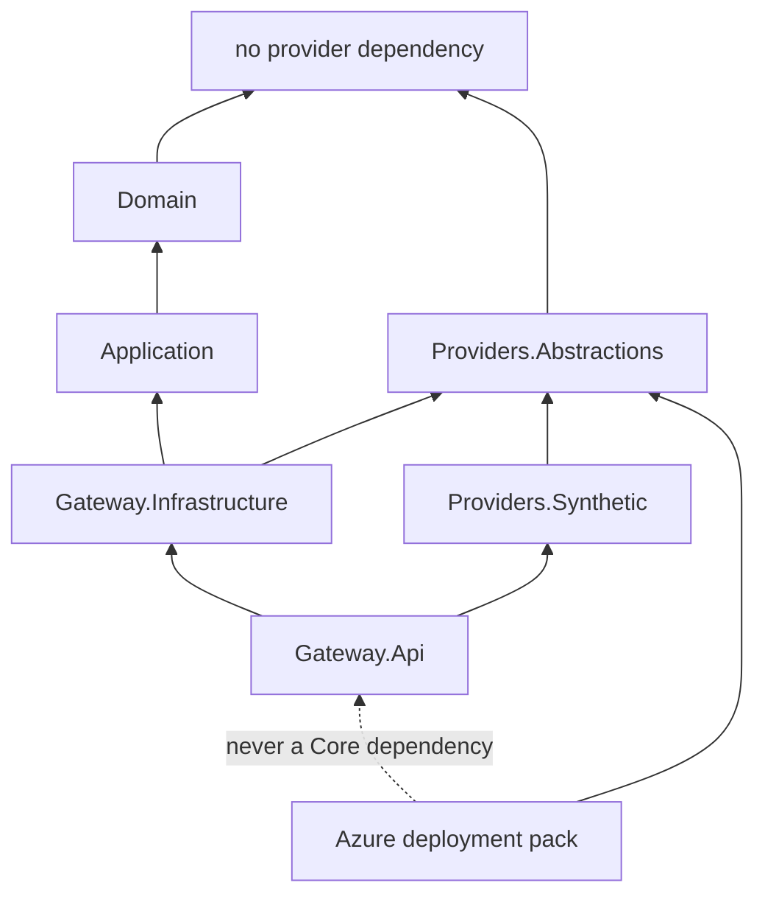
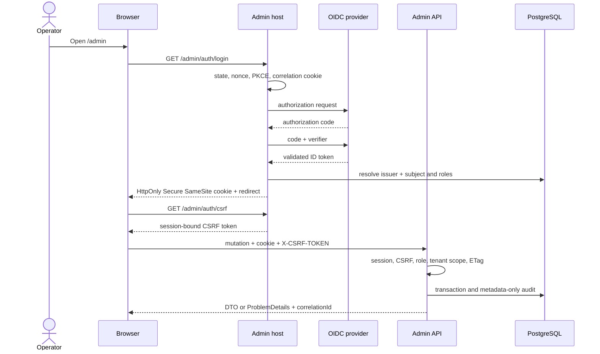
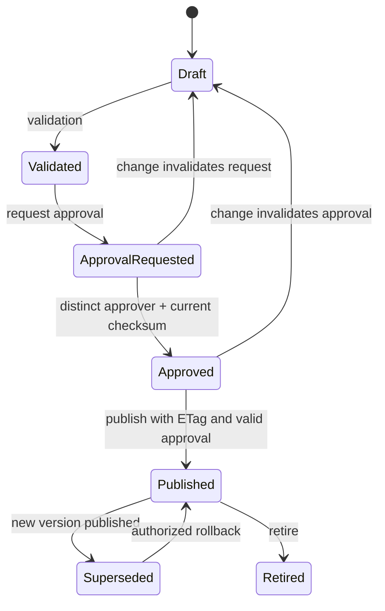
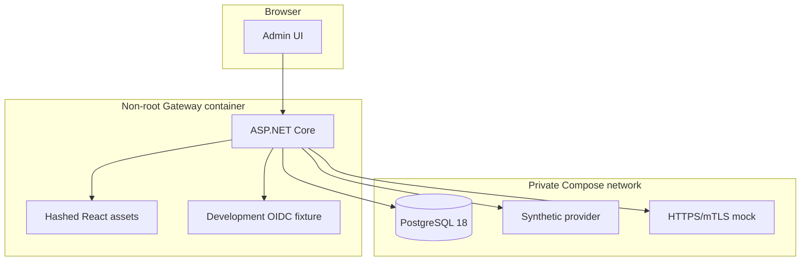

# M5 — Admin UI and provider boundaries

## Purpose

M5 adds a production-grade administrative console without changing the Broker data plane. The console and Admin API cannot read secret values, contact providers directly or choose arbitrary runtime endpoints.

## Component view

Allowed dependencies:

Core comprises Domain, Application, provider-neutral Infrastructure, API, Broker, SDK, contracts and synthetic provider. The Azure pack is an optional consumer of the abstractions alone.

This direction remains unchanged after M5: the local PKCS#12 pack is a second optional
consumer, and the default Gateway image includes neither that pack nor healthcare modules.
The local pack declares `SecretValues=false`; its generic secret provider is
deny-only, while certificate, public material and signing remain separate capabilities.

## Admin authentication flow

The persisted identity is `(issuer, subject)`. Email and display name are visual attributes, never authorization keys.

## Four-eyes lifecycle

An approval is a separate immutable record bound to version ID, checksum and approver. Creator, requester and last editor cannot approve. Any change to content or approval-controlled bindings invalidates prior approvals.

## Data flow and prohibitions

- The browser talks only to the same-origin Admin API.
- Admin UI/API persist logical references and metadata; they do not return secret values or key material.
- The runtime resolves endpoints and credentials exclusively server-side after grants and tenant binding.
- Broker and legacy applications receive no vendor secrets.
- No browser access to PostgreSQL, filesystem, synthetic vault or provider packs.
- The administrative API has no direct or indirect `GetSecret`.

## Local deployment

The frontend uses React 19, strict TypeScript, Vite, React Router, TanStack Query, React Hook Form, AJV 2020-12, CodeMirror 6, MUI Community, Lucide, i18next, Vitest, Testing Library, Playwright and axe. Client-side navigation preserves dirty state in complex forms and requires an explicit choice before discarding changes; no form content is persisted in localStorage. No CDNs, remote fonts, analytics, PWA or production source maps.

Only the Gateway HTTPS port is published. PostgreSQL, synthetic provider and mock remain on the private Compose network.

## Open-source boundaries

The OSS export uses a versioned allowlist, creates a temporary directory, recomputes a SHA-256 manifest, performs license/secret scans and builds/tests the exported Core solution. Azure packs, healthcare packs, commercial adapters, raw evidence and internal reports are excluded. The export does not publish remote repositories.

The raw manifest digest depends on export content and run metadata and is not a
cross-run deterministic value. The exporter also writes a normalized inventory digest
over source commit and sorted paths, sizes and file hashes, without a run timestamp.
This is source-inventory identity, not binary reproducibility or release signing;
see [CoreExportInventory.psm1](../../eng/CoreExportInventory.psm1).
