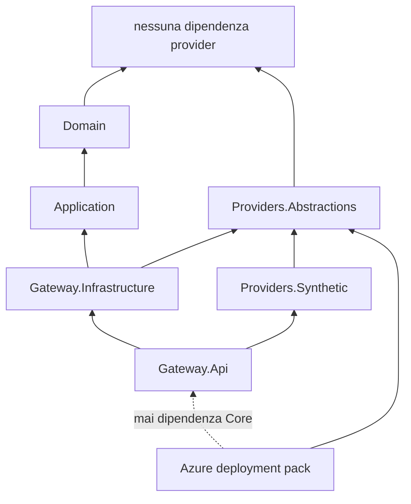
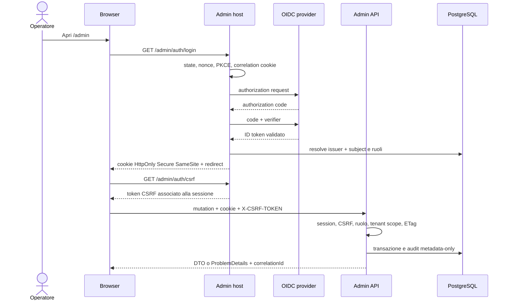
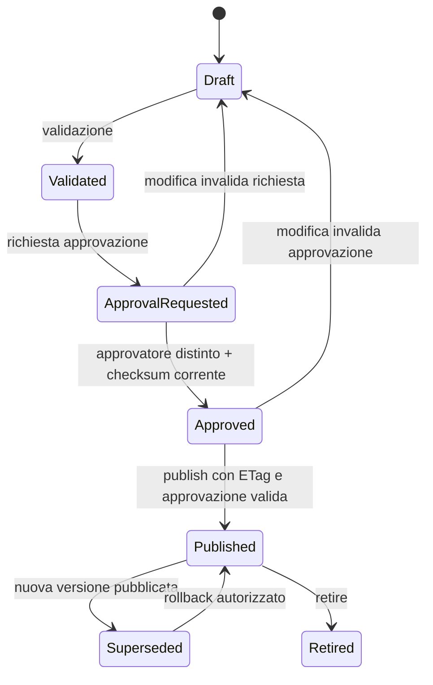

# M5 — Admin UI e confini dei provider

## Scopo

M5 aggiunge una console amministrativa production-grade senza modificare il data plane del Broker. La console e l'Admin API non possono leggere valori segreti, contattare provider direttamente o scegliere endpoint runtime arbitrari.

## Vista dei componenti

Dipendenze consentite:

Il Core è l'insieme di Domain, Application, Infrastructure provider-neutral, API, Broker, SDK, contratti e provider sintetico. Il pack Azure è un consumer opzionale delle sole astrazioni.

## Flusso di autenticazione Admin

L'identità persistita è `(issuer, subject)`. Email e display name sono attributi visuali, mai chiavi di autorizzazione.

## Lifecycle four-eyes

Una approvazione è una registrazione separata e immutabile, legata a version id, checksum e approvatore. Creator, requester e ultimo editor non possono approvare. Ogni modifica del contenuto o dei binding soggetti ad approvazione invalida le approvazioni precedenti.

## Data flow e divieti

- Il browser parla soltanto con l'Admin API same-origin.
- Admin UI/API persistono riferimenti logici e metadata; non restituiscono secret value o materiale di chiave.
- Il runtime risolve endpoint e credenziali esclusivamente server-side dopo grant e tenant binding.
- Il Broker e il Legacy non ricevono vendor secret.
- Nessun accesso browser a PostgreSQL, filesystem, synthetic vault o pack provider.
- Non esiste `GetSecret`, diretto o indiretto, nell'API amministrativa.

## Deployment locale

Il frontend usa React 19, TypeScript strict, Vite, TanStack Query, React Hook Form, AJV 2020-12, CodeMirror 6, MUI Community, Lucide, i18next, Vitest, Testing Library, Playwright e axe. Il routing MVP usa collegamenti same-origin e un piccolo dispatcher di path: React Router è stato escluso perché la famiglia di versioni valutata introduceva advisory npm nel lockfile. La decisione è reversibile quando una versione compatibile e priva di advisory sarà disponibile. Nessun CDN, font remoto, analytics, PWA o source map di produzione.

Solo la porta HTTPS del Gateway è pubblicata. PostgreSQL, provider sintetico e mock restano su rete privata Compose.

## Confini open source

L'export OSS usa una allowlist versionata, crea una directory temporanea, ricalcola un manifest SHA-256, esegue scansioni license/secret e compila/testa la soluzione Core esportata. Sono esclusi pack Azure, futuri pack sanitari, adapter commerciali, raw evidence e report interni. L'export non pubblica repository remoti.
