# Diagrammi di sequenza

## 1. Protezione di un segreto locale

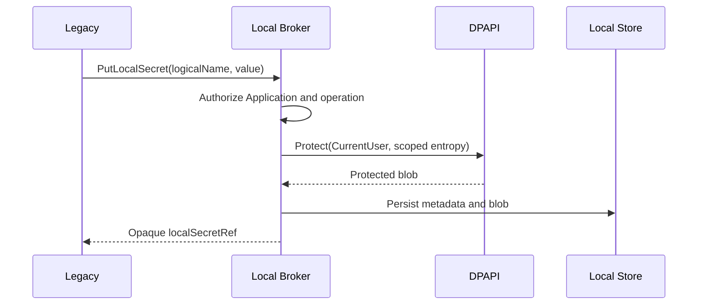

## 2. Cifratura di un dato locale

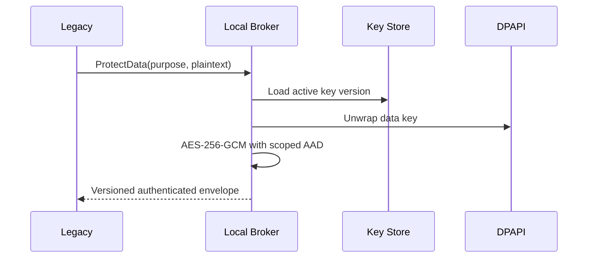

## 3. HMAC tramite Local Broker

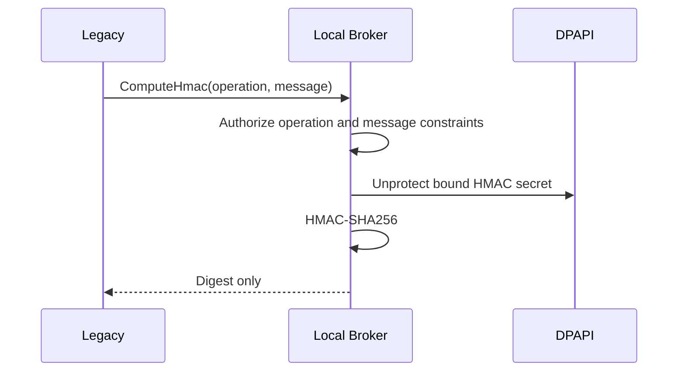

## 4. Chiamata mTLS centralizzata

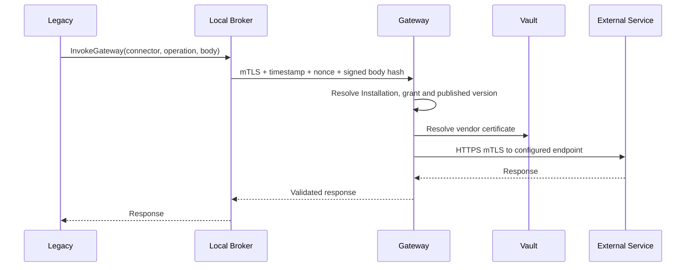

## 5. OAuth browser locale e token exchange centrale

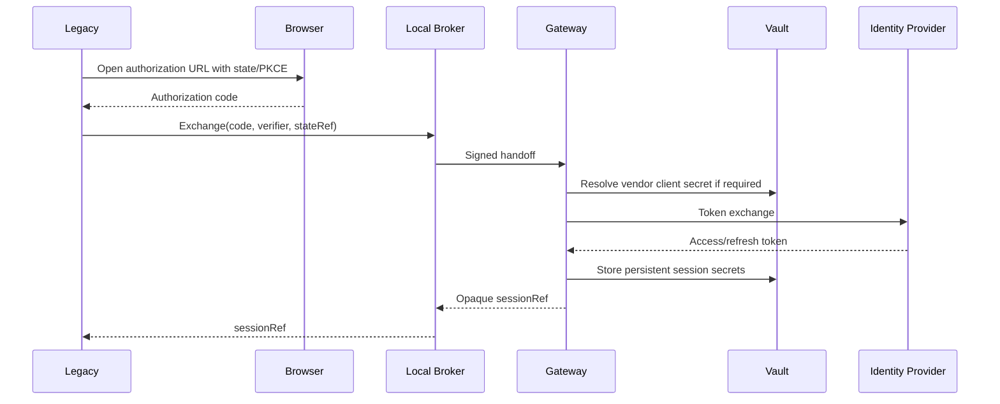

## 6. Smart card locale

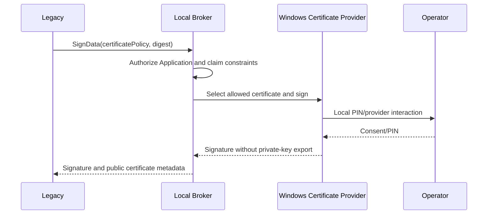

## 7. Enrollment Installation

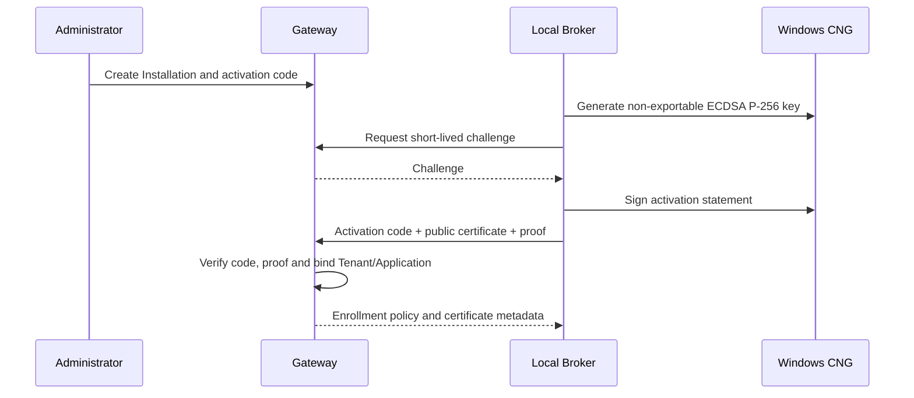

## 8. Revoca Installation

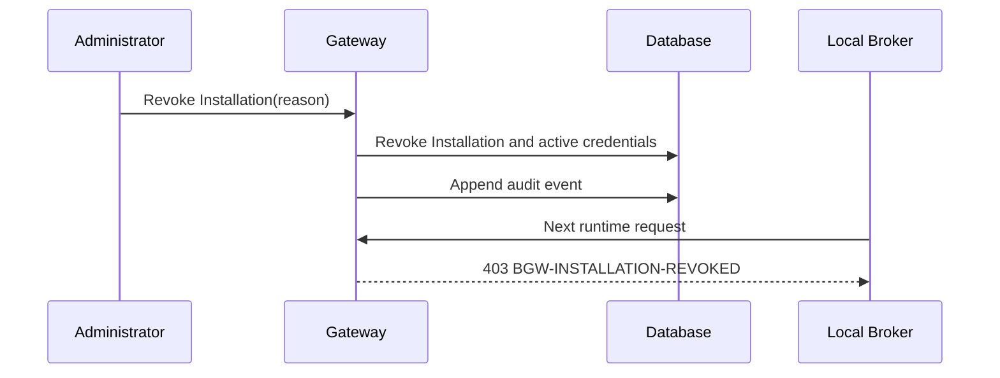

## 9. Pubblicazione Connector

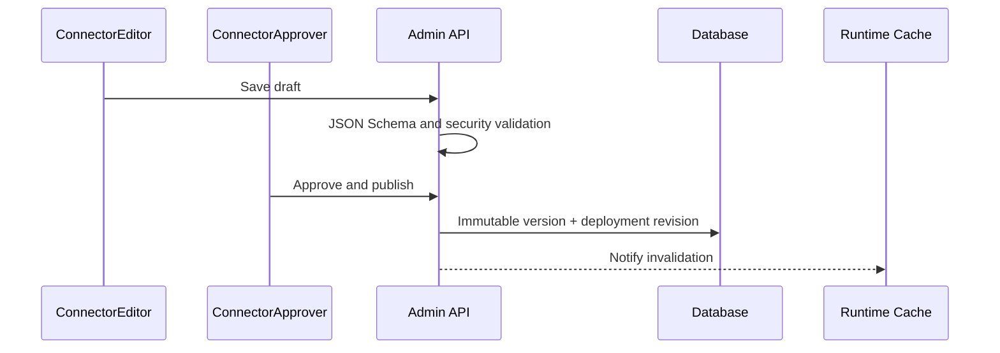

## 10. Rollback Connector

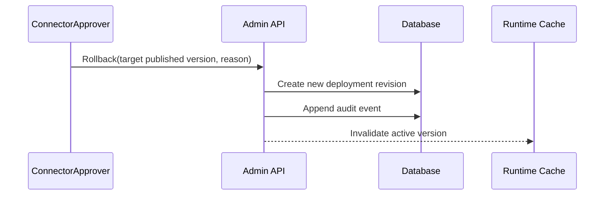

## 11. Managed Connector

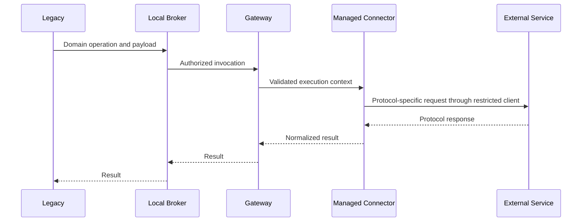

## 12. Secure Layer pass-through

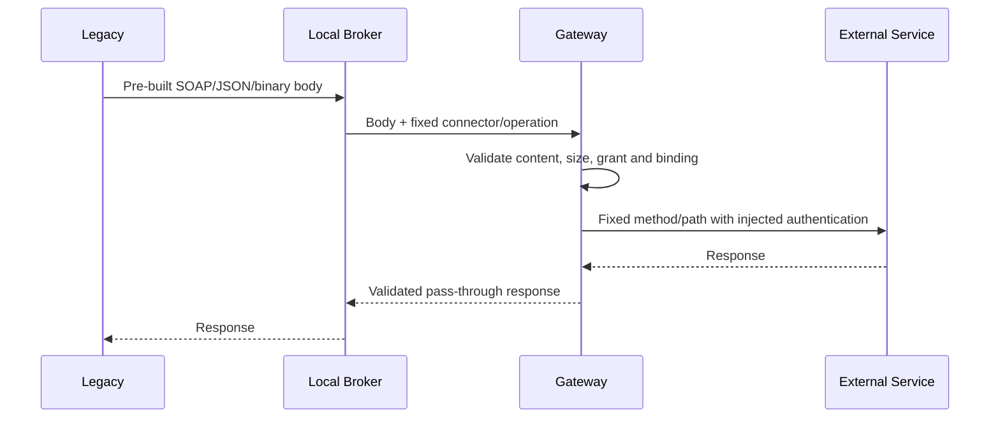

