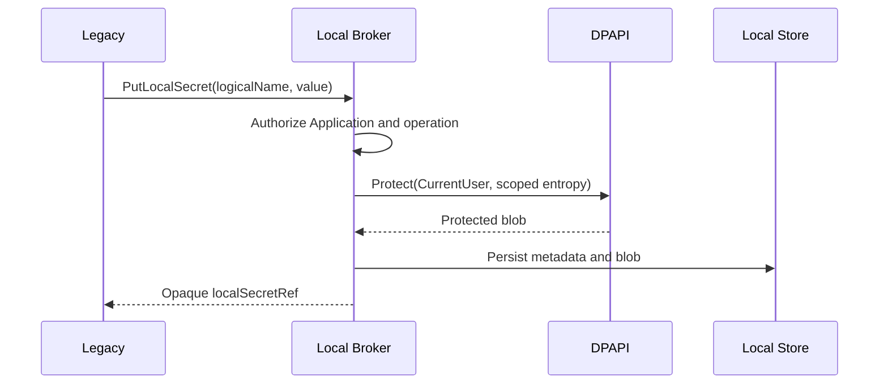
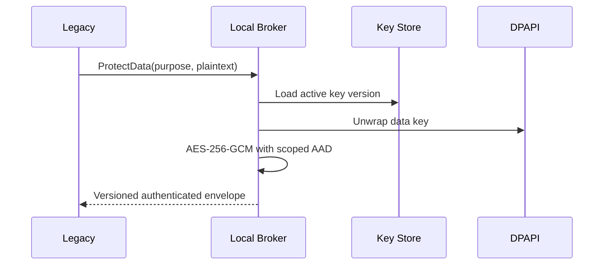
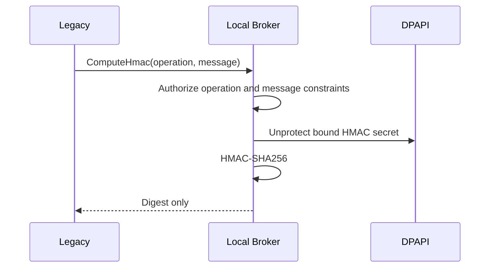
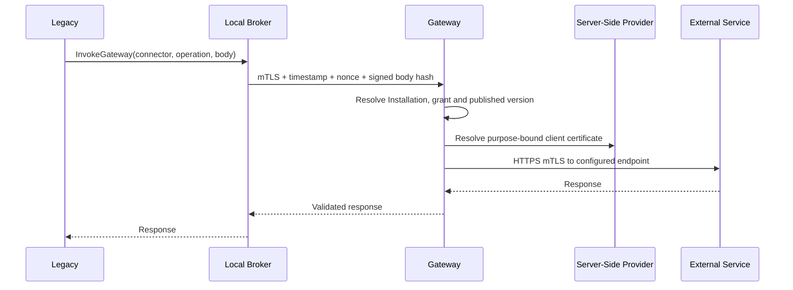
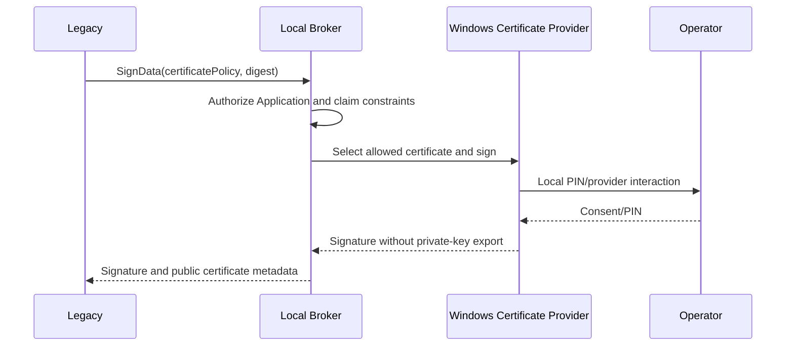
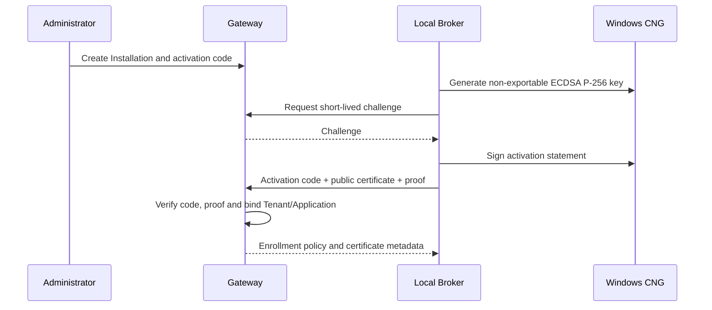
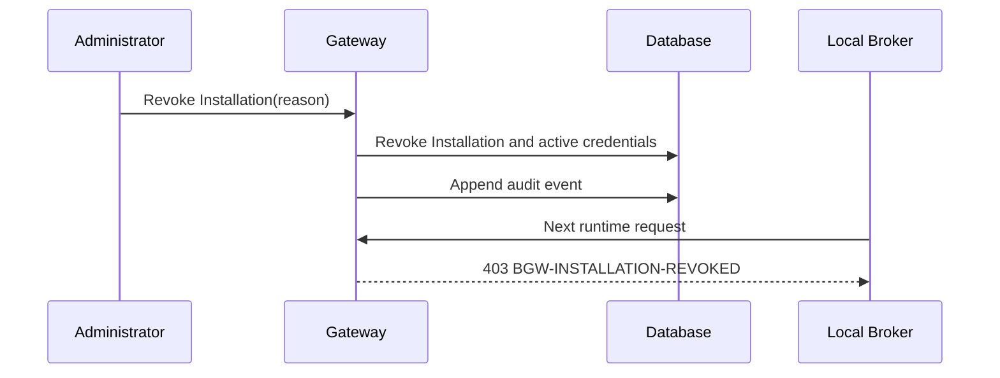
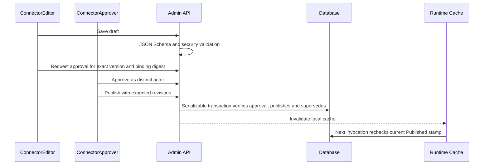
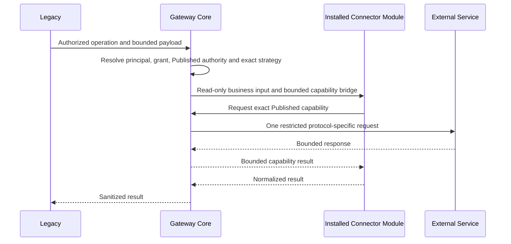
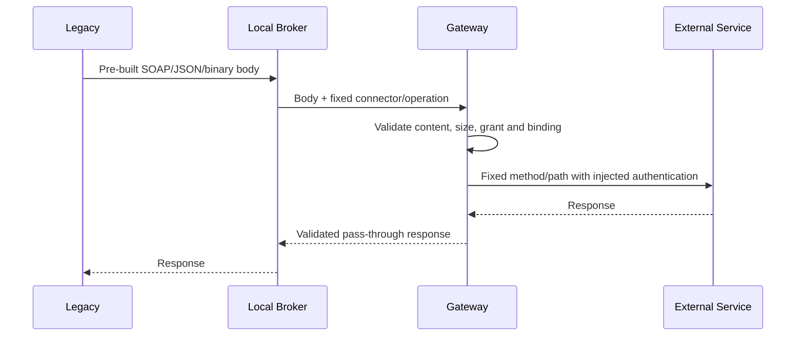

# Sequence diagrams

Labels distinguish **CURRENT** sequences, current foundations not qualified
end-to-end, and targets. Numbering is retained for historical continuity.

## 1. CURRENT — Protecting a local secret



## 2. CURRENT — Encrypting local data



## 3. CURRENT — HMAC through Local Broker



## 4. CURRENT synthetic — Centralized mTLS call



## 5. FOUNDATION CURRENT — OAuth authorization code and central token exchange

```mermaid
sequenceDiagram
  participant L as Legacy
  participant U as Browser
  participant B as Local Broker
  participant G as Gateway
  participant V as Server-Side Provider
  participant I as Identity Provider
  L->>B: Begin authorization for logical profile
  B->>G: Signed handoff for authorized operation
  G->>G: Generate state and S256 verifier; retain bounded one-time attempt
  G-->>U: Approved authorization URL
  U-->>G: Authorization callback with code and state
  G->>V: Resolve vendor client secret if required
  G->>I: Token exchange
  I-->>G: Access/refresh token
  G->>G: Keep bounded process-local token session
  G-->>B: Opaque sessionRef
  B-->>L: sessionRef
```

The foundation is implemented and tested at module level. It is not an E2E hosted OAuth execution
strategy or qualification of an external identity provider.

## 6. TARGET — Local smart card



## 7. CURRENT — Installation enrollment



## 8. CURRENT — Installation revocation



## 9. CURRENT — Connector publication



## 10. CURRENT — Connector rollback

```mermaid
sequenceDiagram
  participant A as ConnectorApprover
  participant G as Admin API
  participant D as Database
  participant R as Runtime Cache
  A->>G: Rollback(target Superseded version, reason, expected revision)
  G->>D: Reactivate exact prior bytes and update active pointer/revision
  G->>D: Append metadata-only audit event
  G-->>R: Invalidate local cache; next invoke rechecks stamp
```

## 11. CURRENT seam / TARGET packaged example — Connector execution module



## 12. CURRENT — Secure Layer pass-through


