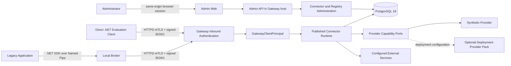

# System architecture and trust boundaries

This document describes the baseline integrated in `main`. Labels have a precise
meaning:

- **CURRENT**: existing code, configuration or tests;
- **TARGET**: approved direction, without availability or qualification claims;
- **HISTORICAL**: description valid only for the explicitly named baseline.

The current [capability summary](../../IMPLEMENTATION_STATUS.md) is included in the Core
export; its optional-pack links point to the full repository.
A synthetic test, controlled live laboratory, OfficialTest environment and
production qualification are not interchangeable evidence.

## CURRENT — system context



The Gateway is a modular monolith. Admin APIs, runtime APIs and module composition
share the host; migrations are executed by a separate process/image. The
Local Broker is the local Windows boundary. A `DirectInstallation` bypasses only that
boundary and converges on the same `GatewayClientPrincipal` and runtime.

The default repeatable path uses the Synthetic Provider. Azure and local
PKCS#12 packs are optional and depend on Core abstractions, never the reverse. The
default Gateway image contains no healthcare packs; a vertical module requires
explicit downstream composition.

## CURRENT — trust boundaries

| ID | Boundary | Main controls | Status and limit |
|---|---|---|---|
| TB-01 | Legacy → Local Broker | Named Pipe ACL, Windows identity, PID/process handle, path, publisher/hash, Application policy, nonce and limits. | Implemented; the client distributed in the repository is .NET. |
| TB-02 | Broker → local storage | Service SID, `ProgramData` ACL, DPAPI `CurrentUser`, CNG and AES-GCM. | Implemented; Administrator/SYSTEM remain privileged. |
| TB-03 | Broker/Direct → Gateway | TLS ClientAuth, per-Installation credentials, BGW1, timestamp and anti-replay nonce. | Tenant/Application/Environment derive from the registry; the Direct sample key is process-local only. |
| TB-04 | Gateway → PostgreSQL | Separate roles, composite foreign keys, FORCE RLS, no secret values and migration 0017 making event records append-only for application roles. | TLS depends on deployment. Owner/migration and host/DB administrators remain in the TCB; no signing/notarization or absolute protection from the DBA. |
| TB-05 | Gateway → provider | Separate capabilities for secret values, client certificates, public material, signing/key use, MAC, health and discovery. | Current Synthetic Provider; optional external packs. Missing capabilities are not inferred or emulated. |
| TB-06 | Gateway → external service | Published endpoints, DNS/IP validation, TLS, redirect denial, method/path/header/content-type and response bounds. | Qualified on synthetic paths; does not imply qualified external services or cloud. |
| TB-07 | Admin browser → Admin Plane | OIDC code flow, PKCE/nonce, secure cookie, CSRF, RBAC, tenant scope, ETag and four-eyes. | DevelopmentAuth is local/test-only and is rejected in Production. |
| TB-08 | Pipeline → artifacts | Build/tests, boundary tests, secret scan, container checks, SBOM and Core export. | Current repository gates; signing/provenance and release publication are targets. |

## CURRENT — runtime authorization flow

1. On the Broker path, the service identifies the Application without relying only on
   process name and checks local policy for operation and Connector.
2. Broker and Direct clients present a ClientAuth credential and sign the
   BGW1 request. The Gateway authenticates the credential, checks state/expiry and consumes the nonce.
3. Installation, Application, Tenant, Environment and caller kind come from authenticated
   server-side state; the payload cannot replace them.
4. The Gateway applies the deny-by-default Connector/operation grant.
5. The runtime reads the Published-version and current-binding stamp on every
   invocation. A TTL cache is reused only if the stamp matches; unavailable store,
   different stamp or inconsistent snapshot fail closed.
6. Published configuration selects strategy, logical endpoint, method, limits and
   authentication profile. The caller supplies no destination, provider or locator.
7. Logical references are resolved in the server-side catalog. Keys, certificates,
   secret values and physical locators remain within the Gateway/provider boundary.
8. Restricted egress validates destination and TLS, invokes the service, bounds and sanitizes
   the response and records metadata-only audit.

Publication and rollback verify checksum, binding digest and distinct approval in a
transaction, update `active_version_id`/`publication_revision` and do not modify an already
Published version in place. Local invalidation is immediate; every process
nevertheless rechecks the PostgreSQL stamp on its next invocation.

## CURRENT — sensitive material and providers

| Material | Owner/location | Rule |
|---|---|---|
| Vendor secret | Gateway server-side provider | Never returned as a value to Broker, Direct clients, browser or database. |
| Local secret/data key | Local Broker | DPAPI under service identity; AES-256-GCM data envelope; no `GetSecret` IPC operation. |
| Broker Installation key | Windows CNG under service identity | Non-exportable; used for enrollment PoP and BGW1. |
| Direct Installation key | Direct client | Production custody is the client's responsibility; not qualified by the sample. |
| Outbound certificate/key | Server-side provider | Runtime uses purpose-bound capabilities; private keys/PFX do not cross client-facing contracts. |
| Outbound token/session | Bounded process-local cache in the Gateway module | Only an opaque reference reaches the caller; there is no implicit distributed durability. |

The local PKCS#12 pack declares `SecretValues=false`. Its
`ISecretValueProvider` slot is deny-only and does not access the filesystem; the pack offers only its
declared certificate/signing capabilities. Integrated qualification uses
per-run synthetic material. It does not prove operational import, HSM/KMS custody, official certificates or
live FSE2 calls.

## CURRENT — execution location

- The **Local Broker** implements storage/deletion of authorized local secrets,
  data protect/unprotect, HMAC, status and constrained Gateway invocation.
- The **Gateway** implements authentication/grants, Published catalog, provider
  resolution, authentication modules and restricted egress.
- The **Direct** path uses the same Gateway pipeline after the principal.
- Execution modules are deployment-allowlisted and full-trust in-process; the
  narrow surface limits supported authority, not creates a sandbox.
- OAuth, SOAP/session, JWT/X.509 and signing foundations do not by themselves
  qualify a Connector or external service.

## TARGET — without current claims

- developer-alpha publication and completion of the adoption gate; licensing and the
  reporting channel are already documented in [LICENSING.md](../../LICENSING.md) and
  [SECURITY.md](../../SECURITY.md), without implying publication approval;
- Azure/cloud and real-provider qualification;
- MSI and additional legacy adapters;
- smart cards and operator-assisted hybrid flows;
- HA/DR, backup/restore, load/soak, artifact signing/provenance, pentest and pilots.

Historical adopter-simulation evidence applies to its recorded baseline, not an
automatic qualification of every subsequent release candidate. The FSE2
OfficialTest track is separate from Core. Its current offline/live qualification and
limits are maintained in the [capability summary](../../IMPLEMENTATION_STATUS.md);
the [current pilot](https://github.com/marcobiz/secure-integration-platform/blob/main/docs/user/fse2-validation-status.md)
owns the procedure and observed live evidence.

## CURRENT — monorepo structure

```text
/src/Broker             Windows host, core and infrastructure
/src/Gateway            API, application, domain and infrastructure
/src/Providers          provider abstractions and Synthetic Provider
/src/ConnectorPacks     optional vertical packs, not Core dependencies
/src/Admin              Admin Web
/src/Shared             shared contracts and primitives
/sdk/dotnet             thin Local Broker SDK
/samples                Direct evaluation client
/packs/deployment       optional provider packs, outside Core solution/export
/tests                  unit, integration, e2e, security and architecture
/deploy                 Compose, Windows scripts and laboratory Bicep
/eng and /tools         gates, migrations, diagnostics and harnesses
/docs                   contracts, decisions, status, plans and redacted evidence
```

The structure expresses dependency boundaries, not microservices. Milestone documents and
reports with an explicit baseline remain historical evidence and do not broaden
**CURRENT** status.
