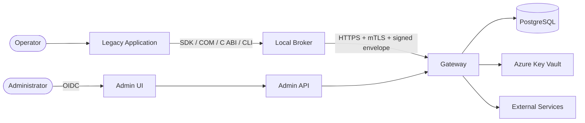

# System architecture e confini di fiducia

## System context



## Trust boundaries

| ID | Confine | Controlli principali |
|---|---|---|
| TB-01 | Legacy → Local Broker | Pipe ACL, Windows identity, PID/process handle, path, publisher/hash, Application grants, nonce e limits. |
| TB-02 | Broker → storage locale | Service SID, ACL ProgramData, DPAPI CurrentUser, CNG e AES-GCM. |
| TB-03 | Broker → Gateway | TLS, certificato per Installation, SPKI registry, request signature, timestamp e nonce anti-replay. |
| TB-04 | Gateway → PostgreSQL | TLS, DB roles, composite foreign key, RLS e nessun secret value. |
| TB-05 | Gateway → Vault | Managed Identity, least privilege, secret/version scope e audit Azure. |
| TB-06 | Gateway → servizio esterno | Endpoint configurato, DNS/IP validation, TLS, method/path/header/content-type allowlist. |
| TB-07 | Admin browser → Admin Plane | Entra OIDC, PKCE, nonce, antiforgery, RBAC e four-eyes. |
| TB-08 | Pipeline → artefatti | Review, signature, checksum, SBOM, provenance e publisher allowlist. |

## Flusso di autorizzazione runtime

1. Il Local Broker identifica l'Application senza affidarsi al solo nome processo.
2. Verifica che Application, Windows identity e immagine siano ammesse per l'operazione.
3. Il Gateway autentica il certificato mTLS e la firma applicativa.
4. Risolve Installation, Application, Tenant ed Environment dal registry.
5. Verifica stato Installation, compatibilità versione e grant.
6. Seleziona la ConnectorVersion pubblicata nel deployment attivo.
7. Risolve endpoint e SecretBinding dal server; ignora identificatori client derivabili.
8. Applica policy, invoca il servizio e produce audit redatto.

## Distribuzione dei segreti

| Classe | Posizione predefinita | Regola |
|---|---|---|
| Vendor Secret | Gateway + Vault | Mai restituito o distribuito. |
| Tenant Secret | Broker oppure Vault tenant-scoped | Dichiarato per Connector e operation. |
| Operator Secret | Interazione/memoria locale | Mai log o persistenza salvo requisito esplicito. |
| Session Secret | Componente che esegue le chiamate successive | Al client solo riferimento opaco. |
| Local Data Key | Local Broker | Per Installation, versionata, protetta da DPAPI. |

## Execution strategy

- `gateway`: Vendor Secret, token exchange, mTLS vendor e servizi cloud-raggiungibili.
- `broker`: smart card, VPN, periferiche, risorse locali e chiavi non esportabili.
- `hybrid`: handoff ristretto e predefinito, come authorization code centrale o firma locale.

Un client non può cambiare execution strategy a runtime.

## Struttura del monorepo

```text
/src/Broker       host, core e infrastruttura Windows
/src/Gateway      API, application, domain e infrastructure
/src/Connectors   abstractions, built-in e Connector Pack
/src/Admin        Admin Web
/src/Shared       contratti e wrapper di primitive standard
/sdk              dotnet, native, COM e CLI
/tests            unit, integration, e2e, security, compatibility
/deploy           docker, local e Azure Bicep
/docs             baseline e runbook
/tools            migration, diagnostics, validation e release
```

La suddivisione è per confini di responsabilità, non per microservizi. Il Gateway produce un'unica immagine e usa un unico database.

