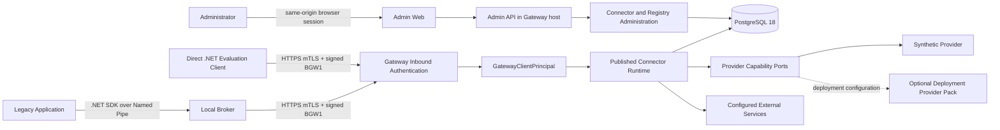

# System architecture e confini di fiducia

Questo documento descrive la baseline integrata in `main`. Le etichette hanno significato
preciso:

- **CURRENT**: codice, configurazione o test presenti;
- **TARGET**: direzione approvata, senza claim di disponibilità o qualifica;
- **HISTORICAL**: descrizione valida soltanto per la baseline esplicitamente indicata.

Nel repository completo la dashboard corrente resta `IMPLEMENTATION_STATUS.md`, che non
fa parte dell'export Core.
Un test sintetico, un laboratorio live controllato, un ambiente OfficialTest e una
qualifica production non sono evidenze intercambiabili.

## CURRENT — system context



Il Gateway è un modular monolith. Admin API, runtime API e composizione dei moduli
condividono l'host; le migrazioni sono eseguite da un processo/immagine distinto. Il
Local Broker è il confine Windows locale. Una `DirectInstallation` salta soltanto quel
confine e converge sullo stesso `GatewayClientPrincipal` e sullo stesso runtime.

Il percorso ripetibile predefinito usa il Synthetic Provider. Il pack Azure e il pack
local PKCS#12 sono opzionali e dipendono dalle astrazioni Core, mai il contrario. Il
Gateway image predefinito non contiene pack healthcare; un modulo verticale richiede una
composizione downstream esplicita.

## CURRENT — trust boundaries

| ID | Confine | Controlli principali | Stato e limite |
|---|---|---|---|
| TB-01 | Legacy → Local Broker | Named Pipe ACL, Windows identity, PID/process handle, path, publisher/hash, Application policy, nonce e limiti. | Implementato; il client distribuito nel repository è .NET. |
| TB-02 | Broker → storage locale | Service SID, ACL `ProgramData`, DPAPI `CurrentUser`, CNG e AES-GCM. | Implementato; Administrator/SYSTEM restano privilegiati. |
| TB-03 | Broker/Direct → Gateway | TLS ClientAuth, credential per Installation, BGW1, timestamp e nonce anti-replay. | Tenant/Application/Environment derivano dal registry; la chiave del sample Direct è solo process-local. |
| TB-04 | Gateway → PostgreSQL | Ruoli distinti, composite foreign key, FORCE RLS e nessun secret value. | TLS dipende dal deployment. Il runtime ha solo INSERT sull'audit; `gateway_admin` conserva una grant UPDATE storica da correggere prima della claim DB append-only. |
| TB-05 | Gateway → provider | Capability separate per secret value, certificato client, materiale pubblico, firma/key-use, MAC, health e discovery. | Synthetic Provider corrente; pack esterni opzionali. Capability assenti non sono inferite o emulate. |
| TB-06 | Gateway → servizio esterno | Endpoint Published, DNS/IP validation, TLS, redirect deny, method/path/header/content-type e response bounds. | Qualificato sui percorsi sintetici; non implica servizio esterno o cloud qualificato. |
| TB-07 | Browser Admin → Admin Plane | OIDC code flow, PKCE/nonce, cookie sicuro, CSRF, RBAC, tenant scope, ETag e four-eyes. | DevelopmentAuth è locale/test-only e Production la rifiuta. |
| TB-08 | Pipeline → artefatti | Build/test, boundary tests, secret scan, container checks, SBOM e Core export. | Gate di repository correnti; signing/provenance e pubblicazione release sono target. |

## CURRENT — flusso di autorizzazione runtime

1. Sul percorso Broker, il servizio identifica l'Application senza affidarsi al solo
   nome del processo e verifica la policy locale per operation e Connector.
2. Broker e Direct client presentano una credential ClientAuth e firmano la richiesta
   BGW1. Il Gateway autentica la credential, verifica stato/scadenza e consuma il nonce.
3. Installation, Application, Tenant, Environment e caller kind provengono dallo stato
   server-side autenticato; il payload non può sostituirli.
4. Il Gateway applica il grant Connector/operation deny-by-default.
5. Il runtime legge lo stamp della versione Published e dei binding correnti a ogni
   invocazione. Una cache TTL è riusata solo se lo stamp coincide; store indisponibile,
   stamp diverso o snapshot incoerente falliscono chiusi.
6. La configurazione Published seleziona strategia, endpoint logico, metodo, limiti e
   profilo di autenticazione. Il caller non fornisce destinazione, provider o locator.
7. I riferimenti logici sono risolti nel catalogo server-side. Chiavi, certificati,
   secret value e locator fisici restano nel Gateway/provider boundary.
8. Restricted egress valida destinazione e TLS, invoca il servizio, limita e sanitizza
   la risposta e registra audit metadata-only.

Pubblicazione e rollback verificano checksum, binding digest e approvazione distinta in
transazione, aggiornano `active_version_id`/`publication_revision` e non modificano in
place una versione già Published. L'invalidazione locale è immediata; ogni processo
ricontrolla comunque lo stamp PostgreSQL alla successiva invocazione.

## CURRENT — materiale sensibile e provider

| Materiale | Proprietario/collocazione | Regola |
|---|---|---|
| Vendor secret | Provider server-side del Gateway | Mai restituito a Broker, Direct client, browser o database come valore. |
| Secret/data key locale | Local Broker | DPAPI sotto service identity; data envelope AES-256-GCM; nessuna operation IPC `GetSecret`. |
| Chiave Installation Broker | Windows CNG sotto l'identità del servizio | Non esportabile; usata per enrollment PoP e BGW1. |
| Chiave Installation Direct | Client Direct | Custodia production responsabilità del client; non qualificata dal sample. |
| Certificato/chiave outbound | Provider server-side | Il runtime usa capability purpose-bound; private key/PFX non attraversano i contratti client-facing. |
| Token/sessione outbound | Cache bounded process-local del modulo Gateway | Al chiamante passa solo una reference opaca; non esiste durability distribuita implicita. |

Il pack local PKCS#12 dichiara `SecretValues=false`. Il relativo slot
`ISecretValueProvider` è deny-only e non accede al filesystem; il pack offre soltanto le
capability certificate/signing dichiarate. La qualifica integrata usa materiale
sintetico per-run. Non prova import operativo, custody HSM/KMS, certificati ufficiali o
chiamate FSE2 live.

## CURRENT — collocazione dell'esecuzione

- Il **Local Broker** implementa storage/delete di secret locali autorizzati,
  protect/unprotect dati, HMAC, status e invocazione vincolata del Gateway.
- Il **Gateway** implementa autenticazione/grant, catalogo Published, provider
  resolution, moduli di autenticazione e restricted egress.
- Il percorso **Direct** usa la stessa pipeline Gateway dopo il principal.
- I moduli di execution sono allowlisted dal deployment e full-trust in-process; la
  superficie ristretta limita l'autorità supportata, non crea una sandbox.
- Le foundation OAuth, SOAP/session, JWT/X.509 e signing non costituiscono da sole una
  qualifica di un Connector o servizio esterno.

## TARGET — senza claim corrente

- packaging e pubblicazione della developer alpha, licenza e canale security operativo;
- qualifica Azure/cloud e provider reali;
- MSI e adapter legacy aggiuntivi;
- smart card e flussi ibridi operator-assisted;
- HA/DR, backup/restore, load/soak, artifact signing/provenance, pentest e pilot.

L'adozione early-adopter resta target finché `ALPHA-ADOPT` non è chiuso. La track FSE2
OfficialTest è separata dal Core: `validate-cda` è il primo outcome futuro, e nessuna
chiamata live è attestata da questo documento.

## CURRENT — struttura del monorepo

```text
/src/Broker             host, core e infrastruttura Windows
/src/Gateway            API, application, domain e infrastructure
/src/Providers          astrazioni provider e Synthetic Provider
/src/ConnectorPacks     pack verticali opzionali, non dipendenze del Core
/src/Admin              Admin Web
/src/Shared             contratti e primitive condivise
/sdk/dotnet             SDK sottile del Local Broker
/samples                client Direct di evaluation
/packs/deployment       provider pack opzionali, fuori dal Core solution/export
/tests                  unit, integration, e2e, security e architecture
/deploy                 Compose, script Windows e Bicep di laboratorio
/eng e /tools           gate, migrazioni, diagnostica e harness
/docs                   contratti, decisioni, stato, piani ed evidence redatta
```

La struttura esprime confini di dipendenza, non microservizi. Documenti milestone e
report con una baseline esplicita restano evidence storica e non ampliano lo stato
**CURRENT**.
