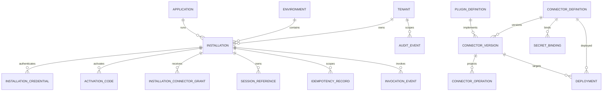

# Database schema

## Principi

- PostgreSQL 18 è il source of truth operativo.
- UUID generati dall'applicazione.
- Timestamp `timestamptz` UTC.
- Secret value vietati; `vault_ref` e metadata non sensibili soltanto.
- JSONB canonico per ConnectorVersion; proiezioni relazionali per query/grants.
- Multi-tenancy con composite foreign key, RLS e ruoli separati.
- Audit append-only e partizionamento mensile.

## ER diagram

## Tabelle

### `tenant`

- `id uuid PK`
- `code varchar(64) NOT NULL UNIQUE`
- `display_name varchar(256) NOT NULL`
- `status varchar(32) CHECK active|suspended|retired`
- `created_at`, `updated_at`
- `row_version bigint`

### `application`

- `id uuid PK`
- `code varchar(100) UNIQUE`
- `display_name`
- `minimum_broker_version`, `maximum_broker_version`
- `status`
- `created_at`, `updated_at`, `row_version`

Application rappresenta un prodotto autorizzabile, non un processo specifico. Il manifest locale associa process identity e Application ID.

### `environment`

- `id uuid PK`
- `code varchar(32) UNIQUE CHECK dev|test|preprod|prod o namespace approvato`
- `display_name`
- `production_controls boolean`
- `endpoint_policy_json jsonb`

### `installation`

- `id uuid PK`
- `tenant_id uuid NOT NULL FK tenant`
- `application_id uuid NOT NULL FK application`
- `environment_id uuid NOT NULL FK environment`
- `status CHECK pending|active|suspended|revoked|retired`
- `broker_version`, `last_seen_at`, `created_at`, `revoked_at`, `revocation_reason`
- `row_version`
- unique `(id, tenant_id)` per composite FK downstream

Tenant/Application/Environment diventano immutabili dopo activation. Un cambio produce una nuova Installation.

### `installation_credential`

- `id uuid PK`
- `installation_id uuid NOT NULL FK`
- `certificate_sha256 bytea NOT NULL`
- `spki_sha256 bytea NOT NULL`
- `serial_number varchar(128)`
- `not_before`, `not_after`
- `status CHECK pending|active|overlap|revoked|expired`
- `replaced_by_id uuid NULL FK self`
- `created_at`, `revoked_at`
- unique `spki_sha256`
- partial unique su una credential `active` per Installation

### `activation_code`

- `id uuid PK`
- `installation_id uuid NOT NULL FK`
- `code_hmac bytea NOT NULL UNIQUE`
- `expires_at`, `used_at`, `created_at`
- `attempt_count smallint CHECK 0..5`
- `created_by varchar(256)`

Challenge di enrollment sono effimeri in memoria; se serve scalare prima dell'activation, la challenge può essere firmata e stateless o conservata in una tabella TTL senza secret.

### `connector_definition` (M4 implementato)

- `id uuid PK`, `slug varchar(100) UNIQUE`, display metadata;
- `active_version_id uuid NULL` punta alla Published corrente;
- `publication_revision bigint` serializza publish concorrenti;
- `row_version bigint`.

### `connector_version` (M4 implementato)

- `id uuid PK`, `connector_id uuid FK`, `version`, `schema_version`;
- `configuration_json jsonb` canonico e `checksum_sha256 bytea` di 32 byte;
- `state CHECK draft|validated|published|superseded|retired`;
- `created_by`, timestamp lifecycle e `row_version`;
- unique `(connector_id, version)` e unique parziale su una sola Published per Connector.

Una versione già pubblicata è immutabile per JSON, checksum, version, schema e Connector tramite trigger; solo le transizioni lifecycle revisionate sono consentite.

### `connector_environment_binding` (M4 implementato)

- PK `(connector_id, environment_id)`;
- `endpoints_json` associa logical endpoint a URI HTTPS;
- `secret_references_json` associa logical secret a provider reference opaca;
- `revision`, `updated_at`, `updated_by`.

Non contiene secret value. I binding non fanno parte del JSON canonico né dell'export Connector.

### `connector_operation`

Proiezione futura, non implementata in M4 e non source of truth:

- `connector_version_id uuid`
- `operation_id varchar(100)`
- `mode`, `execution_strategy`, `auth_kind`, `http_method`
- `max_request_bytes`, `max_response_bytes`, `timeout_ms`, `idempotency_mode`
- PK `(connector_version_id, operation_id)`

Viene rigenerata nella stessa transazione che valida la ConnectorVersion.

### `secret_binding`

Modello futuro normalizzato. M4 usa `connector_environment_binding.secret_references_json`
con soli riferimenti opachi; nessun valore segreto è memorizzato.

- `id uuid PK`
- `logical_name varchar(100)`
- `connector_id uuid NOT NULL`
- `operation_id varchar(100) NULL`
- `environment_id uuid NOT NULL`
- `tenant_id uuid NULL`
- `secret_class CHECK vendor|tenant|session`
- `location CHECK vault|broker`
- `provider varchar(64)`
- `vault_ref varchar(1024) NULL`
- `version_policy CHECK latest|pinned`
- `rotation_due_at`, `certificate_expires_at`
- `status CHECK active|disabled|rotationRequired`
- unique su scope logico `(logical_name, connector_id, operation_id, environment_id, tenant_id)` con normalizzazione NULL

`vault_ref` non viene mai restituito al Broker/Admin UI ordinaria.

### `installation_connector_grant`

- `id uuid PK`
- `installation_id uuid NOT NULL`
- `tenant_id uuid NOT NULL`
- `connector_id uuid NOT NULL`
- `operation_id varchar(100)`
- `enabled boolean`
- `constraints_json jsonb`
- `valid_from`, `valid_until`
- unique `(installation_id, connector_id, operation_id)`
- composite FK `(installation_id, tenant_id)` → installation

### `deployment`

Modello futuro di promotion multi-environment. M4 usa `active_version_id` e
`publication_revision` sul Connector; rollback riattiva una Superseded.

- `id uuid PK`
- `environment_id uuid NOT NULL`
- `connector_id uuid NOT NULL`
- `connector_version_id uuid NOT NULL`
- `revision bigint NOT NULL`
- `status CHECK active|superseded`
- `rollback_of_id uuid NULL`
- `reason varchar(1000)`
- `created_by`, `created_at`, `activated_at`
- unique `(environment_id, connector_id, revision)`
- partial unique su deployment `active` per Environment/Connector

Publish/rollback acquisiscono advisory lock su Environment+Connector e committano versione/deployment/audit atomici.

### `plugin_definition`

- `id uuid PK`
- `plugin_id`, `plugin_version`, `contract_version`
- `package_sha256`, `publisher_thumbprint`, `manifest_json`
- `status CHECK staged|approved|deployed|revoked`
- unique `(plugin_id, plugin_version)`

Nessun package binario nel database; solo metadata del package installato dalla pipeline.

### `session_reference`

- `id uuid PK` usato internamente; riferimento esterno random opaco
- `reference_hash bytea UNIQUE`
- `installation_id`, `tenant_id`, `connector_id`, `operation_id`
- `vault_ref varchar(1024)`
- `expires_at`, `last_used_at`, `revoked_at`
- `status CHECK active|expired|revoked`

Token/session value risiede nel Vault o nel Broker, mai in questa tabella.

### `idempotency_record`

- `installation_id`, `connector_id`, `operation_id`
- `key_hash`, `request_hash`
- `status CHECK inProgress|completed|failed`
- `correlation_id uuid`
- `created_at`, `expires_at`
- PK sullo scope + `key_hash`

Non contiene response body.

### `audit_event`

- `id uuid`, `occurred_at`, `tenant_id nullable`
- `actor_type`, `actor_id`, `action`, `target_type`, `target_id`
- `correlation_id`, `outcome`, `reason_code`
- `metadata_redacted jsonb`
- PK composta con `occurred_at` per partizionamento

### `invocation_event`

- `id`, `occurred_at`, `tenant_id`, `installation_id`
- `connector_id`, `connector_version_id`, `operation_id`
- `correlation_id`, `outcome`, `duration_ms`
- `external_status_category`, `error_code`, `payload_bytes`

Nessun body, header sensibile o Operator Secret.

### `health_status`

- `component_type`, `component_id`, `observed_at`
- `status CHECK healthy|degraded|unhealthy|unknown`
- `reason_code`, `metadata_redacted`

## RLS e ruoli

- `migration_owner`: DDL, non usato dal runtime.
- `gateway_runtime`: invoke, enrollment e audit operativo.
- `gateway_admin`: operazioni amministrative autorizzate.
- `gateway_readonly`: health/reporting sanificato.

RLS è `ENABLE` e `FORCE` sulle tabelle tenant-scoped. Ogni transazione imposta `SET LOCAL app.tenant_id = '<uuid>'` dopo autenticazione. Le operazioni cross-Tenant richiedono una funzione/ruolo amministrativo esplicito e auditato.

## Indici

- `(tenant_id, status)` e `(application_id, status)` su Installation.
- `(installation_id, status, not_after)` su credential.
- `(connector_id, state, version)` su ConnectorVersion.
- GIN su `configuration_json` solo se un caso di query reale lo giustifica; non nell'MVP.
- `(environment_id, connector_id) WHERE status='active'` su Deployment.
- `(expires_at) WHERE status='active'` su session/idempotency.
- `(correlation_id)` e BRIN `(occurred_at)` su audit/invocation.

## Retention

- Invocation event: 90 giorni.
- Administrative audit: 365 giorni.
- Health history: 30 giorni.
- Idempotency: 24 ore.
- Session metadata: scadenza + 30 giorni per audit, quindi cancellazione.
- Partizioni scadute eliminate da job controllato e auditato.

## Migrazioni

- Tool separato eseguito dalla pipeline prima del rollout.
- Expand/contract: aggiungere, dual-read/write se necessario, migrare, rimuovere in release successiva.
- Nessun auto-migrate all'avvio dell'app.
- Backup/PITR verificato prima di migration classificata high-risk.
- Connector rollback non implica database rollback.
