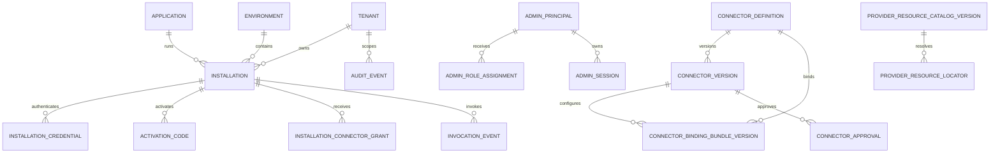

# PostgreSQL schema as-built

Baseline: migration runner e migration additive `0001`..`0014` su PostgreSQL 18.
Le migration SQL sono la fonte eseguibile; questo documento non promuove modelli target
a stato corrente.

## Principi correnti

- UUID applicativi e timestamp `timestamptz` UTC.
- Nessun secret value nel database: soltanto metadata, certificato pubblico e logical/
  opaque provider locator server-side.
- Connector JSON canonico in `jsonb`, checksum SHA-256 e lifecycle Published immutabile.
- Tenant identity derivata dall'autenticazione, composite FK e FORCE RLS sulle tabelle
  tenant-scoped.
- Identità migration, runtime, admin, readonly e locator-owner con responsabilità
  distinte.
- Migrazioni additive con nome e checksum registrati in `gateway.schema_migration`.

Le tabelle audit/invocation sono ordinarie, non partizionate. Il codice e il ruolo
`gateway_runtime` scrivono solo in append, ma `gateway_admin` eredita oggi `UPDATE` dalla
grant ampia della migration 0001. L'append-only enforcement DB completo è un finding
deferred: richiede migration additiva e test di privilege, non è PASS sulla baseline.

## ER corrente

I locator di identità (`installation_locator`, `credential_locator`,
`activation_locator`) e i provider locator sono separati dai cataloghi tenant-scoped.

## Inventario delle tabelle

| Gruppo | Tabelle correnti |
|---|---|
| Migration | `schema_migration` |
| Directory | `tenant`, `application`, `environment`, `installation`, `installation_credential`, `activation_code` |
| Runtime | `connector_definition`, `installation_connector_grant`, `replay_nonce`, `audit_event`, `invocation_event` |
| Identity locator | `installation_locator`, `credential_locator`, `activation_locator` |
| Connector | `connector_version`, `connector_environment_binding`, `connector_binding_bundle_version` |
| Admin | `admin_principal`, `admin_role_assignment`, `admin_bootstrap`, `connector_approval`, `admin_session` |
| Provider | `provider_resource_catalog_version`, `provider_resource_locator` |

## Directory ed enrollment

### `tenant`, `application`, `environment`

Contengono identità, display/status, compatibility/version policy ed environment policy.
`application` rappresenta un prodotto autorizzabile; la process identity locale è
vincolata dal manifest Broker.

### `installation`

Lega Tenant, Application ed Environment. Dalla migration 0011 contiene
`installation_kind` (`broker`/`direct`), `client_version` e `updated_at`, oltre a stato,
Broker version, last-seen, revoca e row version. Tenant/Application/Environment diventano
immutabili dopo activation.

### `installation_credential`

Contiene fingerprint, SPKI, DER pubblico, seriale, validità, stato e relazione di
sostituzione. La chiave privata non è nel database. Un indice parziale consente una sola
credential `active` per Installation.

### `activation_code`

Conserva HMAC, expiry, uso e attempt count. Il codice in chiaro non è persistito. Le
challenge brevi restano in uno store applicativo dedicato.

## Runtime e Connector lifecycle

### `connector_definition` e `connector_version`

`connector_definition` conserva slug, metadata, `active_version_id`,
`publication_revision` e `row_version`. `connector_version` conserva JSON canonico,
checksum, schema/version, lifecycle e attori/timestamp. Trigger impediscono la modifica
del contenuto già Published; una sola versione è Published per Connector.

### `connector_environment_binding`

Tabella M4 legacy ancora presente nella lineage ma non letta dal runtime dopo la
migration 0004. Non è una seconda source of truth corrente.

### `connector_binding_bundle_version`

Revisioni immutabili per ConnectorVersion/Environment con endpoint e soli riferimenti
server-side a secret/certificati. Checksum e stato draft/active/retired sono legati al
`binding_digest_sha256` dell'approvazione. Publish/four-eyes verifica e attiva revisioni
exact nella transazione che pubblica la versione.

### `installation_connector_grant`

Grant deny-by-default per Installation/Tenant/Connector/operation, con validità e
constraint JSON. La composite FK impedisce associazioni cross-Tenant incoerenti.

### `replay_nonce`

Registra nonce bounded/TTL consumati dal runtime anti-replay.

## Admin

- `admin_principal`: chiave stabile issuer+subject e metadata visuali;
- `admin_role_assignment`: ruolo globale o tenant-scoped, revocabile;
- `admin_bootstrap`: stato del bootstrap Security Administrator;
- `admin_session`: sessione server-side, digest cookie, scadenza e revoca;
- `connector_approval`: request/decision four-eyes legata a version checksum e binding
  digest.

## Provider catalog e locator

`provider_resource_catalog_version` contiene metadata pubblici/revisionati, scope
Environment/Connector/operation, checksum e stato. `provider_resource_locator` associa
la risorsa logica al locator fisico server-side; il client non lo seleziona e il normale
runtime non può enumerarlo.

Le funzioni `gateway.resolve_published_provider_locator(...)` sono
`SECURITY DEFINER`, hanno `search_path` fisso e owner
`gateway_locator_owner NOLOGIN/NOINHERIT`. Le migration 0009-0014 restringono il
predicato a principal, grant, Published authority, binding/resource revision,
capability, signing slot e input tipizzato pertinenti.

I locator possono rappresentare secret, certificati o chiavi server-side, ma non il
valore. `SecretValues=false` del pack local PKCS#12 significa che nessuna funzione DB o
fallback Gateway trasforma quel pack in generic secret provider.

## Audit e invocation metadata

`audit_event` contiene attore, azione, target, outcome, reason, correlation e metadata
redatti. `invocation_event` contiene Tenant/Installation/Connector/operation,
correlation, outcome, durata, categoria esterna, error code e dimensione payload.

Non contengono body, Authorization/Cookie, secret, private key o response raw. Le primary
key includono `(occurred_at, id)`, ma non esistono `PARTITION BY`, child partition o
retention job nella baseline.

## RLS e ruoli effettivi

| Ruolo/identità | Uso corrente |
|---|---|
| owner che esegue le migration | DDL e bootstrap; le migration non creano un ruolo nominato `migration_owner`. |
| `gateway_runtime` | Runtime/enrollment, replay, letture autorizzate e INSERT audit/invocation secondo grant/RLS. |
| `gateway_admin` | Directory e amministrazione; la grant storica `SELECT, INSERT, UPDATE ON ALL TABLES` include oggi le tabelle audit. |
| `gateway_readonly` | Subset di metadata sanificato. |
| `gateway_locator_owner` | Owner NOLOGIN delle funzioni locator; CREATE sullo schema viene revocato dopo la definizione. |

RLS è `ENABLE` e `FORCE` sulle tabelle tenant-scoped. Le transazioni impostano il Tenant
server-derived; le funzioni cross-scope hanno superficie stretta e grant espliciti. RLS
non sostituisce la correzione della grant UPDATE amministrativa sull'audit.

## Vincoli e indici rilevanti

- uniqueness/status per Tenant/Application/Environment e Installation;
- credential attiva unica e indici per Installation/status/expiry;
- grant unico per Installation/Connector/operation;
- una Published version per Connector e revisioni binding uniche;
- principal issuer+subject e session digest unici;
- catalog/locator revision e scope vincolati;
- trigger di immutabilità per Published definition e active binding bundles.

## Modello target, non implementato

Le seguenti entità descritte in roadmap precedenti non esistono nelle migration
`0001`..`0014`: `connector_operation`, `secret_binding`, `deployment`,
`plugin_definition`, `session_reference`, `idempotency_record` e `health_status`.

Sono inoltre target, non claim correnti:

- partizionamento e retention automatica di audit/invocation;
- deployment revision multi-environment dedicato;
- workflow/session durability PostgreSQL;
- backup/PITR/restore e HA qualificati;
- append-only DB completo per audit dopo revoca dei privilegi UPDATE/DELETE non necessari.

Ogni adozione richiede migration additiva, fresh/upgrade/no-op, privilege/RLS test,
documentazione e rollback application-compatible. Connector rollback non implica
database downgrade.
