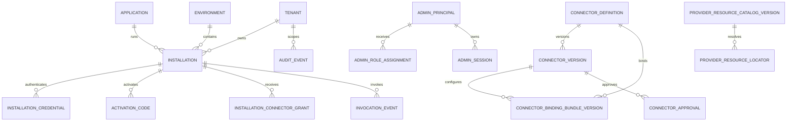

# PostgreSQL schema as-built

Baseline: migration runner and additive migrations `0001`..`0019` on PostgreSQL 18.
SQL migrations are the executable source; this document does not promote target models
to current status.

## Current principles

- Application UUIDs and UTC `timestamptz` timestamps.
- No secret values in the database: only metadata, public certificates and logical/
  opaque server-side provider locators.
- Canonical Connector JSON in `jsonb`, SHA-256 checksum and immutable Published lifecycle.
- Authentication-derived Tenant identity, composite FKs and FORCE RLS on
  tenant-scoped tables.
- Migration, runtime, admin, readonly and locator-owner identities with
  separate responsibilities.
- Additive migrations with name and checksum recorded in `gateway.schema_migration`.

Audit/invocation tables are ordinary, nonpartitioned tables. Migration 0017 makes
records append-only for application roles: `gateway_runtime` retains only INSERT
on both; `gateway_admin` retains SELECT and INSERT on `audit_event` and has no privileges
on `invocation_event`, which has no product Admin consumer. Owner/migration and
privileged host/DB administrators remain in the TCB: there is no signing, notarization
or absolute protection against the DBA.

## Current ER diagram

Identity locators (`installation_locator`, `credential_locator`,
`activation_locator`) and provider locators are separate from tenant-scoped catalogs.

## Table inventory

| Group | Current tables |
|---|---|
| Migration | `schema_migration` |
| Directory | `tenant`, `application`, `environment`, `installation`, `installation_credential`, `activation_code` |
| Runtime | `connector_definition`, `installation_connector_grant`, `replay_nonce`, `audit_event`, `invocation_event`, `connector_workflow_context` |
| Identity locator | `installation_locator`, `credential_locator`, `activation_locator` |
| Connector | `connector_version`, `connector_environment_binding`, `connector_binding_bundle_version` |
| Admin | `admin_principal`, `admin_role_assignment`, `admin_bootstrap`, `connector_approval`, `admin_session` |
| Provider | `provider_resource_catalog_version`, `provider_resource_locator` |

Migration 0018 adds `connector_workflow_context`: server-derived scope and Published
configuration hashes bind technical workflow/trace correlation, operation, action,
purpose and timestamp, without payloads, patient data or credentials. Forced RLS
checks Tenant and Installation; only `gateway_runtime` receives SELECT/INSERT.
Migration 0019 adds `predecessor_trace_id` and permits a protocol-authorized successor
without replacing the immutable origin. This is durable technical correlation,
not a general durable session store or clinical-data archive.

## Directory and enrollment

### `tenant`, `application`, `environment`

Contain identities, display/status, compatibility/version policy and environment policy.
`application` represents an authorizable product; local process identity is
bound by the Broker manifest.

### `installation`

Binds Tenant, Application and Environment. Since migration 0011 it contains
`installation_kind` (`broker`/`direct`), `client_version` and `updated_at`, plus state,
Broker version, last-seen, revocation and row version. Tenant/Application/Environment become
immutable after activation.

### `installation_credential`

Contains fingerprint, SPKI, public DER, serial, validity, state and replacement
relationship. The private key is not in the database. A partial index allows only one
`active` credential per Installation.

### `activation_code`

Stores HMAC, expiry, use and attempt count. The plaintext code is not persisted. Short-lived
challenges remain in a dedicated application store.

## Runtime and Connector lifecycle

### `connector_definition` and `connector_version`

`connector_definition` stores slug, metadata, `active_version_id`,
`publication_revision` and `row_version`. `connector_version` stores canonical JSON,
checksum, schema/version, lifecycle and actors/timestamps. Triggers prevent modification
of already Published content; only one version is Published per Connector.

### `connector_environment_binding`

Legacy M4 table still present in the lineage but not read by the runtime after
migration 0004. It is not a second current source of truth.

### `connector_binding_bundle_version`

Immutable revisions per ConnectorVersion/Environment with endpoints and only server-side
secret/certificate references. Checksum and draft/active/retired state are bound to the
approval's `binding_digest_sha256`. Publication/four-eyes checks and activates
exact revisions in the transaction publishing the version.

### `installation_connector_grant`

Deny-by-default grant per Installation/Tenant/Connector/operation, with validity and
JSON constraints. The composite FK prevents inconsistent cross-Tenant associations.

### `replay_nonce`

Records bounded/TTL nonces consumed by runtime replay protection.

## Admin

- `admin_principal`: stable issuer+subject key and visual metadata;
- `admin_role_assignment`: revocable global or tenant-scoped role;
- `admin_bootstrap`: Security Administrator bootstrap state;
- `admin_session`: server-side session, cookie digest, expiry and revocation;
- `connector_approval`: four-eyes request/decision bound to version checksum and binding
  digest.

## Provider catalog and locators

`provider_resource_catalog_version` contains public/versioned metadata,
Environment/Connector/operation scope, checksum and state. `provider_resource_locator` maps
a logical resource to its physical server-side locator; the client cannot select it and ordinary
runtime cannot enumerate it.

The `gateway.resolve_published_provider_locator(...)` functions are
`SECURITY DEFINER`, with a fixed `search_path` and
`gateway_locator_owner NOLOGIN/NOINHERIT` owner. Migrations 0009–0014 restrict the
predicate to relevant principal, grant, Published authority, binding/resource revision,
capability, signing slot and typed input.

Locators may represent server-side secrets, certificates or keys, but not their
values. `SecretValues=false` on the local PKCS#12 pack means no DB function or
Gateway fallback turns that pack into a generic secret provider.

## Audit and invocation metadata

`audit_event` contains actor, action, target, outcome, reason, correlation and redacted
metadata. `invocation_event` contains Tenant/Installation/Connector/operation,
correlation, outcome, duration, external category, error code and payload size.

They contain no bodies, Authorization/Cookie, secrets, private keys or raw responses. Primary
keys include `(occurred_at, id)`, but there is no `PARTITION BY`, child partition or
retention job in the baseline.

## RLS and effective roles

| Role/identity | Current use |
|---|---|
| Owner running migrations | DDL and bootstrap; migrations do not create a role named `migration_owner`. |
| `gateway_runtime` | Runtime/enrollment, replay, authorized reads and audit/invocation INSERT according to grants/RLS. |
| `gateway_admin` | Directory and administration; retains only SELECT/INSERT on `audit_event`, with no privileges on `invocation_event`. |
| `gateway_readonly` | Sanitized metadata subset. |
| `gateway_locator_owner` | NOLOGIN owner of locator functions; CREATE on the schema is revoked after definition. |

RLS is `ENABLE` and `FORCE` on tenant-scoped tables. Transactions set the
server-derived Tenant; cross-scope functions have a narrow surface and explicit grants.
Revocation in 0017 changes neither tenant policy nor global-audit semantics with
`tenant_id IS NULL`.

## Relevant constraints and indexes

- uniqueness/status for Tenant/Application/Environment and Installation;
- unique active credential and Installation/status/expiry indexes;
- unique Installation/Connector/operation grant;
- one Published version per Connector and unique binding revisions;
- unique principal issuer+subject and session digest;
- constrained catalog/locator revision and scope;
- immutability triggers for Published definitions and active binding bundles.

## Target model, not implemented

The following entities described in earlier roadmaps do not exist in migrations
`0001`..`0019`: `connector_operation`, `secret_binding`, `deployment`,
`plugin_definition`, `session_reference`, `idempotency_record` and `health_status`.

The following are also targets, not current claims:

- partitioning and automatic audit/invocation retention;
- dedicated multi-environment deployment revisions;
- general-purpose durable protocol sessions; technical workflow correlation is
  already persisted in `connector_workflow_context`;
- qualified backup/PITR/restore and HA;
- audit signing/notarization or protection from owner/migration and privileged DBAs.

Each adoption requires an additive migration, fresh/upgrade/no-op checks, privilege/RLS tests,
documentation and application-compatible rollback. Connector rollback does not imply
database downgrade.
