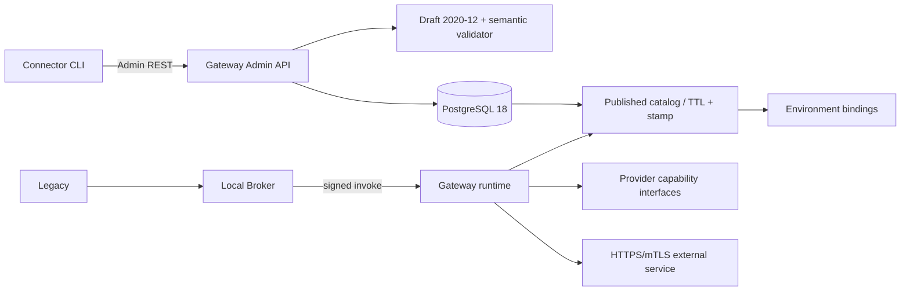

# M4 — Connector Configuration MVP

## Baseline e obiettivo

Baseline: tag `m3a-product-gate-pass-20260805`, commit `5301b61546f814fd32874570ff667218ffe002a2`.

Consentire a uno sviluppatore esterno di definire, validare, importare, pubblicare, invocare e fare rollback di un Connector REST senza modificare il Gateway Core e senza configurare Azure.

## Architettura effettiva

Domain e Application dipendono solo da contratti provider-neutral. Da M5 il seam è fisicamente separato in interfacce per capability e il pack Azure è esterno al grafo Core, come definito da ADR-0019.

## Incrementi

1. JSON Schema v1, sample e canonical checksum.
2. State machine, immutable Published, rollback e optimistic concurrency.
3. Store in-memory/PG e migration additiva.
4. Published-only catalog, binding logici, cache TTL + stamp e fail-closed.
5. Admin API, CLI senza DB e audit redatto.
6. Contract test, PG18, E2E Legacy→Broker→Published Connector→synthetic provider→mTLS mock.
7. Quick start compose, documentazione e open-source hygiene.

## Non-goal

M3B, M5, UI, YAML, plugin, provider aggiuntivi, workflow/scripting, adapter COM/C/Java e Connector Pack reali.

## Gate

Build/test/scans/SBOM/document validation verdi; migration real PG apply/no-op; sample E2E; publication/rollback/cache; quick start clean; evidence redatta fuori repository; nessuna regressione M0–M3A.
