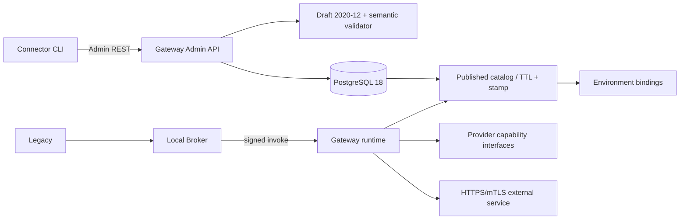

# M4 — Connector Configuration MVP

## Baseline and objective

Baseline: tag `m3a-product-gate-pass-20260805`, commit `5301b61546f814fd32874570ff667218ffe002a2`.

Allow an external developer to define, validate, import, publish, invoke and roll back a REST Connector without changing Gateway Core or configuring Azure.

## Implemented architecture

Domain and Application depend only on provider-neutral contracts. From M5, the seam is physically separated into capability-specific interfaces and the Azure pack is outside the Core dependency graph, as defined by ADR-0019.

## Increments

1. JSON Schema v1, sample and canonical checksum.
2. State machine, immutable Published, rollback and optimistic concurrency.
3. In-memory/PG store and additive migration.
4. Published-only catalog, logical bindings, TTL + stamp cache and fail-closed behavior.
5. Admin API, CLI without DB access and redacted audit.
6. Contract test, PG18, E2E Legacy→Broker→Published Connector→synthetic provider→mTLS mock.
7. Compose quick start, documentation and open-source hygiene.

## Non-goal

M3B, M5, UI, YAML, plugins, additional providers, workflow/scripting, COM/C/Java adapters and real Connector Packs.

## Gate

Green build/tests/scans/SBOM/document validation; real PG migration apply/no-op; sample E2E; publication/rollback/cache; clean quick start; redacted evidence outside the repository; no M0–M3A regressions.
