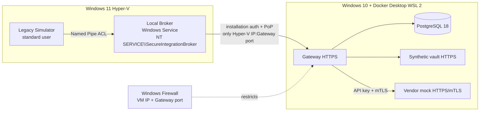

# M3A live gate — split-host runbook

## Status and boundaries

This runbook prepares the manual M3A gate; it does not authorize M3B, M4, merging PR
#3 or using a permanent self-hosted GitHub runner. The candidate commit is always the
full SHA written by `Prepare` into the VM package. A run is valid only if HOST and
VM attest that same SHA.

The gate deliberately uses a manual handoff: `Prepare` stops at
`WAITING_FOR_OPERATOR` and an operator runs one reviewed script in the VM. A generic
SYSTEM executor, autonomous Codex in the VM and perfect laboratory reconstruction
are not M3 criteria; any automation belongs to release qualification.
The Hyper-V checkpoint created before the run is the laboratory's primary recovery mechanism.



PostgreSQL, Vault and the mock are published only on HOST `127.0.0.1`. Gateway is
bound exclusively to the Hyper-V adapter's IPv4 address. The firewall permits inbound
TCP only from the VM IPv4 address and only on the Gateway port.
The VM package contains no PostgreSQL, Vault or mock addresses.

The Windows Firewall profile is not inferred from the VM name or a manually selected
profile: exactly one `Get-NetConnectionProfile` must exist for the HOST IPv4
`InterfaceIndex`. The runner rejects the interface if its profile cannot be resolved
or another active connection uses the same profile. A rule belonging to a disabled
profile does not constitute enforcement.

## HOST prerequisites

- Supported Windows 10 22H2, virtualization and WSL 2 enabled;
- Docker Desktop running with Linux containers and the WSL 2 backend;
- elevated PowerShell 5.1 for firewall and trust-store operations;
- clean, synchronized `m3/production-like-vertical-slice` branch;
- Windows 11 VM Running with stable IPv4 on the Hyper-V network;
- `C:\SecureEvidence` outside the repository.

Non-mutating verification:

```powershell
Set-Location C:\Codice\broker-gateway
$runId = 'm3a-split-' + (Get-Date).ToUniversalTime().ToString('yyyyMMdd-HHmmss')
.\tools\m3\split-host\Invoke-M3ASplitHost.ps1 -Phase ValidateHost -RunId $runId
```

If `M3A_SPLIT_DOCKER_DESKTOP_NOT_INSTALLED` appears, stop. Download the installer
only from the [official Docker Desktop for Windows
page](https://docs.docker.com/desktop/setup/install/windows-install/), check requirements
and obtain user approval for the license, installer and any UAC prompt. This gate
requires the WSL 2 backend and Linux containers. Do not use `--accept-license` without
explicit approval. After startup, select **Use WSL 2 based engine** as described in the
[official WSL documentation](https://docs.docker.com/desktop/features/wsl/) and rerun
`ValidateHost`.

## Network and VM selection

Do not use the VM name as an identifier. In an elevated Hyper-V console:

```powershell
$vmId = [guid]'<UNIQUE-VM-ID>'
$vm = Get-VM -Id $vmId -ErrorAction Stop
$vm | Format-List Name,Id,State,Status,ConfigurationLocation,Path,Uptime
$vm | Get-VMNetworkAdapter | Format-Table Name,SwitchName,Status,IPAddresses
Get-NetIPAddress -AddressFamily IPv4 |
    Where-Object InterfaceAlias -Like 'vEthernet*' |
    Format-Table InterfaceAlias,IPAddress,PrefixLength
```

The run uses a second Hyper-V Internal switch named `M3A-Isolated` and a second
same-named VM NIC. The management NIC connected to Default Switch is neither replaced
nor disconnected. The default configuration, subject to conflict checks, is:

- subnet `192.168.250.0/29`;
- HOST `192.168.250.1/29`;
- VM `192.168.250.2/29`;
- no DHCP, NAT, gateway, DNS or forwarding on the segment;
- DHCP Guard, Router Guard and disabled MAC spoofing on the M3A VM NIC.

The runner records inventory and checkpoint before mutation. A per-run SYSTEM task
restores firewall profiles and Tailscale and removes only the M3A NIC and switch. The
default timeout is 30 minutes; `-RollbackTimeoutMinutes`, validated between 30 and
180 minutes, explicitly reserves a longer operational window for a new run. The UTC
deadline is recorded in state files before mutation. The parameter neither extends
nor replaces tasks for runs already started. Default Switch is outside rollback targets.

Also verify firewall association without mutations:

```powershell
$hostAddress = '192.168.250.1'
$hostNic = Get-NetIPAddress -AddressFamily IPv4 -IPAddress $hostAddress
Get-NetConnectionProfile -InterfaceIndex $hostNic.InterfaceIndex
Get-NetFirewallProfile -PolicyStore ActiveStore -Name Domain,Private,Public |
    Format-Table Name,Enabled
```

`M3A_SPLIT_FIREWALL_PROFILE_UNRESOLVED_DEDICATED_SWITCH_REQUIRED` and
`M3A_SPLIT_FIREWALL_PROFILE_SHARED_DEDICATED_SWITCH_REQUIRED` are pre-handoff
blockers. Do not bypass them with `-Profile Any` or by enabling every profile. Prepare
a dedicated internal Hyper-V network and verify it again; if its profile is shared
with a network the HOST needs, first assess the impact or make the category truly isolated.

## Prepare HOST

```powershell
Set-Location C:\Codice\broker-gateway
git fetch --prune origin
git switch m3/production-like-vertical-slice
git pull --ff-only
$candidate = (git rev-parse HEAD).Trim()
if (git status --porcelain) { throw 'Worktree is not clean' }

$hostHyperVAddress = '192.168.250.1'
$vmAddress = '192.168.250.2'
$vmId = [guid]'5ff35721-5181-4b69-b30a-6ff53fa8c842'
$vmCredential = Get-Credential -UserName 'LabAdmin' `
    -Message 'Local VM credential to configure only the M3A-Isolated NIC'
.\tools\m3\split-host\Invoke-M3ASplitHost.ps1 `
    -Phase Prepare `
    -RunId $runId `
    -CandidateCommit $candidate `
    -HostHyperVAddress $hostHyperVAddress `
    -VmAddress $vmAddress `
    -GatewayPort 28443 `
    -VmId $vmId `
    -VmCredential $vmCredential `
    -IsolatedSwitchName 'M3A-Isolated' `
    -IsolatedVmNicName 'M3A-Isolated' `
    -IsolatedNetworkAddress '192.168.250.0' `
    -IsolatedPrefixLength 29 `
    -RollbackTimeoutMinutes 150
$vmCredential = $null
```

`Prepare`:

- generates per-run synthetic CAs and certificates; the Gateway SAN contains the HOST IP
  and identities actually used by the internal probe (`localhost` and `127.0.0.1`);
- starts Gateway, PostgreSQL 18, Vault and the mock with a per-run Compose project;
- requires `healthy` for Gateway/PostgreSQL as well as live/readiness HTTP 200;
- saves original Domain/Private/Public states, creates a deadline-bound SYSTEM rollback,
  enables only the associated profile and creates a rule limited to interface, VM IP,
  HOST IP and Gateway port;
- verifies the rule in `ActiveStore` and rejects a non-enforcing profile;
- temporarily disables only the HOST Tailscale adapter after rollback activation;
  Private must be associated only with `M3A-Isolated`;
- through PowerShell Direct, verifies management-NIC Internet connectivity and proves
  the VM can reach only HOST `192.168.250.1:28443`, not the same port on Default Switch/LAN
  or PostgreSQL, Vault and the vendor mock;
- produces `C:\SecureEvidence\<RunId>\<RunId>-vm-input.zip` and sidecar;
- transfers the handoff and reviewed script, checks hashes in the VM and returns
  `WAITING_FOR_OPERATOR`, not PASS.

The VM ZIP contains a one-time activation code and is temporary raw material. Do not
upload it to GitHub, include it in redacted evidence or copy it into the repository.
The fail-safe task expires after the timeout selected during `Prepare` (30 minutes
by default): complete the handoff and VM test within that window or clean up and start
a new run with new certificates and activation code. Do not postpone tasks for runs
already started.

Reserve 60–75 continuous minutes for preparation, VM execution, result retrieval,
Finalize and cleanup. The 150-minute window leaves margin for manual input and controlled
cleanup; do not begin VM execution with fewer than 45 minutes remaining.

## Handoff and WAITING_FOR_OPERATOR status

`Prepare` uses PowerShell Direct with only the exact `VMId` and the in-memory
`LabAdmin` credential to copy, without executing:

- synthetic-input ZIP and sidecar;
- `Invoke-M3ASplitVmOperator.ps1` and its SHA-256 sidecar;
- `RUNID.txt`.

The destination is `C:\Lab\M3A\<RunId>`. Hashes are recalculated in the VM; the runner
returns `WAITING_FOR_OPERATOR`, `operatorScriptSha256` and `operatorCommand`. At this
point the HOST starts no privileged task and keeps the stack running.

## Manual VM execution

Follow [M3A split-host — manual execution in the VM](M3A-SPLIT-HOST-CODEX-VM.md).
The operator opens Windows PowerShell 5.1 as administrator and runs one command,
the one returned by `Prepare`. Starting Codex as administrator is unnecessary.

The acceptable result is PASS `RESULT.json` and a **redacted** archive with sidecar,
`vm-manifest.json`, `legacy-simulator.json` and cleanup PASS. Broker must have been
observed Running with the service-SID process token; Legacy Simulator must be a standard
user and must have actually traversed the Named Pipe and HOST Gateway.

The VM result may be transferred through a temporary private GitHub release asset or
an approved administrative channel. Do not commit evidence. For a private release:

```powershell
# in the VM, after verifying that the archive contains only redacted material
$tag = "evidence-$runId"
gh release create $tag --repo marcobiz/secure-integration-platform `
    --prerelease --title "Redacted $runId" --notes "M3A VM redacted evidence only"
gh release upload $tag "C:\SecureEvidence\$runId\$runId-vm-redacted.zip" `
    "C:\SecureEvidence\$runId\$runId-vm-redacted.zip.sha256" `
    --repo marcobiz/secure-integration-platform
```

On the HOST, download into `C:\SecureEvidence\<RunId>\vm-transfer`, verify the sidecar
and extract into `vm-result`. The Git repository is not involved in the transfer.

## Finalize HOST

```powershell
$vmResult = "C:\SecureEvidence\$runId\vm-result"
.\tools\m3\split-host\Invoke-M3ASplitHost.ps1 `
    -Phase Finalize `
    -RunId $runId `
    -CandidateCommit $candidate `
    -HostHyperVAddress $hostHyperVAddress `
    -VmAddress $vmAddress `
    -GatewayPort 28443 `
    -VmResultDirectory $vmResult
```

`Finalize` verifies the VM manifest, runs N01–N14 on the real stack using SecurityDriver,
scans logs and reports using all HOST-known canaries, records image digests, migration
checksums, public fingerprints, SIDs, firewall and scenarios, then cleans up before
creating the redacted bundle.

PASS simultaneously requires:

- P02 and operation-grant denial through the real Broker Service;
- unauthorized local application denied and audited;
- N01 revocation, N03 replay, N04 altered tenant, N07 arbitrary URL, N10 arbitrary secret
  reference and the other SecurityDriver scenarios PASS;
- no activation codes, vendor keys, tokens, passwords or payload canaries in logs;
- zero project containers and volumes, zero temporary firewall rules;
- zero temporary networks and rollback tasks, and exact restoration of original
  Domain/Private/Public states;
- VM attestation with zero remaining test services and tasks.

The result is `C:\SecureEvidence\<RunId>\<RunId>-redacted-evidence.zip` with SHA-256
sidecar. Raw evidence stays outside Git and is subject to laboratory retention policy.

The VM runner also produces `RESULT.json`. A completed path uses `PASS`; a runtime
failure produces a separate `*-vm-redacted-failure.zip` archive with `BLOCKED` status
and only error codes, cleanup and redacted metadata. Partial files are not included and
cannot be interpreted as PASS.

## Emergency cleanup

HOST:

```powershell
.\tools\m3\split-host\Invoke-M3ASplitHost.ps1 -Phase Cleanup -RunId $runId
```

VM, in an elevated console:

```powershell
Set-Location C:\Lab\broker-gateway
.\tools\m3\split-host\Invoke-M3ASplitVm.ps1 -Phase Cleanup -RunId $runId
```

The scripts refuse to delete a service whose binary path is outside the run directory.
A collision with an existing `SecureIntegrationBroker` is a blocker: identify its
properties and ownership before removing it using its own harness.

HOST cleanup removes the rule, containers, volumes and networks, restores all three
firewall states from the per-run record, re-enables Tailscale if originally active,
removes only the VM NIC and `M3A-Isolated` switch and deletes rollback tasks. If the
session ends earlier, the SYSTEM task performs the same restoration at the recorded
deadline, without persisted passwords. A result with `firewallProfileRestored=false`
or `isolatedNetworkRestored=false` is not PASS.
