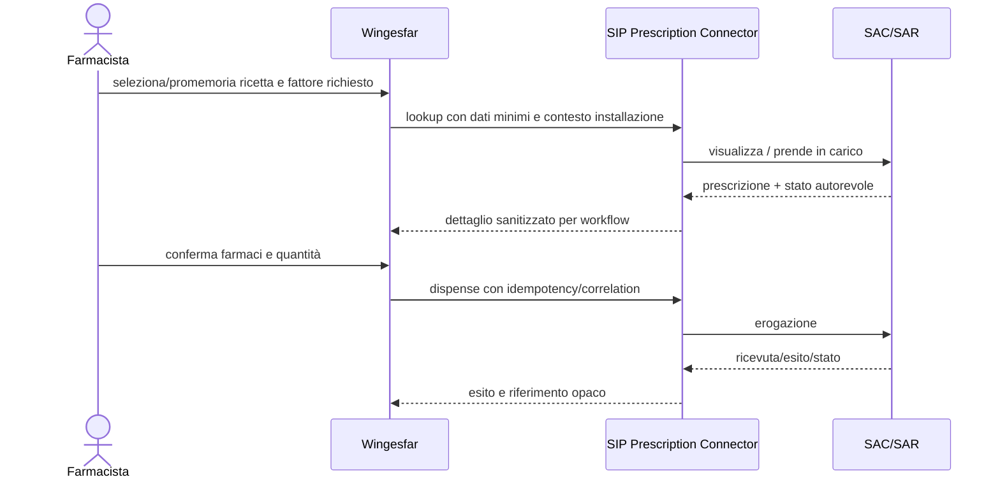
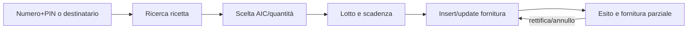

# CGM business capability map

## Capability osservate

| Famiglia | Operazioni dimostrate | Non dimostrato / limite | Seam | Provenance |
|---|---|---|---|---|
| FSE2 producer | Validate; nel target ufficiale create, replace, delete, metadata update, validate+create/replace, status workflow/trace | Wingesfar producer non osservato; drCLOUD prova direttamente solo validation e producer regionali | D-07, D-09, D-11 | `LEGACY_CODE_DRCLOUD`, `OFFICIAL_CURRENT` |
| ePrescription farmacia | Retrieve/view, take in charge, dispense, partial state, suspend, cancel, monthly report, deferred flows, RBE; profili regionali con consenso/DCR | Un unico contratto uniforme fra regioni non è dimostrato | W-01..W-08 | `LEGACY_CODE_WINGESFAR` |
| ePrescription prescrittore | Create/send, white prescription, view, cancel, request NRE lot, request OTP | Dispensing da drCLOUD non osservato | D-01..D-05 | `LEGACY_CODE_DRCLOUD` |
| FSE consumer | Search/query, retrieve/download; consensi e disclosure in alcuni profili | Patient summary come API distinta non dimostrato; GTW non copre consumer | W-09..W-14, D-06, D-08, D-10 | `LEGACY_CODE_WINGESFAR`, `LEGACY_CODE_DRCLOUD`, `OFFICIAL_CURRENT` |
| VetInfo | Search by number/PIN or recipient, insert/update/delete/search supply, retrieve PDF; AIC, lot, expiry and partial completion nel target ufficiale | Auth ufficiale di onboarding non completamente pubblico | W-15, W-16 | `LEGACY_CODE_WINGESFAR`, `OFFICIAL_CURRENT` |
| Health expenses / 730 | Async file send, sync insert/update, status, receipt PDF, error detail; mediated protocol/status | Regole correnti di accreditamento da acquisire | W-17, W-18 | `LEGACY_CODE_WINGESFAR` |
| DPC | Token, verify/confirm prescription insertion, detail, dispense, active prescriptions v1/v2, reopen, bind v1/v2, AIFA variants | Reservation/order/receive/stock/reconciliation non dimostrati in WgDPC | W-19 | `LEGACY_CODE_WINGESFAR` |
| WebCare / assistenza integrativa | Work session, movement/dispensing import, unreceipted movements, pre-accounting, accounting, listino, events; allowance/celiac profile | Authorization plan/residual update semantics non uniformi tra profili | W-20, W-21 | `LEGACY_CODE_WINGESFAR` |
| Vaccination | Set/register and delete | Lookup, correction e reporting esistono in client ONIT compilati ma non nel client attivo Abruzzo | D-12 | `LEGACY_CODE_DRCLOUD`, `NEEDS_CHARACTERIZATION` |
| Certificato malattia | Send, search, cancel, correct | Current official contract/accreditation non acquisito | D-13 | `LEGACY_CODE_DRCLOUD`, `NEEDS_CHARACTERIZATION` |
| Assistiti/esenzioni | Extended patient identification, exemptions lookup | Nessun write osservato | D-14 | `LEGACY_CODE_DRCLOUD` |
| NSO mediato | Create order, list/count, retrieve document, dispatch state | Accesso diretto NSO, receive e reconciliation non provati | W-22 | `LEGACY_CODE_WINGESFAR` |

## Flusso 1 — dispensazione ricetta SSN

- Input gestionale: NRE/promemoria, farmaci/quantità, decisione del farmacista (`LEGACY_CODE_WINGESFAR`).
- Input server-owned: tenant/installazione, endpoint, credential/certificate binding, policy/grant (`INFERRED`, coerente con ADR SIP).
- User interaction: sessione/MFA quando richiesta; non implica Broker (`OFFICIAL_CURRENT`).
- Stato: presa in carico e stato ricetta sono esterni; token/sessione e correlation restano opachi nel Gateway (`INFERRED`).
- Errori: il legacy restituisce fault applicativi e file risultato/errore; SIP deve normalizzare Problem Details senza payload clinico o stack trace (`LEGACY_CODE_WINGESFAR`, `INFERRED`).
- Retry: prima interrogare lo stato per write con esito ambiguo; non ripetere una dispensazione alla cieca (`INFERRED`).

## Flusso 2 — FSE consumer regionale

1. L'operatore avvia login/challenge se il profilo lo richiede (`LEGACY_CODE_WINGESFAR`).
2. Wingesfar invia criteri di ricerca e contesto paziente al connector; endpoint, certificati e client secret non sono client-selectable (`INFERRED`).
3. Il profilo regionale costruisce REST o XDS/WS-Security e ricerca i documenti (`LEGACY_CODE_WINGESFAR`).
4. L'utente seleziona un risultato; il connector recupera il documento e restituisce contenuto/metadata secondo grant (`LEGACY_CODE_WINGESFAR`, `INFERRED`).
5. Consent/disclosure sono operazioni separate solo nei profili in cui sono osservate; non vanno aggiunte al core comune (`LEGACY_CODE_WINGESFAR`).

Il GTW FSE 2.0 non sostituisce questo flusso: è un'interfaccia producer e di stato transazione (`OFFICIAL_CURRENT`).

## Flusso 3 — FSE2 producer

1. drCLOUD produce il documento e i metadata clinici; l'attuale route osservata invoca una validazione CGM (`LEGACY_CODE_DRCLOUD`).
2. Nel target, SIP valida CDA2 sul GTW con mTLS e due JWT firmati tramite provider (`OFFICIAL_CURRENT`, `INFERRED`).
3. Se valido, SIP crea o sostituisce il documento; conserva `workflowInstanceId`/`traceId` come stato tecnico opaco (`OFFICIAL_CURRENT`).
4. Stato e fault sono recuperati dalle API ufficiali; il retry di publication usa reconciliation, non replay cieco (`OFFICIAL_CURRENT`, `INFERRED`).

FHIR validation è documentata nel manuale 2.23, ma la matrice locale ufficiale non la considera una capability di produzione da promettere senza nuova verifica (`OFFICIAL_CURRENT`, `NEEDS_CHARACTERIZATION`).

## Flusso 4 — fornitura veterinaria

Il codice Fido dimostra ricerca, insert/update/delete/search e PDF; la fonte ufficiale conferma numero/PIN, AIC, lotto, scadenza e completamento dopo fornitura parziale. Il legacy usa un password grant e token in memoria/disco: il target deve seguire l'accreditamento moderno e non copiare quel grant (`LEGACY_CODE_WINGESFAR`, `OFFICIAL_CURRENT`).

## Flusso 5 — DPC

- Wingesfar acquisisce ricetta e farmacia/stazione; SIP risolve credenziali e route (`LEGACY_CODE_WINGESFAR`, `INFERRED`).
- Il client ottiene un token, verifica e conferma l'inserimento, recupera dettaglio/stato e registra l'erogazione (`LEGACY_CODE_WINGESFAR`).
- La riapertura e l'associazione prescrizione sono transizioni esplicite. Le varianti AIFA condividono la stessa seam ma non sono automaticamente lo stesso contract (`LEGACY_CODE_WINGESFAR`).
- Ordini, ricezione merce, stock e riconciliazione non sono dimostrati: `NEEDS_CHARACTERIZATION`.

## Flusso 6 — WebCare/assistenza integrativa

1. Login username/password o uso di token esistente.
2. Recupero sessione di lavoro/movimenti o allowance del profilo.
3. Conferma erogazione e associazione scontrino/movimento.
4. Aggiornamento implicito del residuo nel sistema esterno, ove previsto dal profilo.
5. Precontabilità/contabilizzazione/report e listino.

Le operazioni 1, 2, 3 e 5 sono osservate; la semantica uniforme di “residuo” è `NEEDS_CHARACTERIZATION`. Il lettore CNS presente nel modulo è un helper di acquisizione e non prova che ogni transazione WebCare richieda il Broker.

## Vector clean-room candidati

Non sono stati creati test o copiati payload. I seguenti vector sintetici possono essere prodotti dopo accesso alle specifiche ufficiali:

| Vector | Request shape sintetico | Response/fault shape | Stato atteso |
|---|---|---|---|
| RX-LOOKUP-OK | riferimento ricetta fittizio + contesto operazione | lista righe farmaco sintetiche + stato | `AVAILABLE → IN_CHARGE` |
| RX-DISPENSE-AMBIGUOUS | correlation fittizia + una riga AIC sintetica | timeout dopo invio | query stato prima del retry |
| FSE-SEARCH-EMPTY | paziente sintetico + intervallo | zero documenti, nessun fault | stateless |
| FSE2-VALIDATION-ERROR | CDA sintetico non conforme | error code e path redatti | workflow non creato |
| VET-PARTIAL | ricetta sintetica + AIC/lotto/scadenza fittizi | quantità residua | `OPEN → PARTIALLY_SUPPLIED` |
| DPC-REOPEN | id prescrizione sintetico + correlation | esito o conflitto di stato | `DISPENSED → REOPENED` se ammesso |
| WEBCARE-ALLOWANCE | piano sintetico + prodotto | allowance/residuo sintetico | aggiornamento atomico da verificare |

I vector dovranno contenere solo identificativi non reali e nessuna costante proprietaria. La nuova implementazione sarà separata e basata su specifiche ufficiali e test comportamentali.
