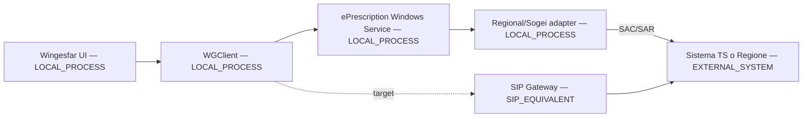
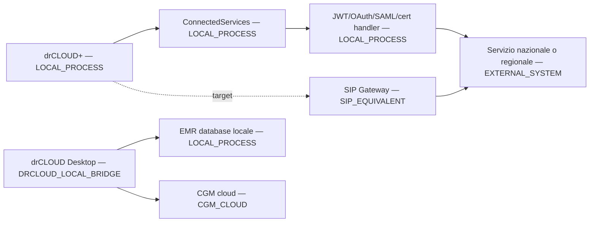

# CGM healthcare integration inventory

**Stato:** research baseline, 8 agosto 2026

**Ambito:** Wingesfar e drCLOUD; analisi statica e documentale, nessuna chiamata a servizi sanitari

**Decisione di conteggio:** 38 integration seam confermate, 23 Wingesfar e 15 drCLOUD

## Regole di lettura

Una *seam* è un confine sostituibile definito da caller, sistema esterno, profilo di autenticazione e responsabilità di stato. Non è una DLL, un URL o una singola operazione. Due URL dello stesso profilo non aumentano il conteggio; due caller o due profili di sicurezza diversi sì.

Le 38 seam comprendono 26 regionali, 10 nazionali e 2 servizi CGM privati. Otto ulteriori famiglie trovate nel catalogo compilato drCLOUD sono `NEEDS_CHARACTERIZATION` e non entrano nei conteggi. La mappa canonica è [CGM-INTEGRATION-SEAM-MAP.md](CGM-INTEGRATION-SEAM-MAP.md).

## Modello delle fonti

| Fonte | Uso | Provenance | Limite |
|---|---|---|---|
| Repository ufficiale Ministero della Salute, `it-fse-support`, Gateway 2.23 | Target FSE 2.0 producer | `OFFICIAL_CURRENT` | Non copre ricerca/recupero FSE né dispensazione |
| Decreto MEF 27 febbraio 2025, GU n. 57/2025 | SAC/SAR e autenticazione forte ricetta SSN | `OFFICIAL_CURRENT` | Non definisce i profili regionali di dettaglio |
| Help ufficiale VetInfo, aggiornato nel 2026 | Flusso di fornitura veterinaria | `OFFICIAL_CURRENT` | Le credenziali di accreditamento non sono pubbliche |
| `input-docs/research/**` | Snapshot verificato delle fonti FSE 2.0 | `OFFICIAL_CURRENT` o `OFFICIAL_HISTORICAL`, come marcato nei file | Cut-off locale 7 agosto 2026 |
| `Autenticazione Servizi Pubblici-v31-20260610_113319.pdf` | Profili osservati/forniti per sistemi nazionali e regionali | `REVERSE_ENGINEERING_REPORT` | Documento di supporto, non fonte normativa |
| `CYBERSICUREZZA_WINGESFAR.md` e `REPORT_SICUREZZA_CGM_DRCLOUD.md` | Indici, configurazioni e ipotesi da verificare sul codice | `REVERSE_ENGINEERING_REPORT` | Le conclusioni non diventano ufficiali per derivazione |
| Binari, decompilato, factory, registrazioni e configurazioni Wingesfar | Call chain Wingesfar | `LEGACY_CODE_WINGESFAR`, `LEGACY_CONFIG` | L'installazione esaminata non prova il rollout in ogni farmacia |
| `cgm.Addons.ConnectedServices.dll` e artefatti drCLOUD | Call chain e catalogo drCLOUD | `LEGACY_CODE_DRCLOUD`, `LEGACY_CONFIG` | Una classe compilata senza registrazione non è conteggiata come attiva |
| Deducibilità architetturale | Target SIP o responsabilità probabile | `INFERRED` | Rimane esplicitamente non confermata |

Link ufficiali ricontrollati l'8 agosto 2026:

- [FSE 2.0 - Interfacce REST Gateway 2.23](https://github.com/ministero-salute/it-fse-support/blob/main/doc/integrazione-gateway/README.md) (`OFFICIAL_CURRENT`);
- [Decreto 27 febbraio 2025 - SAC/SAR e autenticazione a due o più fattori](https://www.gazzettaufficiale.it/atto/vediMenuHTML?atto.codiceRedazionale=25A01494&atto.dataPubblicazioneGazzetta=2025-03-10&tipoSerie=serie_generale&tipoVigenza=originario) (`OFFICIAL_CURRENT`);
- [VetInfo - fornitura di medicinali veterinari](https://www.vetinfo.it/help/farmaco/help/fornitura) (`OFFICIAL_CURRENT`).

## Inventario statico focalizzato sulle call chain

| Gruppo | Artefatti rappresentativi | Classificazione | Ruolo osservato | Provenance |
|---|---|---|---|---|
| ePrescription Wingesfar | `ePrescription.Client.WGClient`, servizio Windows, `Server.Core`, adapter Sogei/Bolzano/Emilia-Romagna/Lombardia/Piemonte/Puglia/Sardegna/Trento/Veneto | `HEALTHCARE_INTEGRATION`, `TRANSPORT`, `DATA_MAPPING` | Facciata locale, selezione regionale, chiamate SAC/SAR, sessione e report | `LEGACY_CODE_WINGESFAR` |
| FSE Wingesfar | `Fse.exe`, `WgFse.Common`, `WgFse.Domain`, `WgFse.Ws`, profili XML | `HEALTHCARE_INTEGRATION`, `AUTHENTICATION` | Query/recupero XDS o REST, consensi e profili regionali | `LEGACY_CODE_WINGESFAR`, `LEGACY_CONFIG` |
| Veterinaria | `Fido.*`, adapter MdS e Sogei, profili prod/test | `HEALTHCARE_INTEGRATION`, `AUTHENTICATION` | Ricerca ricetta, inserimento/rettifica/annullamento fornitura, PDF | `LEGACY_CODE_WINGESFAR`, `LEGACY_CONFIG` |
| Spese sanitarie | `ServiziSS730P`, wrapper CGM, `PromofarmaService` | `HEALTHCARE_INTEGRATION`, `TRANSPORT` | Invio sincrono/asincrono, aggiornamento, stato, ricevuta ed errori | `LEGACY_CODE_WINGESFAR` |
| DPC | `WgDPC.WebDPC`, `WgDPC.WGClient`, `WgWebDpc` | `HEALTHCARE_INTEGRATION` | Token, verifica/conferma, dettaglio, erogazione, riapertura e associazione | `LEGACY_CODE_WINGESFAR` |
| WebCare | `WGWebcare`, `WGWebcare.WGClient`, `WGGOpenCare`, `WGGPack`, plugin Voyager | `HEALTHCARE_INTEGRATION`, `LOCAL_HARDWARE` | Sessione di lavoro, movimenti, erogazioni, precontabilità, listini e celiachia | `LEGACY_CODE_WINGESFAR` |
| NSO mediato | `Enerj.WgClient`, `EnerjApiConnector`, `EnerJ.WebService` | `CGM_BACKEND`, `TRANSPORT` | OAuth client credentials verso Enerj/CGM, creazione/lettura/stato ordine | `LEGACY_CODE_WINGESFAR` |
| Cloud ricette CGM | `WgInvioDistinta.RicetteInCloud` | `CGM_BACKEND` | Busta e stato verso backend CGM, non API sanitaria ufficiale | `LEGACY_CODE_WINGESFAR` |
| drCLOUD healthcare SDK | `cgm.Addons.ConnectedServices.dll`, `Prescription.dll` | `HEALTHCARE_INTEGRATION`, `TRANSPORT`, `DATA_MAPPING`, `AUTHENTICATION` | Client nazionali/regionali registrati dal bootstrapper | `LEGACY_CODE_DRCLOUD` |
| Certificati drCLOUD | `cgm.Addons.Certificates.Mobile.dll`, handler firma/JWT/SAML | `AUTHENTICATION` | Risorse e operazioni crittografiche condivise | `LEGACY_CODE_DRCLOUD` |
| drCLOUD Desktop | servizio/processo locale su loopback e connettori DB EMR | `CGM_BACKEND`, `LOCAL_HARDWARE` | Estrazione da DB locali e sincronizzazione CGM cloud | `LEGACY_CODE_DRCLOUD`, `REVERSE_ENGINEERING_REPORT` |
| Supporto | JSON/REST/WCF/IdentityModel/BouncyCastle/SQLCipher/PCSC | `TRANSPORT`, `AUTHENTICATION`, `LOCAL_HARDWARE` | Dipendenze tecniche; non sono connector | `LEGACY_CODE_WINGESFAR`, `LEGACY_CODE_DRCLOUD` |

Sono presenti EXE, servizi Windows, assembly .NET, configurazioni XML/JSON/INI, proxy SOAP/WSDL generati, cataloghi endpoint e risorse certificate. Non è emersa una call chain sanitaria Java/JAR o COM autonoma. PC/SC e store certificati Windows sono trattati come capability locali, non come connector.

## Sistemi esterni osservati

Gli hostname pubblici sono raggruppati per sistema; endpoint privati CGM/Enerj restano descritti per classe e non per URL.

| Sistema/piattaforma | Protocollo | Famiglie operative | Caller | Diretto/mediato | Ambiente | Provenance |
|---|---|---|---|---|---|---|
| Sistema TS SAC | SOAP/XML | Ricetta SSN/RBE: lookup, presa in carico, erogazione, sospensione, annullamento, report; prescrizione drCLOUD | Wingesfar, drCLOUD | Diretto | Prod/test configurati | `LEGACY_CODE_WINGESFAR`, `LEGACY_CODE_DRCLOUD`, `LEGACY_CONFIG` |
| SAR regionali | SOAP o REST | Prescrizione/erogazione e funzioni regionali | Wingesfar, drCLOUD | Diretto | Prod/test, a seconda del profilo | `LEGACY_CODE_WINGESFAR`, `LEGACY_CODE_DRCLOUD`, `LEGACY_CONFIG` |
| FSE regionali | XDS.b/SOAP o REST | Ricerca, recupero, consensi; due seam drCLOUD anche producer | Wingesfar, drCLOUD | Diretto | Prod/test | `LEGACY_CODE_WINGESFAR`, `LEGACY_CODE_DRCLOUD`, `LEGACY_CONFIG` |
| Gateway FSE 2.0 | REST/CDA2 | Validazione osservata; target include lifecycle producer | drCLOUD | Mediato da servizio CGM per la validazione osservata | Configurato | `LEGACY_CODE_DRCLOUD`, `OFFICIAL_CURRENT` |
| VetInfo/MdS | REST; SOAP alternativo Sogei | Ricerca e fornitura veterinaria, rettifica, annullamento, PDF, AIC/lotto/scadenza | Wingesfar/Fido | Diretto o alternativa Sogei | Prod/test | `LEGACY_CODE_WINGESFAR`, `LEGACY_CONFIG`, `OFFICIAL_CURRENT` |
| Sistema TS spese sanitarie | REST/MTOM | Inserimento, modifica, invio file, stato, ricevute | Wingesfar | Diretto | Prod/test | `LEGACY_CODE_WINGESFAR`, `LEGACY_CONFIG` |
| Promofarma/Federfarma | SOAP/REST proprietario | Spese sanitarie e flussi DCR | Wingesfar | Mediato | Configurato | `LEGACY_CODE_WINGESFAR` |
| WebDPC | REST | Prescrizioni DPC, verifica/conferma, riapertura, AIFA | Wingesfar | Diretto | Configurato | `LEGACY_CODE_WINGESFAR`, `LEGACY_CONFIG` |
| WebCare/GOpenCare/GPack | SOAP/REST proprietario | Piani/movimenti, erogazioni, contabilizzazione, listini, celiachia | Wingesfar | Diretto | Configurato | `LEGACY_CODE_WINGESFAR`, `LEGACY_CONFIG` |
| Enerj/CGM NSO | REST OAuth e WCF | Creazione ordine, lista/documento, stato di dispatch | Wingesfar | Mediato; non chiamata diretta al nodo nazionale | Configurato | `LEGACY_CODE_WINGESFAR`, `LEGACY_CONFIG` |
| Vaccinazioni Abruzzo | REST/FHIR-like bundle | Inserimento/cancellazione | drCLOUD | Diretto | Configurato | `LEGACY_CODE_DRCLOUD` |
| Sistema TS malattia | SOAP | Invio, ricerca, annullamento, rettifica certificato | drCLOUD | Diretto | Configurato | `LEGACY_CODE_DRCLOUD` |
| Lombardia assistiti/esenzioni | SOAP/REST regionale | Identificazione e consultazione esenzioni | drCLOUD | Diretto | Configurato | `LEGACY_CODE_DRCLOUD` |
| CGM NAIS/Helios e cataloghi CGM | REST | Trace documentale/dashboard e vie di somministrazione | drCLOUD | CGM cloud | Configurato | `LEGACY_CODE_DRCLOUD` |

### Domain catalog osservato

| System group | Public hostname/domain observed | Note | Provenance |
|---|---|---|---|
| Sistema TS SAC | `demservice.sanita.finanze.it`, `demservicetest.sanita.finanze.it` | Production e test legacy | `LEGACY_CONFIG` |
| VetInfo legacy | `auth.izs.it`, `authtest.izs.it`, `ws.izs.it`, `wstest.izs.it` | Auth/API legacy; non implicano target auth corrente | `LEGACY_CONFIG` |
| Lombardia integration | `api.integrazione.lispa.it`, `api.lispa.it` | Catalogo Lombardia osservato | `LEGACY_CONFIG` |
| WebDPC | `lombardia.webdpc.it`, `demo-lombardia.webdpc.it`, `piemonte.gopendpc.it`, `liguria.gopendpc.it` | Piattaforme regionali/vendor | `LEGACY_CONFIG` |
| WebCare/GOpenCare/GPack | `lombardia.webcare.it`, `service.wsdpc.goodmen.it`, `goodmen.it`, `gocpiemonte.goodmen.it`, `gpack.gopencare.it` | Profili assistenza/DPC osservati | `LEGACY_CONFIG` |
| Celiachia Piemonte | `celiachia.sistemapiemonte.it` | Profilo assistenza integrativa | `LEGACY_CONFIG` |
| CGM/Enerj private services | `[REDACTED-PRIVATE-HOST]` | Host privati non necessari alla definizione di un connector pubblico | `LEGACY_CONFIG` |

Sono esclusi dal catalogo i domini di documentazione, CRL, librerie, social/CDN e `localhost`: non sono destinazioni sanitarie. Gli endpoint runtime dovranno comunque provenire da binding server-owned pubblicati, non da questa lista storica.

## Call graph principali

Il secondo grafo mostra una separazione essenziale: il bridge desktop su loopback sincronizza dati EMR con CGM cloud, mentre il client healthcare mobile usa direttamente `ConnectedServices`. Non è provato un percorso generale `Wingesfar → drCLOUD Desktop → servizio sanitario`.

## Codice compilato non contato come integrazione attiva

| Famiglia | Evidenza | Classificazione | Confidence |
|---|---|---|---|
| Campania/SORESA prescrizioni e piani terapeutici | Client e configurazioni presenti, assenti dal bootstrapper principale osservato | `NEEDS_CHARACTERIZATION` | Media |
| Vaccinazioni ONIT Marche/Sicilia/Sardegna | Client multi-regione compilati; solo Abruzzo è registrato come `IVaccinazioneClient` | `NEEDS_CHARACTERIZATION` | Alta |
| Umbria prescrizione | Client dual-JWT/mTLS presente, non registrato nel bootstrapper principale | `NEEDS_CHARACTERIZATION` | Media |
| Bolzano vaccinazioni/consensi/firma | Classi compilate; nessuna prova di invocazione dall'app AOT | `NEEDS_CHARACTERIZATION` | Media |
| Trento FSE/portale | Client e modelli presenti, non registrati | `NEEDS_CHARACTERIZATION` | Media |
| Lazio assistiti | Client presente; non registrato | `NEEDS_CHARACTERIZATION` | Media |
| Piani terapeutici Sogei/NAIS | Client presenti; nessuna registrazione primaria osservata | `NEEDS_CHARACTERIZATION` | Media |
| DOGE/Molise/STS add-on separati | Artefatti di ecosistema citati dal report, non call chain drCLOUD+ provata | `NEEDS_CHARACTERIZATION` | Bassa-media |

## Obsoleto, fallback e compatibilità

| Componente | Valutazione | Base | Confidence |
|---|---|---|---|
| Profilo Umbria FSE v1 STS/SAML accanto al profilo dual-JWT/mTLS | Probabile superseded/fallback; non dichiarato dead | Factory/configurazioni parallele | Media |
| Adapter ePrescription `PF` | Fallback legacy ancora referenziato da rami di selezione | Call reference, non solo nome | Media-alta |
| `eprescriptionNoDotNet452` | Pacchetto di compatibilità runtime, non nuova integrazione | Duplicazione di artefatti | Alta |
| Configurazioni mock/local/test | Test-only, escluse dalle seam di produzione | Nome, ambiente e factory | Alta |
| Client drCLOUD non registrati | Candidate, non dead | Presenza compilata senza registration/call site AOT | Alta |
| drCLOUD Desktop localhost | Attivo per sync EMR, ma fuori dal percorso sanitario pubblico | Responsabilità e destinazione osservate | Alta |

## Controllo dati sensibili e clean-room

Nessun valore di credenziale, token, certificato, chiave, connection string o dato paziente è riportato. I soli marker ammessi sono `[REDACTED-SECRET]`, `[REDACTED-CERTIFICATE]` e `[REDACTED-TOKEN]`. L'analisi descrive comportamento, forma del contratto e transizioni; una futura implementazione dovrà usare specifiche ufficiali e vector sintetici, non corpi metodo o costanti proprietarie.
