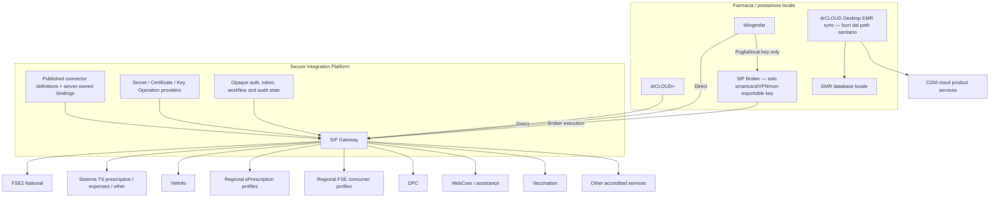
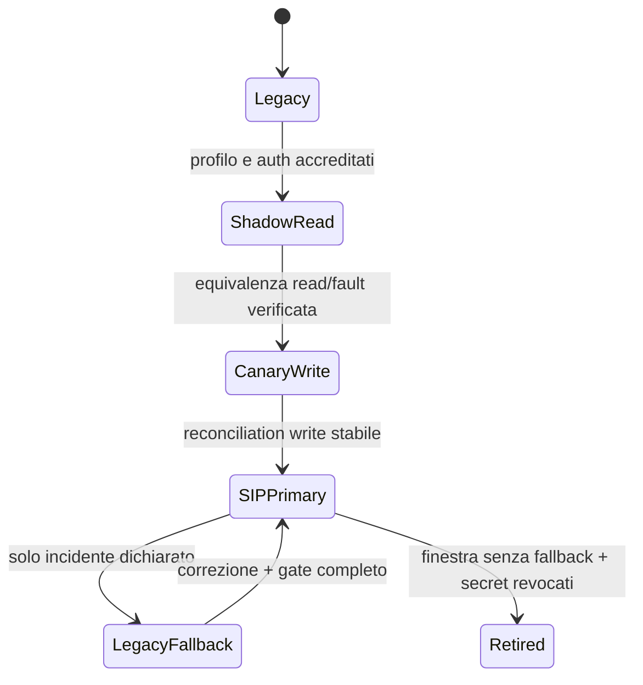

# CGM target architecture

## Target

## Execution mode

| Scenario | Mode | Ragione |
|---|---|---|
| Credenziali/certificati centralizzabili, OAuth, Basic, JWT, mTLS | `GATEWAY` | Custodia e routing server-side; nessun requisito hardware locale |
| Smartcard/PIN e VPN Puglia | `BROKER_LOCAL` | Device e rete sono realmente locali |
| Browser/app callback | `DIRECT` verso Gateway con user interaction | Il callback non richiede un proxy locale generico |
| Certificato non esportabile | `HYBRID` | Gateway orchestra, Broker esegue key operation |
| drCLOUD Desktop EMR sync | Fuori SIP healthcare | Data extraction/product sync, non connector pubblico |

## Trasferimento delle responsabilità

| Oggi | Target | Effetto |
|---|---|---|
| Endpoint e profilo in config/app | Definizione pubblicata e binding server-owned | Il client non sceglie la destinazione |
| Password/client secret locali | `ISecretProvider` | Riduzione secret distribuiti |
| PFX/store/app certificate | `ICertificateProvider`/`IKeyOperationProvider` | Custodia separata dall'uso |
| Token/sessioni in memoria o disco client | Cache runtime cifrata e opaca Gateway | Expiry e audit centralizzati |
| OAuth helper per prodotto | Auth challenge SIP | PKCE/state/replay uniformi |
| JWT/SAML/HMAC/XML signing nei moduli | Key operations provider-neutral | Niente private key nel connector |
| Factory regionale distribuita | Connector definition + profile | Rollout, checksum e four-eyes publication |
| FSE producer Lombardia/Sardegna | FSE2 national lifecycle | Due seam regionali ritirate |
| FSE consumer regionale | Adapter regionale dedicato | Resta separato da FSE2 |
| drCLOUD CGM trace/cataloghi | CGM cloud | Non contaminano il Core SIP |

## Boundary di sicurezza

- Wingesfar e drCLOUD inviano solo operation input e riferimenti di workflow; tenant/installazione, endpoint, secret e certificate binding derivano da stato autenticato server-side.
- Il Gateway applica grant deny-by-default per connector/operation e restricted egress.
- Provider separati per secret retrieval interno, certificate use, key/signing e MAC; nessuna capability `GetSecret` per client, Broker o Admin UI.
- Il Broker riceve un task firmato e allowlisted, non un URL arbitrario o una reference scelta dal caller.
- Audit solo metadata; payload clinici, token, cookie, authorization header, PIN e stack trace non sono evidenza.
- Publication immutabile, checksum-specific e four-eyes prima del rollout CGM.

## Stato e disponibilità

Il Gateway deve persistere correlation, idempotency e stato tecnico senza duplicare lo stato clinico autorevole. Token e challenge hanno expiry e cache effimera/cifrata. Se una definizione pubblicata o un provider non è disponibile, l'esecuzione fallisce chiusa; non effettua fallback silenzioso a endpoint o credenziali locali.

## Strategia di coesistenza

Il fallback è esplicito e temporaneo. Il retirement include revoca/rotazione dei secret legacy, rimozione della route e prova che nessuna factory/config la selezioni più.
