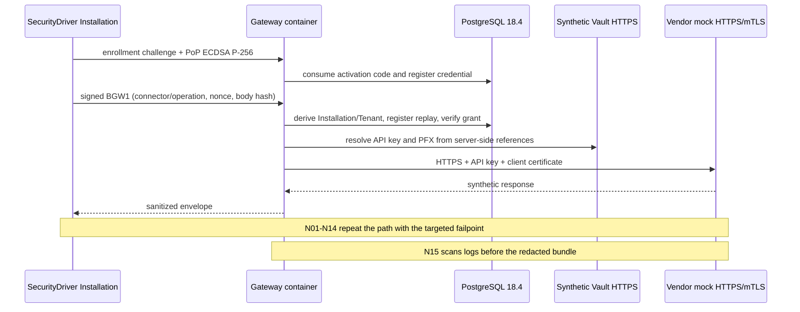

# M3 — Production-like vertical slice Gate Review

Review date: 2026-08-04

Starting baseline: `m2-gateway-baseline-2026-08-04` (`abee866e683ed38b2a2c8350288c7a93ab0550ff`)

Tested implementation commit: `91963cedca1a5c4165aa3c751c08d48755c6fc9f`

Pull request: `#3`, branch `m3/production-like-vertical-slice`

CI: run `30903757495`

## Updated result for the Core/Deployment Pack strategy

**M3A product gate PASS. GO for M4 Core. M3B is non-blocking.**

The deterministic container portion and M3A split-host product gate are PASS: real Gateway,
PostgreSQL 18.4, synthetic HTTPS Vault, HTTPS/mTLS vendor mock, enrollment, positive
path, real Broker Windows Service, standard-user Legacy, 14 application negatives and
correlated canary/log scans. Redacted bundles are outside the repository and verified.

M3B qualification still requires an Azure dev environment, federated OIDC, Managed
Identity and real Key Vault. Since 2026-08-05, it is classified as a gate of the separate Azure Deployment
Pack, not a requirement of the provider-neutral Gateway Core. M4 uses
tag `m3a-product-gate-pass-20260805` on the attested product gate as its baseline. This sequencing
change does not turn M3B into PASS and does not authorize starting M5.

## Simplified M3A gate scope

The Gate Review distinguishes product properties from laboratory automation. The
gate does not measure Codex's ability to acquire an elevated token and does not require a
generic privileged orchestrator.

| Class | Content | Effect on gate |
|---|---|---|
| A — mandatory product | Real Windows Service, StartName `NT SERVICE\SecureIntegrationBroker`, effective service SID, standard-user Legacy, complete P02, installation authentication, server-side tenant, operation grant, revocation, replay, API key/mTLS only in Gateway, rejection of client-side URLs/secret references, redaction and cleanup | Every item must have live PASS evidence; a failure blocks M3A |
| B — useful laboratory | Hyper-V checkpoint, isolated network, targeted firewall, assisted rollback, pre-disabled Tailscale, handoff and sidecar | Improves repeatability and operational safety; an automation limitation does not invalidate the product if isolation and cleanup are manually verified |
| C — future automation | Autonomous VM Codex, generic SYSTEM executor, fully automatic rollback, fully automated Tailscale/firewall-profile management, lab recreated for each run, formal evidence for every preparatory attempt | Deferred to release qualification; not an M3 blocker |

The approved flow is HOST `Prepare` → `WAITING_FOR_OPERATOR` → single PowerShell
5.1 script manually executed in the VM administrative console → acquire `RESULT.json` and redacted
ZIP → HOST `Finalize` → cleanup. The script is produced by the repository, transferred with
SHA-256, contains no secrets, does not print the bootstrap and executes `ValidateVm` before
`Run`. The Hyper-V checkpoint is the primary recovery mechanism.

The SYSTEM executor prototype, stopped before becoming a requirement, is preserved
without rewriting in branch `experimental/m3a-system-executor`, commit
`b081c527186d4b66b1c03511c0c17856b9ea217a`. It is not part of the M3 candidate commit and
is not required to declare M3A PASS.

## Commit lineage and review

History from M2 is linear and contains no merges, rebases or squashes.

| Commit | Content/review |
|---|---|
| `4078c01` | Architecture, plan, runbook and evidence contract before code |
| `5d200d9` | Production Broker invoker: non-exportable CNG P-256, enrollment and BGW1; Gateway combined API key+mTLS and App Service boundaries |
| `11bb465` | Fixtures, Compose, Windows orchestrator, SecurityDriver, Legacy Simulator, Bicep and M3A job |
| `5d32968` | Removed reference to a nonexistent Bicep action; validation through official Azure CLI |
| `03dfd98` | Lock files included in Docker restores; only the ordinary E2E client timeout raised to 15 s, leaving the dedicated deadline test at 150 ms |
| `2b3faee` | Manual M3B workflow with OIDC, protected environment, Managed Identity, Key Vault and resource-group cleanup |
| `1c9b7c0` | `M3Testing` may use only the per-run synthetic HMAC; Production continues to require Key Vault; startup regression test added |
| `022d12c` | Explicit TLS DNS aliases for Vault/vendor and consistent HTTPS probe; no TLS validation disabled |
| `5b7fc57` | Synthetic CA emitted as real PEM; previous trust failure eliminated without `-k` or permissive callbacks |
| `1c2752b` | Atomic revocation retained but split into individual Npgsql prepared commands; no control or grant weakened |
| `dd3602e` | Redacted CI bundle retained before cleanup, with declared scope and digest |
| `953b7a7` | Evidence bound to `CANDIDATE_COMMIT_SHA` and checkout assertion; synthetic PR merge SHA no longer used as product identity |
| `91963ce` | Enriched manifest and ZIP finalized only after cleanup PASS with zero residual containers/volumes |
| `d88be56` | SHA-256-verified operator handoff, `WAITING_FOR_OPERATOR`, single VM script and regression test; no SYSTEM executor |

All fixes derive from preserved blocked runs (`30900135811`, `30900263348`,
`30901085026`, `30901570191`, `30902042566`, `30902477494`). None introduces authentication,
authorization, TLS, egress or redaction bypasses.

## M3A container evidence

HOST bundle: `C:\SecureEvidence\m3a-ci-30903757495\m3a-ci-30903757495-redacted-evidence.zip`

SHA-256: `A52CACB8460F1B9B8D5B12CF8C4B784B3DA434466EAF133235B328AFD43FCA30`

The sidecar matches; the manifest attests commit `91963cedca1a5c4165aa3c751c08d48755c6fc9f`,
scope `gateway-container-only`, 16 PASS scenario records, canary scan PASS,
cleanup PASS with zero residual containers/volumes, `brokerWindowsServiceVerified: false` and
`azureVerified: false`. The ZIP contains only:
`manifest.json`, `security-scenarios.json` and `fixture-public.json`; it contains no raw
evidence, PFX, keys, environment, canaries or logs.

Observed digests:

- M3A Gateway: `sha256:13e0292073ab4db87bb27f99dbbdb19dea38917d4538c7f31bd0da0aed45e9b5`;
- synthetic Vault: `sha256:aa4009b47f94fdcfcd359de81341f9f42f2bc4d9347d1f6c04a79af133441a82`;
- vendor mock: `sha256:bbbaf5a34d602f5f8905b0420244e94ce54e45a45e3f4256f52330db195993ab`;
- M2/M3 hardening-job Gateway image: `sha256:d5178d47b9a3e68ac5fd18c9de5dc673828cd74edfcf27351a63de5f5586dcbd`;
- migration runner: `sha256:6f52428750ba5176180a184b1c9177b33166b2bd4ef62a3d52fbbfb799317779`;
- migration SQL: `182CC690E16BB986638A4B52EE1554A4B540A8E58FD673F2111A79D194C66A98`.

### Scenario matrix

| Scenario | Status | Evidence/code |
|---|---|---|
| P01 enrollment | PASS-CI | `BGW-ENROLLMENT-OK` |
| P02 invocation through real Broker Service | **PASS-LIVE** | Run `m3a-live-20260805-094131`, real service/virtual account and standard-user Legacy |
| P03 server-side tenant | PASS-CI | Positive response and N04 tenant override denied |
| P04 valid grant | PASS-CI | `BGW-OK`; connector/operation N05/N06 denied |
| P05 API key read from Vault | PASS-CI | Vendor accepts the canary only from Gateway |
| P06 mTLS Gateway→vendor | PASS-CI | Correct certificate accepted, wrong N12 rejected |
| P07 sanitized response | PASS-CI | `BGW-OK`, no vendor secret/header in result |
| N01 revocation | PASS-CI | `BGW-INSTALLATION-REVOKED` |
| N02 invalid signature/PoP | PASS-CI | `BGW-AUTHN-SIGNATURE` |
| N03 replay | PASS-CI | `BGW-AUTHN-REPLAY` |
| N04 different tenant | PASS-CI | `BGW-PROTOCOL-JSON` |
| N05/N06 connector/operation | PASS-CI | `BGW-OPERATION-NOT-FOUND` |
| N07 arbitrary URL | PASS-CI | `BGW-PROTOCOL-JSON` |
| N08 loopback/private/metadata | PASS-CI | Three `BGW-EGRESS-DESTINATION-DENIED` |
| N09 DNS override/rebinding input | PASS-CI | Field rejected; transport uses server-side resolution/pinning |
| N10 arbitrary secret reference | PASS-CI | `BGW-PROTOCOL-JSON` |
| N11 redirect | PASS-CI | `BGW-EGRESS-REDIRECT-DENIED` |
| N12 wrong client certificate | PASS-CI | `BGW-EGRESS-UPSTREAM-REJECTED` |
| N13 unavailable Vault | PASS-CI | `BGW-VAULT-UNAVAILABLE` |
| N14 unavailable PostgreSQL | PASS-CI | Sanitized error `BGW-INTERNAL` |
| N15 canary/secret in logs | PASS-CI | Byte-for-byte canary search, no matches |

## Sequence actually executed in CI

The Gateway sequence is proven by CI and the split-host run. The Legacy Simulator
→ Named Pipe → real Broker Windows Service → Gateway segment is PASS-LIVE in run
`m3a-live-20260805-094131` and is not simulated.

## Targeted security review

- Tenant/Application/Installation derive from the authenticated credential; unexpected
  `tenantId`, URL, address and secret-reference properties fail deserialization.
- Deny-by-default grants and revocation are verified before Vault/DNS/dispatch; replay uses
  a persistent PostgreSQL nonce and BGW1 signature over method, target, timestamp, nonce and body hash.
- Endpoints, auth headers and Vault references come only from the server-side catalog.
  No Broker/Gateway endpoint returns secrets; `GetSecretAsync` is
  an internal Gateway abstraction and does not cross the API boundary.
- The Broker contains no vendor API key/PFX: it owns only its non-exportable
  Installation CNG key and associated public certificate.
- Restricted egress prohibits proxies, cookies, redirects, loopback, link-local, metadata and
  private addresses; the only private exception is an exact host+CIDR registered only in
  `M3Testing` for the synthetic vendor.
- The App Service certificate forwarded through `X-ARR-ClientCert` is accepted only in
  `Production` when `WEBSITE_INSTANCE_ID` proves the App Service boundary. The behavior
  still requires live validation in M3B.
- Errors and audit contain codes/correlation IDs, not payloads or credentials. CI canary
  scan and M3A Windows Event Log are PASS. Only the aggregate container-log scan
  for the live run was not reached by the finalizer and is declared as a non-blocking
  evidence limitation.

## Build, tests and scanning

| Check on commit `91963ce` | Result |
|---|---|
| Release build | PASS, 0 warnings/errors locally and in CI |
| Ordinary suites | PASS, 87/87 on the current branch, including real Schannel mTLS handshake |
| Gateway PostgreSQL 18 | PASS, migration apply/no-op, checksum, roles, FORCE RLS, tenant isolation, cleanup |
| `m3-deterministic-container-slice` | PASS, run `30903757495` |
| Container hardening/SBOM | PASS, non-root, read-only, health/readiness, fail-closed, shutdown and digest |
| Docs, secret and vulnerability scans | PASS |
| Gitleaks | PASS |
| Bicep and workflow lint | PASS |
| PowerShell 5.1 parse | PASS |
| `ValidateHarness`/elevated HOST execution | PENDING: Docker is not installed on the current HOST |

## M3 baseline blockers

- GitHub environment `azure-dev`, federated OIDC and variables listed in the runbook;
- Azure smoke PASS with real Managed Identity/Key Vault and verified redacted bundle.

### Latest split-host run

Run `m3a-live-20260805-094131` closes **M3A PRODUCT GATE PASS** on commit `86b4e0f`.
P02, Windows Service/virtual account, standard-user Legacy, VM denials and cleanup are
PASS in the original VM archive; HOST P01/P03–P07 and N01–N14 are PASS in the original report.
The laboratory finalizer remains declared BLOCKED for the optional Schannel probe,
without masking it as PASS. Evidence, hashes, log-aggregation limitation and composition
criterion are in `M3A-PRODUCT-GATE-20260805.md`.

## Non-blockers and deferred debt

- Node 20 warning from v4 actions on the GitHub runner: update when the actions publish
  a compatible major version;
- optional `libgssapi_krb5` warning in migration/provisioner containers: no Kerberos
  use in the test, but it must be removed before the baseline for clean operational logs;
- M3 Azure dev uses “Azure services” PostgreSQL access and a temporary runner firewall;
  private endpoint/VNet belong to M9 hardening;
- in-memory challenge store and in-process Key Vault cache remain the single-node limitations
  already accepted in M2;
- Gateway HTTP v1 and IPC v1 remain **provisional** until the M3 gate is complete.

## Decision

Synthetic Vault and the private allowlist are confined to the test environment; Azure uses OIDC,
Managed Identity and Key Vault as planned. **M3A is PASS and constitutes the Core baseline;
M3B remains PENDING as Azure Deployment Pack qualification and does not block M4.**
