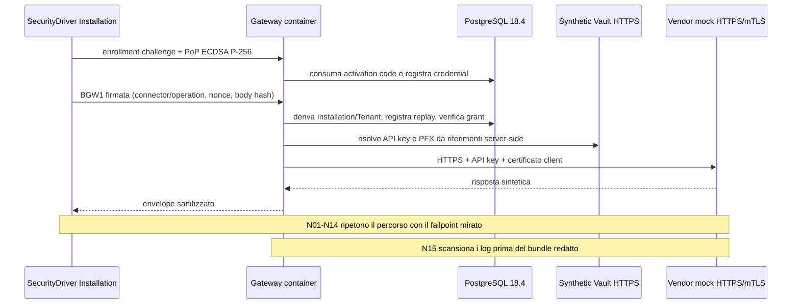

# M3 — Gate Review del vertical slice production-like

Data review: 2026-08-04

Baseline di partenza: `m2-gateway-baseline-2026-08-04` (`abee866e683ed38b2a2c8350288c7a93ab0550ff`)

Commit implementativo testato: `91963cedca1a5c4165aa3c751c08d48755c6fc9f`

Pull request: `#3`, branch `m3/production-like-vertical-slice`

CI: run `30903757495`

## Esito

**M3 non è ancora Done. NO-GO per M4.**

La parte container deterministica e il product gate split-host M3A sono PASS: Gateway reale,
PostgreSQL 18.4, synthetic Vault HTTPS, vendor mock HTTPS/mTLS, enrollment, percorso
positivo, vero Broker Windows Service, Legacy standard user, 14 negative applicative e
canary/log scan correlati. I bundle redatti sono fuori dal repository e verificati.

Resta un blocker non sostituibile con simulazioni:

1. M3B deve ancora essere eseguita in Azure dev; il repository non ha environment
   `azure-dev`, variabili OIDC o subscription autorizzata.

Per questo non sono stati creati tag/baseline M3, non è stato aggiornato `main` e M4 non
è stata avviata.

## Perimetro del gate M3A semplificato

La Gate Review distingue le proprietà del prodotto dall'automazione del laboratorio. Il
gate non misura la capacità di Codex di acquisire un token elevato né richiede un
orchestratore privilegiato generico.

| Classe | Contenuto | Effetto sul gate |
|---|---|---|
| A — prodotto obbligatorio | vero Windows Service, StartName `NT SERVICE\SecureIntegrationBroker`, service SID effettivo, Legacy standard user, P02 completo, installation authentication, tenant server-side, operation grant, revoca, replay, API key/mTLS solo Gateway, rifiuto URL/secret reference client-side, redazione e cleanup | ogni voce deve avere evidenza live PASS; una failure blocca M3A |
| B — laboratorio utile | checkpoint Hyper-V, rete isolata, firewall mirato, rollback assistito, Tailscale pre-disabilitato, handoff e sidecar | aumenta ripetibilità e sicurezza operativa; un limite di automazione non invalida il prodotto se isolamento e cleanup sono verificati manualmente |
| C — automazione futura | Codex VM autonomo, executor SYSTEM generico, rollback completamente automatico, gestione Tailscale/profili firewall perfettamente automatizzata, laboratorio ricreato a ogni run, evidence formale di ogni tentativo preparatorio | rinviata alla qualificazione di release; non è blocker M3 |

Il flusso approvato è HOST `Prepare` → `WAITING_FOR_OPERATOR` → singolo script PowerShell
5.1 eseguito manualmente in console amministrativa VM → acquisizione `RESULT.json` e ZIP
redatto → HOST `Finalize` → cleanup. Lo script è prodotto dal repository, trasferito con
SHA-256, non contiene segreti, non stampa il bootstrap ed esegue `ValidateVm` prima di
`Run`. Il checkpoint Hyper-V è la recovery primaria.

Il prototipo di executor SYSTEM, interrotto prima di diventare requisito, è preservato
senza riscritture nel branch `experimental/m3a-system-executor`, commit
`b081c527186d4b66b1c03511c0c17856b9ea217a`. Non appartiene al candidate commit M3 e
non è richiesto per dichiarare M3A PASS.

## Lineage e review dei commit

La storia da M2 è lineare e non contiene merge, rebase o squash.

| Commit | Contenuto/review |
|---|---|
| `4078c01` | architettura, piano, runbook ed evidence contract prima del codice |
| `5d200d9` | invoker Broker production: CNG P-256 non esportabile, enrollment e BGW1; Gateway combinato API key+mTLS e confini App Service |
| `11bb465` | fixture, compose, Windows orchestrator, SecurityDriver, Legacy Simulator, Bicep e job M3A |
| `5d32968` | rimosso riferimento a una action Bicep inesistente; validazione tramite Azure CLI ufficiale |
| `03dfd98` | lock file inclusi nei Docker restore; timeout solo del client ordinario E2E portato a 15 s, lasciando il test deadline dedicato a 150 ms |
| `2b3faee` | workflow M3B manuale con OIDC, environment protetto, Managed Identity, Key Vault e cleanup resource group |
| `1c9b7c0` | `M3Testing` può usare esclusivamente l'HMAC sintetico per-run; Production continua a richiedere Key Vault; aggiunto test startup regressivo |
| `022d12c` | alias DNS TLS espliciti per Vault/vendor e probe HTTPS coerente; nessuna validazione TLS disabilitata |
| `5b7fc57` | CA sintetica emessa in PEM reale; eliminato il precedente trust failure, senza `-k` o callback permissive |
| `1c2752b` | revoca atomica mantenuta ma divisa in prepared command Npgsql singoli; nessun controllo o grant indebolito |
| `dd3602e` | bundle CI redatto conservato prima del cleanup, con scope dichiarato e digest |
| `953b7a7` | evidence vincolata a `CANDIDATE_COMMIT_SHA` e assert sul checkout; il merge SHA sintetico PR non è più usato come identità del prodotto |
| `91963ce` | manifest arricchito e ZIP finalizzato soltanto dopo cleanup PASS con zero container/volumi residui |
| `d88be56` | handoff operatore verificato con SHA-256, `WAITING_FOR_OPERATOR`, script VM unico e test regressivo; nessun executor SYSTEM |

I fix derivano tutti da run bloccate preservate (`30900135811`, `30900263348`,
`30901085026`, `30901570191`, `30902042566`, `30902477494`). Nessuno introduce bypass
di autenticazione, autorizzazione, TLS, egress o redazione.

## Evidenza M3A container

Bundle HOST: `C:\SecureEvidence\m3a-ci-30903757495\m3a-ci-30903757495-redacted-evidence.zip`

SHA-256: `A52CACB8460F1B9B8D5B12CF8C4B784B3DA434466EAF133235B328AFD43FCA30`

Il sidecar coincide; il manifest attesta commit `91963cedca1a5c4165aa3c751c08d48755c6fc9f`,
scope `gateway-container-only`, 16 record scenario PASS, canary scan PASS,
cleanup PASS con zero container/volumi residui, `brokerWindowsServiceVerified: false` e
`azureVerified: false`. Lo ZIP contiene soltanto:
`manifest.json`, `security-scenarios.json` e `fixture-public.json`; non contiene raw
evidence, PFX, chiavi, environment, canary o log.

Digest osservati:

- M3A Gateway: `sha256:13e0292073ab4db87bb27f99dbbdb19dea38917d4538c7f31bd0da0aed45e9b5`;
- synthetic Vault: `sha256:aa4009b47f94fdcfcd359de81341f9f42f2bc4d9347d1f6c04a79af133441a82`;
- vendor mock: `sha256:bbbaf5a34d602f5f8905b0420244e94ce54e45a45e3f4256f52330db195993ab`;
- immagine Gateway M2/M3 hardening job: `sha256:d5178d47b9a3e68ac5fd18c9de5dc673828cd74edfcf27351a63de5f5586dcbd`;
- migration runner: `sha256:6f52428750ba5176180a184b1c9177b33166b2bd4ef62a3d52fbbfb799317779`;
- migration SQL: `182CC690E16BB986638A4B52EE1554A4B540A8E58FD673F2111A79D194C66A98`.

### Matrice scenario

| Scenario | Stato | Evidenza/codice |
|---|---|---|
| P01 enrollment | PASS-CI | `BGW-ENROLLMENT-OK` |
| P02 invocazione tramite vero Broker Service | **PASS-LIVE** | run `m3a-live-20260805-094131`, vero service/virtual account e Legacy standard user |
| P03 tenant server-side | PASS-CI | risposta positiva e tenant override N04 negato |
| P04 grant valido | PASS-CI | `BGW-OK`; connector/operation N05/N06 negati |
| P05 API key letta dal Vault | PASS-CI | vendor accetta il canary soltanto dal Gateway |
| P06 mTLS Gateway→vendor | PASS-CI | cert corretto accettato, N12 errato rifiutato |
| P07 risposta sanitizzata | PASS-CI | `BGW-OK`, nessun secret/header vendor nel risultato |
| N01 revoca | PASS-CI | `BGW-INSTALLATION-REVOKED` |
| N02 firma/PoP invalida | PASS-CI | `BGW-AUTHN-SIGNATURE` |
| N03 replay | PASS-CI | `BGW-AUTHN-REPLAY` |
| N04 tenant differente | PASS-CI | `BGW-PROTOCOL-JSON` |
| N05/N06 connector/operation | PASS-CI | `BGW-OPERATION-NOT-FOUND` |
| N07 URL arbitrario | PASS-CI | `BGW-PROTOCOL-JSON` |
| N08 loopback/privato/metadata | PASS-CI | tre `BGW-EGRESS-DESTINATION-DENIED` |
| N09 DNS override/rebinding input | PASS-CI | campo rifiutato; transport usa risoluzione/pinning server-side |
| N10 secret reference arbitraria | PASS-CI | `BGW-PROTOCOL-JSON` |
| N11 redirect | PASS-CI | `BGW-EGRESS-REDIRECT-DENIED` |
| N12 certificato client errato | PASS-CI | `BGW-EGRESS-UPSTREAM-REJECTED` |
| N13 Vault indisponibile | PASS-CI | `BGW-VAULT-UNAVAILABLE` |
| N14 PostgreSQL indisponibile | PASS-CI | errore sanitizzato `BGW-INTERNAL` |
| N15 canary/secret nei log | PASS-CI | ricerca byte-for-byte sulle canary, nessuna corrispondenza |

## Sequenza effettivamente eseguita in CI

La sequenza Gateway è provata dalla CI e dalla run split-host. Il tratto Legacy Simulator
→ Named Pipe → vero Broker Windows Service → Gateway è PASS-LIVE nella run
`m3a-live-20260805-094131` e non è simulato.

## Review sicurezza mirata

- Tenant/Application/Installation derivano dalla credential autenticata; proprietà
  `tenantId`, URL, address e secret reference inattese falliscono la deserializzazione.
- Grant deny-by-default e revoca sono verificati prima di Vault/DNS/dispatch; replay usa
  nonce persistente PostgreSQL e firma BGW1 su method, target, timestamp, nonce e body hash.
- Endpoint, header auth e riferimenti Vault provengono soltanto dal catalogo server-side.
  Non esiste un endpoint Broker/Gateway che restituisca secret; `GetSecretAsync` è
  un'astrazione interna al Gateway e non attraversa il boundary API.
- Il Broker non contiene vendor API key/PFX: possiede soltanto la propria chiave CNG
  Installation non esportabile e il certificato pubblico associato.
- Restricted egress vieta proxy, cookie, redirect, loopback, link-local, metadata e
  indirizzi privati; l'unica eccezione privata è host+CIDR esatta e registrata soltanto in
  `M3Testing` per il vendor sintetico.
- Il certificato App Service inoltrato via `X-ARR-ClientCert` è accettato soltanto in
  `Production` quando `WEBSITE_INSTANCE_ID` prova il boundary App Service. Il comportamento
  deve ancora essere validato live in M3B.
- Errori e audit contengono codici/correlation ID, non payload o credenziali. Il canary
  scan CI e il Windows Event Log M3A sono PASS. Il solo scan aggregato dei log container
  della run live non è stato raggiunto dal finalizzatore ed è dichiarato come limite di
  evidence non bloccante.

## Build, test e scanning

| Controllo sul commit `91963ce` | Risultato |
|---|---|
| build Release | PASS, 0 warning/error locale e CI |
| suite ordinarie | PASS, 87/87 sul branch corrente, incluso handshake mTLS Schannel reale |
| Gateway PostgreSQL 18 | PASS, migration apply/no-op, checksum, ruoli, FORCE RLS, tenant isolation, cleanup |
| `m3-deterministic-container-slice` | PASS, run `30903757495` |
| container hardening/SBOM | PASS, non-root, read-only, health/readiness, fail-closed, shutdown e digest |
| docs, secret e vulnerability scan | PASS |
| Gitleaks | PASS |
| Bicep e workflow lint | PASS |
| PowerShell 5.1 parse | PASS |
| `ValidateHarness`/esecuzione elevata HOST | PENDING: Docker non è installato sull'HOST corrente |

## Blocker per la baseline M3

- environment GitHub `azure-dev`, OIDC federato e variabili elencate nel runbook;
- smoke Azure PASS con Managed Identity/Key Vault reali e bundle redatto verificato.

### Ultima run split-host

La run `m3a-live-20260805-094131` chiude **M3A PRODUCT GATE PASS** sul commit `86b4e0f`.
P02, Windows Service/virtual account, Legacy standard user, negazioni VM e cleanup sono
PASS nell'archive VM originale; P01/P03–P07 e N01–N14 HOST sono PASS nel report originale.
Il finalizzatore del laboratorio resta dichiarato BLOCKED per il probe Schannel opzionale,
senza mascherarlo come PASS. Evidence, hash, limite di log aggregation e criterio di
composizione sono in `M3A-PRODUCT-GATE-20260805.md`.

## Non-blocker e debito rinviato

- warning Node 20 delle action v4 sul runner GitHub: aggiornare quando le action pubblicano
  una major compatibile;
- warning opzionale `libgssapi_krb5` nei container migration/provisioner: nessun uso
  Kerberos nel test, ma va rimosso prima della baseline per log operativi puliti;
- M3 Azure dev usa accesso PostgreSQL “Azure services” e firewall temporaneo del runner;
  private endpoint/VNet appartengono all'hardening M9;
- challenge store in-memory e cache Key Vault in-process restano i limiti single-node già
  accettati in M2;
- Gateway HTTP v1 e IPC v1 restano **provvisori** finché il gate M3 non è concluso.

## Decisione

Nessuna deviazione architetturale richiede una nuova ADR: synthetic Vault e allowlist
privata sono confinati all'ambiente di test; Azure usa OIDC, Managed Identity e Key Vault
come previsto. **M3A è PASS; M3 resta aperto per M3B. Nessun tag M3 viene creato. NO-GO per M4.**
