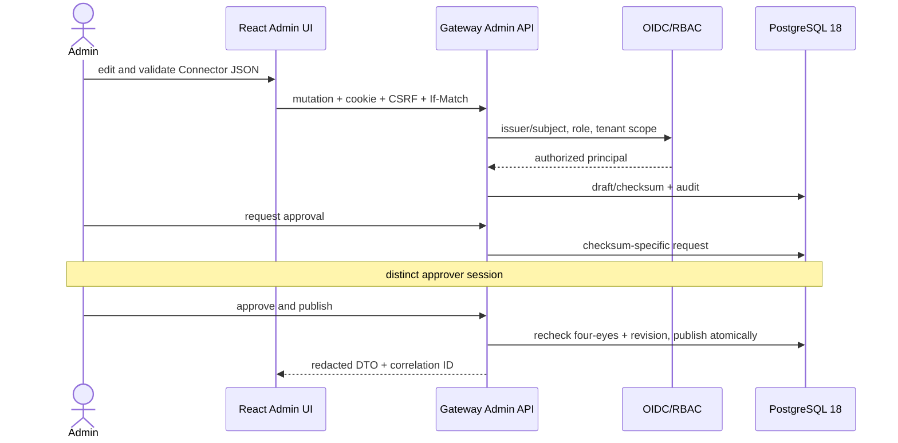

# M5 Admin UI MVP — Gate Review

**Baseline M4:** `m4-connector-configuration-baseline-20260805` (`49f81cb37dcd5bf8956638fe4af53c3c5cf39b2b`)  
**Branch:** `m5/admin-ui-mvp`  
**Stato:** implementation complete; final GitHub CI/evidence pending.

## Product result

M5 adds a usable same-origin administration plane, not a static mock. The browser authenticates through server-side OIDC, uses a secure session cookie and CSRF, and calls only `/admin/api/v1`. Authorization, tenant scope, four-eyes approval, optimistic concurrency and audit are enforced server-side. Provider values, private keys, activation codes after the one-time response and arbitrary runtime URLs are absent from read APIs.

## Acceptance evidence

| Area | Evidence | Result |
|---|---|---|
| Auth/session/web security | Admin API integration; CSP/header/cookie/CSRF/logout and Production fail-closed tests | PASS local |
| RBAC/four-eyes | `AdminSecurityTests`, HTTP Viewer negative, E2E-04–07 | PASS local |
| Resources and activation | integration create/list, E2E-12/13 | PASS local |
| Connector lifecycle | M4 regression plus E2E import/validate/publish/rollback/retire/concurrency | PASS local |
| Binding/grant/test/audit/health | E2E-08/09/15/16/17 and no-arbitrary-URL unit | PASS local |
| Frontend | lint, deterministic build, 14 Vitest, 20 Playwright | PASS local |
| Accessibility | axe on primary flow, zero critical/serious | PASS local |
| Database/container/quickstart/export/scans/SBOM | dedicated M5 CI jobs | PENDING final CI |

## Security review

- CSP is nonce-bound; scripts/styles/connect are self-only and no CDN/font/analytics/PWA is used.
- Tokens remain server-side; Web Storage is limited to language/theme.
- DevelopmentAuth is fixed-identity, local Development only and startup-fails in Production.
- Runtime and Admin database credentials are separated; runtime cannot mutate administration tables.
- Connector test accepts identifiers only and resolves Published operations/bindings server-side.
- Admin account/browser compromise and two-account collusion remain residual risks; Local Administrator/SYSTEM scope is unchanged.

## Scope control

M3B Azure live qualification, AWS/HashiCorp providers, real healthcare connectors, commercial legacy adapters, M6 and subsequent milestones were not started. The optional Azure pack remains physically downstream of provider-neutral abstractions.

## Open items before Done

1. Final CI on the exact candidate commit, including PostgreSQL 18, container/quickstart, Core export, secret/vulnerability/license scans and combined SBOM.
2. Redacted external evidence manifest/hash and final status update.
3. PR #5 review. The PR must not be merged automatically.
4. Final Apache-2.0 versus MPL-2.0 decision remains legal/business-owned and does not block a private preview build; it blocks public licensing.
