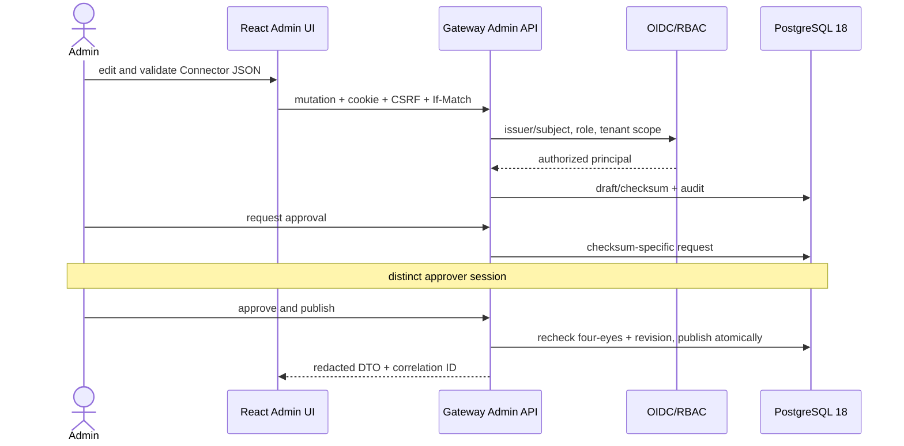

# M5 Admin UI MVP — Gate Review

**Baseline M4:** `m4-connector-configuration-baseline-20260805` (`49f81cb37dcd5bf8956638fe4af53c3c5cf39b2b`)  
**Branch:** `m5/admin-ui-mvp`  
**Implementation candidate:** `c3a448763ed80e9427d1828e95009996d0a9554d`
**Stato:** **PASS — M5 Done sul candidate; PR #5 resta aperta e non unita.**

## Product result

M5 adds a usable same-origin administration plane, not a static mock. The browser authenticates through server-side OIDC, uses a secure session cookie and CSRF, and calls only `/admin/api/v1`. Authorization, tenant scope, four-eyes approval, optimistic concurrency and audit are enforced server-side. Provider values, private keys, activation codes after the one-time response and arbitrary runtime URLs are absent from read APIs.

## Acceptance evidence

| Area | Evidence | Result |
|---|---|---|
| Auth/session/web security | Admin API integration; CSP/header/cookie/CSRF/logout and Production fail-closed tests | PASS local |
| RBAC/four-eyes | `AdminSecurityTests`, principal disabilitato, HTTP Viewer negative, E2E-04–07/21/24 | PASS local + CI |
| Resources and activation | integration create/list, E2E-12/13 | PASS local |
| Connector lifecycle | M4 regression plus E2E import/validate/publish/rollback/retire/concurrency | PASS local |
| Binding/grant/test/audit/health | E2E-08/09/15/16/17 and no-arbitrary-URL unit | PASS local |
| Frontend | lint, deterministic build, 14 Vitest, 24 Playwright | PASS local + CI |
| Accessibility | axe on primary flow, zero critical/serious | PASS local |
| Database/container/quickstart/export/scans/SBOM | M5 CI `31005091580` (12/12), regression CI `31005091566` (6/6) | PASS |

## Gate artefacts

- .NET: 117 test PASS (3 architecture, 26 Broker unit, 43 Gateway unit, 28 Broker integration, 16 Gateway integration, 1 vertical slice); PostgreSQL 18 integration PASS in CI.
- Frontend: 14 Vitest and 24 Playwright PASS; axe reports zero critical/serious violations.
- Gateway/Admin image: `sha256:9aa9f4ddb3a9cedfd57104a7a12c9868f4e91c5c5de2392a910224dce418a1d8`; quick start started healthy/non-root/read-only and cleanup left zero containers, volumes and networks.
- Migration `0003_admin_ui_m5.sql`: SHA-256 `F527C6747ED2AB0FC984B28986CBEA2AF8175AE61C4FDFEAD848B8CD4F0034CB`.
- Core export: 286 allowlisted files, build/test/secret/license/boundary PASS on Linux, manifest SHA-256 `7C2849F5FFB3F3D031B293D7D1482A3430D59889D4D1D6A1511BA148F39E8E1D`.
- SBOM: backend and frontend SPDX produced; local hashes are recorded in external evidence `C:\SecureEvidence\m5-gate-20260805-142300`.
- Secret scan, Gitleaks, NuGet/npm vulnerability scan, frontend license scan and documentation validation: PASS.

## Security review

- CSP is nonce-bound; scripts/styles/connect are self-only and no CDN/font/analytics/PWA is used.
- Tokens remain server-side; Web Storage is limited to language/theme.
- DevelopmentAuth is fixed-identity, local Development only and startup-fails in Production.
- Runtime and Admin database credentials are separated; runtime cannot mutate administration tables.
- Connector test accepts identifiers only and resolves Published operations/bindings server-side.
- Admin account/browser compromise and two-account collusion remain residual risks; Local Administrator/SYSTEM scope is unchanged.

## Scope control

M3B Azure live qualification, AWS/HashiCorp providers, real healthcare connectors, commercial legacy adapters, M6 and subsequent milestones were not started. The optional Azure pack remains physically downstream of provider-neutral abstractions.

## Gate decision and open items

M5 is technically Done and is **GO for reviewed merge of PR #5**, but the PR must not be merged automatically. The private preview is GO. Public distribution is NO-GO until legal/business chooses Apache-2.0 or MPL-2.0 and adds the definitive license. The first real healthcare Connector Pack is NO-GO: it remains a later, separately threat-modelled and qualified product milestone.

Residual work is limited to PR review/merge, the definitive license decision, real external OIDC interoperability and later release qualification. M3B, M6+, cloud deployment, healthcare connectors and commercial adapters remain unstarted.
